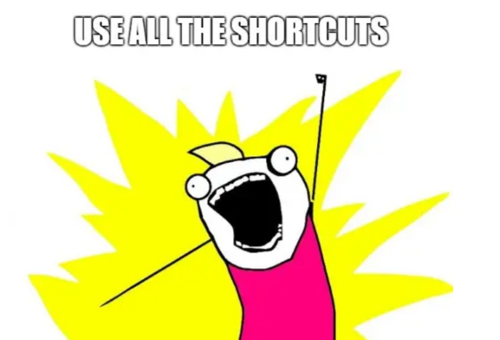

```{r setup, include=FALSE}
options(htmltools.dir.version = FALSE)
knitr::opts_chunk$set(
  fig.width=9, fig.height=3.5, fig.retina=3,
  out.width = "100%",
  cache = FALSE,
  echo = TRUE,
  message = FALSE, 
  warning = FALSE,
  hiline = TRUE,
  comment = NA
)

xaringanExtra::use_tile_view()
xaringanExtra::use_panelset()

```


```{r xaringan-themer, include=FALSE, warning=FALSE}

library(xaringanthemer)

style_duo_accent(
  secondary_color = "#782F40",
  primary_color = "black", 
  background_color = "#CEB888",
  code_inline_color = "black",
)
```


class: inverse, left, middle

background-image: url(img/cover2.png)

# Data Management Overview: Session 3
## Training for Schoen Research

----

## Crystal Lewis

Slides available on [`r fontawesome::fa("github", fill = "white")`](https://cghlewis.github.io/schoen-workshop-series/)


---

# Plan for this series

.pull-left[
Session 1  
* ~~Data flow~~  
* ~~Documentation~~  

<br>


]

.pull-right[
Session 2
* ~~Creating instruments~~
* ~~Tracking data~~
* ~~Capturing and storing data~~
* ~~Preparing to clean and validate data~~
]

???

Just as a recap, we spent the first two sessions talking about this data management life cycle
* Starting with creating internal documentation all the way to creating a data cleaning plan

---

# Plan for this series

.pull-left[

Session 3
* Why R?
* Getting acclimated with R and RStudio
* Understanding objects, functions, and packages
* Code writing best practices

Session 4
* Packages and functions for data wrangling
]

.pull-right[

Session 5
* Setting up a reproducible syntax file
* Cleaning and validating data with R

Session 6
* Additional data wrangling with R

```{r, echo = FALSE, out.width = "300px", fig.align='center'}
knitr::include_graphics("img/r-project.svg")
```
]

???

For the next 4 sessions we are going to be working with R

Today is not going to be our most exciting day, especially for those who are already R users. But this day is all about getting us all on the same page with our RStudio settings, and using similar terminology and making sure we all grab the basics of code writing. So please bear with me.

Session 5: We will work on cleaning a messy data file from start to finish

Session 6:

Restructuring data

Merging Data 

Writing our own functions


---

background-image: url(img/syntax.PNG)
background-size: contain

???

I wanted to start here and remind us why we are talking about moving to syntax writing and R

Consider the scenario on the left

You are given a raw data file that you are asked to clean

Depending on what program you plan to clean the data in , you might either import the raw data into a program like SPSS or if the data is in like a csv or excel file, you might make a copy of the raw file before you start making any changes to the data

And you do them all by hand - point and click (no syntax)

Then a few weeks later, someone reaches out to tell you they left off 4 participants from the original file, so they downloaded a new file that has everyone

And this could take hours or days to clean again

And now instead of taking hours or days, this takes about 10 seconds

---

background-image: url(img/syntax2.PNG)
background-size: contain

???

Here's another scenario

You give someone a clean dataset, but you didn't use syntax to clean the data

Your user isn't sure what has or has not been done to the data. 

This helps them decide if everything that needs to be done, has already been done, or if they need to do any further transformations

---

# Why use R for Data Management?

.pull-left[
* Writing syntax: 
  - Automates your work
  - Allows your work to be reproducible
  - Facilitates collaboration
  - Allows others to check your work 
```{r, echo = FALSE, out.width = "300px", fig.align = "center"}
knitr::include_graphics("img/heartyr.gif")
```
.center[Source: @allison_horst]

]

.pull-right[
* R specifically:

  - **Free and open source**
  - Platform independent
  - Supportive community
  - Powerful packages that allow us to quickly manipulate data
  - It integrates well with other languages, file types, and applications
  - Becoming more ubiquitous in the world of education research
]

???

For those of you moving over to a scripting language from hand manipulating data in a tool like Excel or SPSS - a reminder that the benefits of using a scripting language as opposed to point and click are...
  - Automates your work - reduces the burden on you, saves time, also reduces human errors (b/c your machine is doing a lot of the heavy lifting)
  - Other people can use your script and run your code
  - You and colleagues can write code together and make decisions together
  - Did you accidentally leave out a variable in that sum score? Or did you recode a value incorrectly?

For those of you who are already using a scripting language such as Stata, SAS or maybe you are writing scripts in SPSS, reasons to switch to R include......
  - Open source meaning it is publicly available to anyone, no restrictions on licenses or copies. 
  - Compatible with Windows, Mac, Unix and Linux platforms
  - There are endless ways to receive support in the R community (and we will talk about those ways) and the number of people who are willing to help beginners far outnumber anyone who thinks they are too good to help someone just starting out. It's a very friendly community.
  - And the available packages continue to grow and evolve with the community because anyone in the world can make new packages that can be integrated and used within R. So it is a program that keeps up with the times
  - Integrates
      - You can read in files from other programs like SAS, Stata, SPSS
      - You can connect to APIs to seamlessly and directly pull in data from places like Qualtrics or the Department of Education
      - You can connect to version control software like Git and GitHub
      - You can integrate with other programming languages like SQL or Python and run those languages inside of R
      - You can integrate with databases like Amazon RedShift or Google BigQuery
      - It's just a very powerful tool

https://techvidvan.com/tutorials/pros-and-cons-of-r/

https://campus.sagepub.com/blog/why-universities-are-switching-to-r-for-social-science

https://www.simplilearn.com/what-is-r-article

https://techvidvan.com/tutorials/pros-and-cons-of-r/

---

.panelset[
.panel[.panel-name[messy_data]

```{r, echo = FALSE}

library(tibble)
library(kableExtra)

mess <- tribble(
  ~ id, ~ `Teach Years`, ~ `Teach grade`, ~ `School District ID`,
  123, "12yrs", "k", "50_100",
  234, "15", "2", "50_100",
  345, "22.5", "1", "60_102",
  456, "4yrs", "2", "60_102",
  567, "5", "3", "60_102",
  678, ".5", "4", "50_100"
)

kable(mess, format = "html") %>%
    kable_styling("striped", full_width=T)

```
]
.panel[.panel-name[cleaning_code]

```{r}

library(tidyverse)
library(stringr)
library(janitor)

clean <- mess %>%
  # fix names
  clean_names() %>%
  # remove "yrs" from teach_years
  mutate(teach_years = str_remove_all(teach_years, "yrs")) %>% 
  # make teach_years numeric and round up
  mutate(teach_years = ceiling(as.numeric(teach_years))) %>%
  # for teach_grade, recode k to 0 and make it a numeric variable
  mutate(teach_grade = as.numeric(recode(teach_grade, `k` = "0"))) %>%
  # separate school and district id
  separate(school_district_id, into = c("sch_id", "district_id"), sep = "_")
  

```
]

.panel[.panel-name[clean_data]

```{r, echo = FALSE}

kable(clean, format = "html") %>%
    kable_styling("striped", full_width=T)

```
]
]

???

Just to demonstrate the power of R

Messy Data: And you can imagine that if you had hundreds of records, this could take a long time to hand clean

Cleaning Code: But using R, I wrote this cleaning code in probably 5 minutes

Clean Data: And within 5 minutes, I have clean data

And this is going to work on any number of records, whether it's just these 6 rows or 6000 rows. It's still going to take 5 minutes

---

class: inverse, top, center

# What Else Can R Do?

```{r, echo = FALSE, out.width = "800px", fig.align = "center"}

```

Source: [<span style="color: white; ">rviews</span>](https://rviews.rstudio.com/2019/06/19/a-gentle-intro-to-tidymodels/)


???

But another reason to start using R is that you'll find that R is your one stop shop for all things data

You no longer have to switch between Excel (for data wrangling), to SPSS (for some analyses), to MPlus (for other analyses), and back to Excel (for graphing), and to Word for writing reports

---

class: top, center

# Analyze Data

```{r, echo = FALSE, out.width = "800px", out.height= "450px", fig.align = "center"}
knitr::include_graphics("img/models.PNG")
```

.footer[Source: [statisticsglobe](https://statisticsglobe.com/extract-standard-error-t-and-p-value-from-regression-in-r)]

???

So let's cover some of the things that R can do besides help you clean data

You can use R as a simple calculator 

You can use it to calculate descriptive statistics 

Or you can use it for complex models and machine learning

https://www.psychologicalscience.org/observer/why-you-should-become-a-user-a-brief-introduction-to-r

---

class: top, center

# Data Visualization

```{r, echo = FALSE, out.width = "800px", out.height= "450px", fig.align = "center"}

```

.footer[Source: @mohsinramay_]

???

People use it for simple static visualizations to be used in journal articles

But R has been used for elaborate interactive visualizations in publications like the New York Times 

---

class: top, center

# Mapping

```{r, echo = FALSE, out.width = "700px", out.height= "450px", fig.align = "center"}
knitr::include_graphics("img/map.png")
```

.footer[Source: [revolutionanalytics](https://blog.revolutionanalytics.com/2012/02/creating-beautiful-maps-with-r.html)]

???

Again, static or interactive

---

class: top, center

.left-column[
# Reporting
]

.right-column[
```{r, echo = FALSE, out.width = "550px", out.height= "600px"}

```
]

.footer[Source: [RfortheRestofUs](https://rfortherestofus.com/consulting/)]

???

You can also produce visual, descriptive reports like the one here

Or you can create technical reports, documentation (codebooks), or academic publications

---

class: top, center

# Applications

```{r, echo = FALSE, out.width = "600px", out.height= "425px", fig.align = "center"}
knitr::include_graphics("img/app.PNG")
```

Source: [Ashley Edwards](https://wordreadinggrowth.shinyapps.io/exposures_to_mastery/)

???

You can make dashboards and interactive applications

This is an application made in R by someone who I think is at FSU

It has inputs, you update the inputs to change the trajectory here

These apps are a nice way to visually communicate your research findings

---

class: top, center

# Slide Decks

```{r, echo = FALSE, out.width = "650px", out.height= "475px", fig.align = "center"}
knitr::include_graphics("img/slides.PNG")
```

---

class: top, center

# Websites

```{r, echo = FALSE, out.width = "750px", out.height= "475px", fig.align = "center"}

```

Source: [Meghan Hall](https://meghan.rbind.io/)

???

Including blogs

---

class: top, center

.left-column[
# CVs
]

.right-column[
```{r, echo = FALSE, out.width = "550px", out.height= "550px"}

```
]

Source: [Rob Hyndman](https://github.com/robjhyndman/CV/blob/master/RobHyndman_1page.pdf)

???

Or resumes

Using the vitae package

---

background-image: url(img/smiling_r_user.jpg)
background-size: contain

???

Like I said, R can be a one-stop shop for most of your research needs, so hopefully as you become more comfortable using it, you will be smiling too

---

.pull-left[

```{r, echo = FALSE, out.width = "480px", out.height= "415px", fig.align = "center"}

```

### R is a free, open-source programming language for statistics and data visualization
]

.pull-right[


### RStudio is an integrated development environment (IDE) for R
]

???

So let's talk about getting set up with R

As I am sure you all are familiar with now, there are 2 pieces to get set up

You only NEED R to get things up and running but RStudio is a really nice addition to have

Customizable workbench with all of the tools required to work with R in one place (console, source, plots, workspace, help, history, etc.)

And we'll see what that all means shortly

---

background-image: url(img/dashboard.PNG)

.footnote[Source: [ModernDive](https://moderndive.com/1-getting-started.html#r-rstudio)]

???

If you did David's Getting Started with R course, you probably already saw this analogy

But when you think of the difference between R and RStudio and how they work together

The R language runs your computations, like an engine, while RStudio's interface makes it easier to understand and use the "engine" 

So you could probably drive a car with just the engine, but when you add a dashboard, it covers up and connects to the overwhelming engine and allows you to just drive the car

---

.pull-left[


]

.pull-right[

```{r, echo = FALSE, out.width = "540px", out.height= "540px", fig.align = "center"}
knitr::include_graphics("img/justRStud.PNG")
```
]

???

On the left here is R

R does come with a VERY basic GUI for us to use, but it's not great. We don't want to use this.

This is what RStudio desktop looks like. And this is what we'll be working with.

There is also RStudio Cloud which runs in a browser (we aren't going to do that).

You can see here that the R GUI is basically the simplified version of RStudio. 

They both have consoles. 

---

background-image: url(img/rstudio_types.PNG)
background-size: contain

???

This is just a reminder, that what we are using is RStudio Desktop (Free version)
We're not using cloud which isn't even shown here because you don't need to download it

---

background-image: url(img/cruella.gif)
background-size: contain

???

So let's learn how to drive this engine

---

# Disclaimer

```{r, echo = FALSE, out.height = "500px", out.width = "900px", fig.align = "center"}
knitr::include_graphics("img/r_rollercoaster.png")
```

???

But before we jump in, I did want to give a disclaimer

You know that I love my disclaimers

I am not an expert. Many R users tend to go through this lifecycle where they start off, when they first learn R, thinking "how am I ever going to learn any of this."

And then they start to learn stuff and they practice and get confidence and after failing a few times, they eventually are like, hey, I'm awesome at this. 

And then they meet other R users out there in the world and realize they know maybe a fraction of what there is to know about writing code and using R. And they just keep learning anyway because they want to get better at it.

And that's where I am. I'm not an expert. I know how to do data management and it works well for what I do, but I don't know everything and there may be better or smarter ways to do things than what I show you. So if you are an R user, and you have input at any point in this workshop, please chime in! Your feedback and insight is very welcome.

---

class: inverse

# Let's Get to Know R and RStudio

<style>

.exercise {

font-size: 2em;
font-style: bold

}
.tan{

color: #CEB888;

}
</style>

.exercise[`r fontawesome::fa("question", fill = "#CEB888")` .tan[Exercises] `r fontawesome::fa("question", fill = "#CEB888")`]

### 1. Open R

### 2. Open RStudio

### 3. Find what version of R and RStudio that you have

???

Just a head's up, there is going to be a lot of switching back and forth between slides and RStudio today so just bear with me as I navigate this

1. Why do we care about versions?
  - Certain functionality may or may not be available depending on the version
  - Compatibility (if you wrote code in a prior version of R and you try to run it in a new version or vice versa, things may break)
  - So it's good practice for us to know what version we are working with

2. Does everyone have both R and RStudio downloaded
  - If no, drop links in the chat to get people started
  - R: http://cran.wustl.edu/
  - RStudio: https://www.rstudio.com/products/rstudio/download/#download

3. Open R
  - Pull up CRAN to show newest version

4. Open RStudio
  - To get R version: type the functions "R.Version()" or "sessionInfo()" to get R version or look in options or look in top left hand corner
  - To get RStudio version: Go to Help -> About Rstudio to get RStudio version
     - In the console you can also type Studio.Version()
  - There are other ways to get versions, I'm just showing you the point and click ways right now to keep it simple

Questions??

So now we know what version of R we are on, let's go back to the slides for a minute and take a tour of RStudio

---

## Tour of RStudio

```{r, echo = FALSE, out.height= "500px", out.width = "800px", fig.align = "center"}
knitr::include_graphics("img/panes.PNG")
```

???

When you first open R, this is what it should look like

You can arrange the sizes of these panes

You can also minimize these panes

Console: This is the R engine. 
  - You can run commands here (but be aware that any commands run here will not be saved like they will be in a syntax file which we will talk about shortly). 
  - The console is also where any non-graphical output from your commands will appear as well as errors or warnings from those commands.
  - So let's go ahead and type something in our console. 
  - Remember earlier I said you can use R as a basic calculator: 
      + 5 + 5 (hit enter to run). 
      + You don't have to have these spaces around the + but it is encouraged for readability
      + You can ignore the [1] - it is sort of an index to track the items printed
  - By default the returned object is merely printed to the screen. It's not saved anywhere.
  - If you want I want to save it in my environment to use it at any point, I need to assign it to an object.
  - And I do that using the assignment operator <-
  - x <- 5 + 5
  - a <- 5
  - b <- 1
  - a + b
  - sum_ab <- a + b
  - You might find that some people use an = sign (rather than this arrow). It also works but it is not recommended, and you will almost always see <- so let's stick with that


* Environment: An overview of all objects (datasets, variables, lists, functions, etc) that you have imported or created, that are in your current environment. 
  - You will also see another tab here called history, which is a log of everything you've run. 
  - The Connections tab allows you to connect to various data sources such as external databases.
  - You may also have a Tutorial tab which is where you can complete interactive tutorials 
  - On mine or others' RStudio Desktops, you may see additional tabs such as a Git tab, and that is because they have enabled additional functionality that you might not have enabled yet.

If at any point you want to delete objects from your environment, you can just use this broom.

* Files Pane: 
  - Files tab lists all external files and directories in the current working directory on your computer. 
      - When you first start R, you will be in your home directory which is the top-level directory of the R installation being run. RStudio chooses a default home directory. 
      - If you are unsure what directory you are in, you can look up in the top left of your console. Right now it is stating you are in your "home" directory. 
      - If you don't know what your home directory is, you can view and/or change your home directory by going to Tools -> Global Options..
      - Don't worry too much about this. For now, keep your home directory as is. 
      - Working in the files tab is similar to a file explorer.
          - You can open, copy, rename, move and delete files in the window.
          - You can navigate around within that Files pane and explore, but note that you won’t change where you are: even as you click through you’ll still be Home: ~/
          - And if at any point I want to change my working directory, we have to do some further steps
      
* Plots tab: All plots you create in R are displayed here (unless you tell R to display them somewhere else)
* Packages tab: Lists all packages you have installed on your computer. You can also install new packages and update packages here
* Help tab: displays R help documentation
* Viewer tab: displays local web content, such as graphics generated by some packages

Questions??

I'm gonna head back to slides real quick to transition

---

class: inverse
background-image: url(img/reminders.PNG)
background-size: 80%

---

## Source Pane

```{r, echo = FALSE, out.height= "500px", out.width = "800px", fig.align = "center"}
knitr::include_graphics("img/panes2.PNG")
```

???

Our 4th pane is the source pane and it really only appears when we open some sort of source (R script, RMarkdown template, etc)

The source pane is for editing, dispatching and saving R code (saving being the key word here). This pane can also display any datasets for viewing that we have read into our environment.

So let's switch back to R:
  - How to open a syntax file
      + There are 2 different ways
  - How to type in a syntax file
      + 5 + 5
  - How to run syntax
      + Highlight and click run
      + Click in the line and click run
      + Notice if I put 1 + 4 below and click in there (it will only run this line, not all lines of code)
      + If I want to run both lines of code, I need to highlight both lines
  - The other thing to know about working in a syntax file is
      + that everything inside a syntax file is considered "executable" unless you comment it out
      + "Add two numbers together" - it will give me an error
      + It doesn't recognize that I am making a comment for myself
      + Similar to some of the other stats programs you may have worked with before, you have to denote this as a comment. In R you do that using a pound sign or hash #
  - How to save syntax
      + The best thing about a syntax file is, you can save it and re-run it again later
      + I'll show you 2 ways to save your script
      + When you save an R script, it will be saved as .R

Questions??

Ok, let's navigate back to the slides again for a recap

---

class: inverse
background-image: url(img/reminders2.PNG)
background-size: 80%

---

class: inverse

# Let's Get to Know our Settings

.pull-left[

</style>

.exercise[`r fontawesome::fa("question", fill = "#CEB888")` .tan[Exercises] `r fontawesome::fa("question", fill = "#CEB888")`]

### Tools -> Global Options

1. General Options

2. Code Options

3. Appearance Options

4. Pane Layout

]

.pull-right[


]

???

Now that we understand the general layout of RStudio, let's get to know how we can personalize RStudio a little more

Most of these are personal preferences, but for now we are going to tweak a few things together, to help us get on the same page as beginners. You can always untweak these things later if you don't like the changes

So we are first going to go back to RStudio and go to Tools and then Global Options and we should pull up a window like this

1. In General options
  + we can see here this is where we can change our default working directory if we wanted to
  + We can also change our version of R if we want to revert to an older version that we've installed
  + The one thing we want to change in our general options right now is: untick "Restore .RData into Workspace at startup". 
      + This prevents loading previously created R objects. This will make starting R quicker and also reduce the chance of getting bugs due to previously created objects. This is a general best practice to untick this box. When we close out RStudio and we reopen later to start a new project, we don't want our old objects to still be there in our environment. We want a clean slate.

2. In Code options
  + Editing Tab
      + We want to check the box "Insert matching parens/quotes" - this will help us autocomplete any parenthese or quotes we use and as beginners, this is a helpful tool
      + Uncheck "Focus console after executing from source"
          - If you don't uncheck this box, whenever you run code in your syntax file, you cursor when then jump out of your syntax file and down to your console - which is not helpful for what we are trying to do
  + Display Tab
      + Check the box for "Rainbow parentheses"
      
3. Appearance Options
  + I'm not going to do anything here but I am going to show you a couple of options
  + This is where you can zoom if you need your view larger or smaller
  + You can change the font
  + You can change the theme (maybe you want dark mode)
  
4. Pane Layout
  + You might want your panes in different locations (I prefer my console in the top right)

Just a head's up, several of these options can also be accessed via the "Code" and "View" tab

If a pane ever disappears, try view, pane, show all panes

Questions??

Ok, back to the slides

---

# Terminology

<style>

.yellow{

color: yellow;
font-style: bold;

}
</style>


Everything that exists in R is an **object**

Recall the assignment operator .yellow[`<-`]

```{r}

x <- 5

y <- 6

```

Everything that happens is a **function**

Consider the function .yellow[sum]

```{r}

sum(x, y)

```

.footnote[Source: [R for the Rest of Us](https://rfortherestofus.com/courses/getting-started/)]

???

Now that we have a lay of the land and we have RStudio set up how we want it, let's start getting an understanding of the terminology we will be using

Which is a base function automatically provided in R

---

# Objects

.pull-left[
1. There are 6 types of **objects** in R programming
  + **Vector**
  
  + Lists
  
  + Matrices
  
  + Array
  
  + Factors
  
  + **Data Frame** (Tibble)
  
]

.pull-right[


]

???

Remember all of your current existing objects can be found in your Environment pane

While all of these objects are important, this is not a heavy programming workshop. I really want to get you all up and running with code to clean your data and so I just want to focus on what is most important for those purposes. 

And for getting set up with data cleaning, the two things I want to cover for now are dataframes and vectors


---

# Objects

.pull-left[
* Data Frame
  - Simply put, this is your dataset. A two dimensional data structure, where each column is a variable and each row is a case.
  - In R you can create your own dataframe or read in a dataframe from your computer, a website, or a package.
  - Tibble is another term you might hear
      
```{r}

data <- data.frame(
  id = c(123, 234, 456), 
                   age = c(12, 10, 9))

data

```
]

.pull-right[
* Vector
  - This is the simplest object
  - It consists of one or more elements all of the same type (ex: all numeric, all character)
  - Think of vector as a variable outside of a dataframe
  
```{r}

id <- c(123, 234, 456)

id

```
]

???

The first type of object is a Dataframe
  - 99.99% of the time, you'll be reading in a dataframe
  - You can see here I created my own dataframe for demonstration purposes, but you don't need to worry about that right now. Most often we are reading in datasets that have already been created, we just need to manipulate them
  - And then the last thing to know about dataframes, is that sometimes instead of dataframes we are working with tibbles, which are just a simplified type of dataframe in R - don't worry too much about that right now, I just want you to be familiar with the terms
  - So here is what a printed out dataframe would look like in R


vector
  - So here I am making an ID variable (or vector) and filling it with some sample IDs
  - Notice I created the vector by using the c() function
  - c() means combine
  - It's not in a dataframe right now, it's just a stand alone variable
  - And you'll notice it's not vertical like we expect. It's horizontal. And that's because we haven't put it into a dataframe structure yet. And if I wanted to do that, I would have to use something like this data.frame function.
  - Again, don't panic about this right now, we are pretty much always going to be working with these dataframe objects


---

# Best Practices for Object Naming

.pull-left[

1. No spaces

2. Use all lower case

3. Use underscores to separate words

4. Descriptive

5. Not names of existing functions

6. Don't start with a number

7. No special characters

]

.pull-right[

```{r, eval = FALSE}

# Good
day_one
day_1

# Bad
1_day
DayOne
day-one
x

```

```{r}

# Bad
T <- FALSE
c <- 10
sum <- x + y

```

Source: [Advanced R](http://adv-r.had.co.nz/Style.html)

]

???

Much like a style guide for all the data management practices we've already discussed, there are generally agreed upon style guide rules for object naming

Any time you create an object in R using the assignment operator, you have to consider how you will name it. Remember these are just objects within R. This has nothing to do with your actual data or how it will be exported. These names just allow you to work with objects in R (which 9 times out of 10 will be your datasets)

Many of the rules are similar to variable naming that we covered in earlier trainings

2\. R is case sensitive so let's not cause confusion

3\. Remember, - is confused as minus sign


---

# Every R Object has a Type and Class

.pull-left[

#### **Type**: How an object is stored in memory

1. Character: **"apple"**, **"12_405"**

2. Double: **2**, **2.5**

3. Integer: **2L**

4. Logical: **TRUE**, **FALSE**

5. Complex: **1+4i**

]

.pull-right[

#### **Class**: The abstract type

1. Character

1. Numeric

1. Integer

1. Factor

1. Date

1. POSIXct

1. Logical


]

.footnote[[The Carpentries](https://swcarpentry.github.io/r-novice-inflammation/13-supp-data-structures/)]

???

The other thing to know about objects is that every R object has a type and a class

Type is less concerning for your purposes, but it is sometimes good to know how R stores a variable on the back end

For vectors (aka variables), types you might encounter include:
  - Character (need to be provided with "" around the text or otherwise R will throw an error)
  - Double (number with decimals)
  - Integers are numeric data without decimals (The L tells R to store this number as an integer)
  - Logical: TRUE or FALSE
  - Complex: numbers with an imaginary component

Class is how you would typically think of a variable type. How you might use it in your analysis.

For vectors (aka variables), classes you might encounter include:
  - Factor is essentially a categorical variable where you have assigned order to those categories
  - Date is a date without time
  - POSIXct is a date with time
  
Other objects besides vectors also have types and class, including dataframes/tibbles and lists

---

# Examples of Type and Class

.pull-left[
```{r}

# Numeric vector

age <- c(12, 14)

class(age)

typeof(age)

```
]

.pull-right[

```{r}

# Factor

grade_level <- as.factor(c("k", "1", "2"))

class(grade_level)

typeof(grade_level)

levels(grade_level)

```
]

???

Numeric vector:

Even though there are no decimals in this variable, we didn't tell R to record this as an integer, we didn't use that L

---

# Examples of Type and Class

```{r}

# Dataframe

data <- data.frame(
  id = c(123, 234, 456), 
                   age = c(12, 10, 9))

print(data)

class(data)

typeof(data)

```

---

# Functions

.pull-left[

**Option 1:**

Write your own function

```{r}

my_sum <- function(x,y){
  x + y
}

my_sum(x=1, y=2)

```

]

.pull-right[

**Option 2:**

Use an existing function (calling a function)

```{r}

x <- 1
y <- 2

sum(x, y)

```
]

.center[Anatomy of a function call]
```{r, eval = FALSE}

function_name(arguments)

mean(x, na.rm = FALSE) # x is an R object
class(x) # x is an R object

```


???

Functions are a piece of code written to carry out a specified task 

They are what make all of your data transformations happen.

Every function has one or more arguments
  + The parameters provided to a function to perform that operation

This argument already has a default input of FALSE

False means, you don't want it to create a mean if there are NAs. 

If it's true it means you want to calculate a mean, even if there are NAs in the variable. 

If you want this to stay false (keep the default), you don't even have to acknowledge the argument at all when you call the function.

---

# `r fontawesome::fa("question", fill = "#782F40")` Let's Practice Some Base R Functions `r fontawesome::fa("question", fill = "#782F40")`

| Task  |  Function   | Arguments   |
|-------|------------|-------|
|combine elements |   `c` | objects to be concatenated |
|check the class of an object | `class` | an R object |
|check the length of a vector | `length` | object | 
|mean of values | `mean`  | an R object, na.rm|
|create a data frame | `data.frame` | value |
|check internal structure of an object | `str`| object |

<br>
<br>

???

Base R meaning, these functions just came ready and pre-installed for you

Functions take inputs and return outputs. The arguments are the inputs.

These arguments might have defaults, like we saw above with the sum argument (na.rm = FALSE)

Let's try out these functions

- numeric vector
  + If you want to be reminded what the arguments are for a function, you can type ?function_name in your console
  + test_score <- c(20, 30, 40, NA)
  + Check the class 
  + Check the length
  + Get the mean
      - Let's keep the default for the na.rm argument, which is false, and see what happens. Any guesses?

- numeric vector
  + id <- c(10,11,12,13)
  + Another way to create this numeric variable since the IDs are in a sequence is use the colon operator
  + id2 <- 10:13
  + Check the class of id and id2
  
- character vector
  + fav_color <- c("green", "black", "blue", "violet")
      + Remember when we create character variables we have to use these quotation marks, otherwise, R is going to be looking for an object named Green
  + Get class

- character vector
  + grade_level <- c(k, 1, 2, 1)
    - What will happen if I try to create my vector like this?
        + You have to put "" around letters/words (you'll get an error b/c R is looking for an object named k)
  + grade_level <- c("k", 1, 2, 1)
    - What do you think the class will be?
    - R will create a resulting vector with a type/mode that can most easily accommodate all the elements it contains.

- create a data frame
  + sch_data <- data.frame(
  id, grade_level, test_score, fav_color
  )
  + And if we click on it, we can see how all of our vectors/variables have now been added to a data frame
  
- Last let's check the class and structure of the data frame
  + class(sch_data)
  + str(sch_data)

---
class: inverse

# Packages

Packages are a collection of functions.

They are written by a worldwide community of R users and can be downloaded for free from the internet.

```{r, echo = FALSE, out.height = "300px", out.width = "600px", fig.align = "center"}

```

.footnote[Source: [<span style="color: white;">Modern Dive</span>](https://moderndive.com/1-getting-started.html#r-rstudio)]

???

So now we are familiar with some base R functions, but most of the time when we are cleaning data, we aren't using base functions, we are using functions from a package.

If you did the Getting Started with R course, you've probably seen this analogy

You can think of packages like apps you download onto your phone, that provide additional functionality

---

# Packages

.pull-left[
#### A huge collection of packages are hosted on the internet
1. CRAN
  + A central repository supported by the R Foundation
  + **C**omprehensive **R** **A**rchive **N**etwork
  + These packages must meet certain quality standards, and are regularly tested
  + Anyone can submit their package to CRAN and have it published for broad use
  + https://cran.r-project.org/

#### You may also find packages in other places
2. Bioconductor
3. GitHub
4. Your own personal computer or network drive
]

.pull-right[

]

???

Most of the ones we will use are on CRAN

Click on website

---

# How to Access Packages

.pull-left[
#### Step 1: Install: Do only once

Either install a package through code

```{r, eval = FALSE}

install.packages("package_name")

```

Or install manually

```{r, echo = FALSE, out.height = "275px", out.width = "600px"}
knitr::include_graphics("img/install.PNG")
```

]

.pull-right[
#### Step 2: Load: Do every time you start R

```{r, eval = FALSE}

library(package_name)

library(stringr)
library(dplyr)
library(readr)
library(haven)

```
]

???

Assuming your package is on CRAN, which all the packages we will use for data cleaning are, then there are 2 ways to install a package

When you install these packages, they will be stored somewhere on your machine

R will choose a default. You can change this default if you want. My default is to store in my documents folder in a folder called R

This step of installing you only have to do once

Even though we have the package installed on our computer, each time we open R and want to use that package, we have to load that package into our environment to tell R we want to use that package.

So, every time we close out R and start a new R session, we will need to library our package again if we need to use those functions

Oftentimes we will be using multiple packages and we need to library each package each time we open R. 

So here is an example of calling 4 packages

The order of calling the packages, doesn't really matter

---

class: inverse

# Getting Help

If you want to understand a package, you have several options:

.pull-left[
Review the documentation.


]

.pull-right[
Type .white[`?package_name`] in your console


]

???

If your package is on CRAN, there will be documentation.

You can usually find it by just googling the package name

And all of the functions I plan to teach you should have ample documentation as well as vignettes available to help walk you through how to use any functions in the package.

Similar to how we typed ?function_name in the console earlier


---

class: inverse

# Getting Help in General

.pull-left[

Google is your friend


]

.pull-right[

Turn to the supportive community


Source: [<span style="color: white;">Shannon Pileggi</span>](https://www.pipinghotdata.com/)

]

???

Getting help in general, if you don't know how to use a function, or you get an error, you don't remember how to do something in R? 

1.
Google it. That is probably what 90% of people who code do.

Google: how to rename a variable in R

2.
You can always search for answers on Stack Overflow and if you are a brave soul, you can actually ask questions on there, but that can be a little intimidating

If you are on Twitter, there is an extremely supportive community of R users on there who are always willing to help when you have questions

RStudio has their own community where you can find help 

If you are a Slack user, there are R slack channels that you can join to ask questions

And like I mentioned in workshop 1, there are also subgroups, like R-Ladies that hold periodic workshops that are free and open to everyone to attend and R-Ladies also has their own Slack channel for asking questions

---

class: inverse

# Restart R Session

.pull-left[

]

.pull-right[


]

???

If you are getting an error that you can't solve in all the other ways mentioned above

---

# `r fontawesome::fa("question", fill = "#782F40")` Let's Use our First Package `r fontawesome::fa("question", fill = "#782F40")`

.pull-left[
1. Open a script

2. Install a package
  + `readr`
  
3. Library a package
  + `library(readr)`
  
4. Use a function from that package
  + `read_csv()`
  + To read in this seattle pet names data from a website: https://raw.githubusercontent.com/rfordatascience/tidytuesday/master/data/2019/2019-03-26/seattle_pets.csv
]

.pull-right[

```{r, eval = FALSE}

# Install readr package

install.packages("readr")

# Library package

library(readr)

# Read in data using readr and assign to an object

pet_names <- read_csv("https://raw.githubusercontent.com/rfordatascience/tidytuesday/master/data/2019/2019-03-26/seattle_pets.csv")

```

]

???

Reminder that there are usually multiple functions in a package.

Here we are just using one function.

Bring up readr documentation to show functions


---

# General Code Writing Best Practices


1. Comment your code
  + Comments begin with `#` and a space
  + Comments should explain what and why something is happening

```{r}

# Load raw data

# Drop duplicates cases from raw data

```

2\. Add sections to further refine your comments and make your file more searchable
  + Sections can be added by using 4 dashes after your comment `----`
  + You can also add sections by going to 
      - Code -> Insert Section

```{r}

# Load raw data ----

# (1) Read in the data

# (2) Review the data

```

???

But real quick, because we are going to open a syntax file up to use our first package, let's talk about some best practices for code writing

Show sections in an R script

---

# General Code Writing Best Practices

3\. Use spacing
  + Place spacing around all operators (**except** the colon)
  + Do not put spaces inside or outside parentheses for regular function calls

```{r, eval = FALSE}

# Good
average <- mean(feet / 12 + inches, na.rm = TRUE)
x <- 1:10
mean(x, na.rm = TRUE)

# Bad
average<-mean(feet/12+inches,na.rm=TRUE)
x <- 1 : 10
mean (x, na.rm = TRUE)
mean( x, na.rm = TRUE )

```

---

# General Code Writing Best Practices

4\. Function-indent long lines
  + Strive to limit your code to 80 characters per line 
  + If a function call is too long, place each argument on its own line
  
```{r, eval = FALSE}

do_something_very_complicated(
  something = "that",
  requires = many,
  arguments = "some of which may be long"
)

```

.footnote[Source: [Tidyverse Style Guide](https://style.tidyverse.org/syntax.html) and [Advanced R](http://adv-r.had.co.nz/Style.html)]

???

1\. Install readr package ----

install.packages("readr")

Now that we have installed a package this way, let's never do it again. And the reason is, if you add this to your script, now every time you run your script, you are going to re-install this package. We don't want to do that.

For now we can # it

But I prefer either installing in console, or using point and click

2\. Library package ----

library(readr)

3\. ?readr, ?read_csv - what are the arguments?
- the biggest one is to enter a file as a string
- check examples

4\. Show what the csv file looks like - click link

5\. Read in data using readr and assign to an object

pet_names <- read_csv("https://raw.githubusercontent.com/rfordatascience/tidytuesday/master/data/2019/2019-03-26/seattle_pets.csv")

6\. Review the data

double click
str(pet_names)  
names(pet_names)  
print(pet_names)  
head(pet_names)  

7\. Reminder

This is just an object in R. Any manipulations we do to the data are not being done to the actual file outside of R! We are never touching the raw file on our computer or on the internet or wherever the file came from. That's the beauty of this syntax writing. If we mess up any of our manipulations, it doesn't matter. We can go back to our original raw file and start again.

The only way we can get our manipulated, cleaned up data back out is to export a new file out.


---

# Shortcuts

| Task  |  Windows   | Mac   |
|-------|------------|-------|
|Run current line of code | `Ctrl + Enter` |  `Cmd + Return` |
|Run all lines of code | ` Ctrl + A + Enter` | `Cmd + A + Enter` |
|Code completion | `Tab` | `Tab`|
|Insert assignment operator | `Alt + -` | `Option + -` |
|Insert pipe operator | `Ctrl + Shift + M` | `Cmd + Shift + M` |
|Comment or uncomment a line | `Ctrl + Shift + C` | `Cmd + Shift + C`|
|Restart R Session | `Ctrl + Shift + F10` | `Cmd + Shift + F10`
|Multi-line cursor| `Alt + click and drag` | `Option + click and drag`|
|Previous command in console | `up-arrow` | `up-arrow` |

???

Code completion: if you have a function or object loaded in your environment, R will start to recognize those terms as you are typing it and it will autocomplete if you press tab

---

# `r fontawesome::fa("question", fill = "#782F40")` Let's Practice Shortcuts `r fontawesome::fa("question", fill = "#782F40")`

```{r, echo = FALSE, out.height = "500px", out.width = "600px", fig.align='center'}

```

.footnote[Source: [Zenkit](https://zenkit.com/en/blog/shortcuts-for-all/)]

---

class: inverse, center, middle

# Questions?
