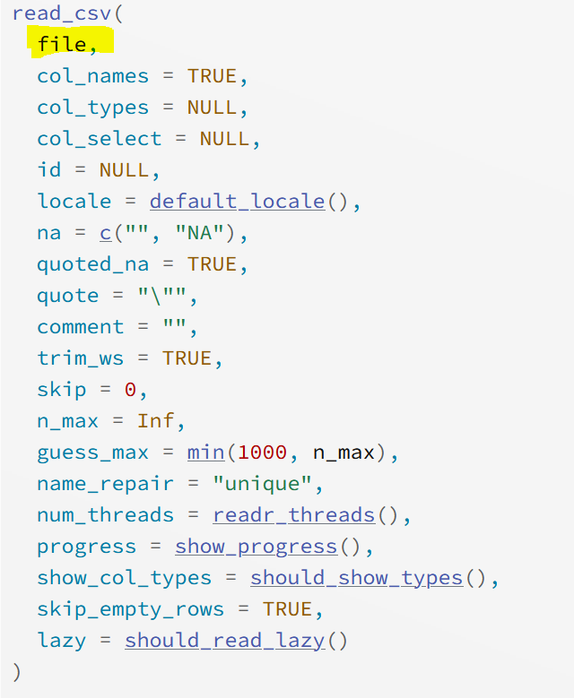
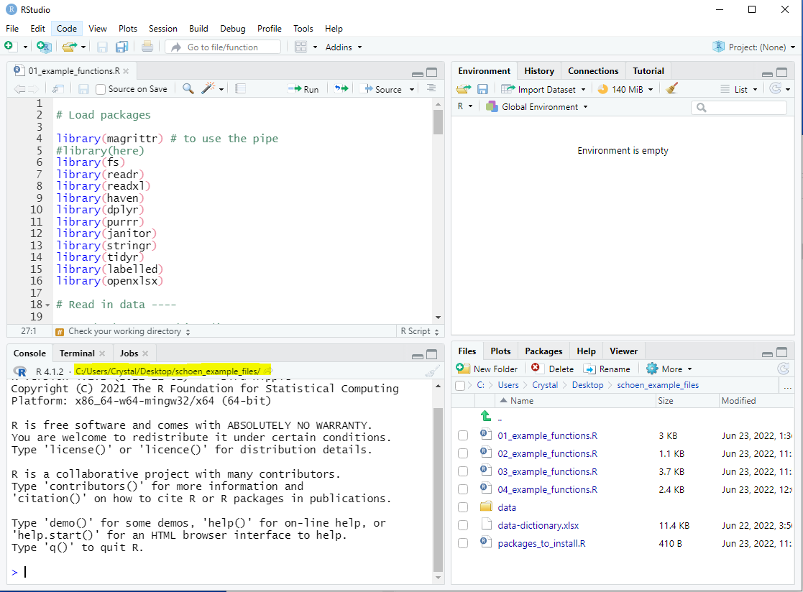
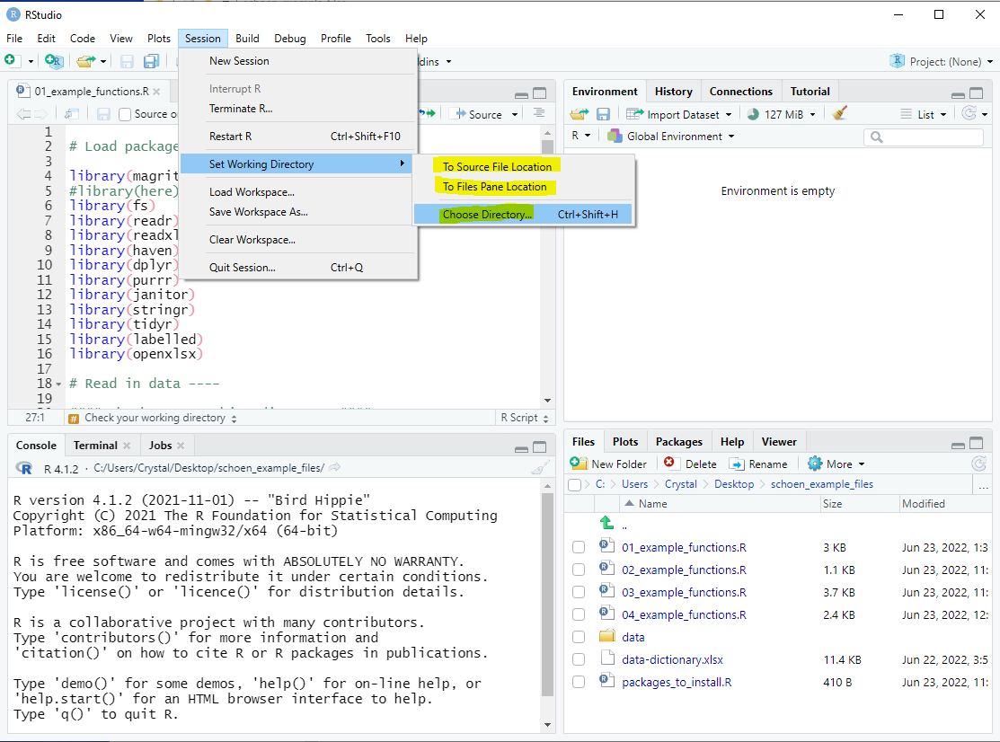
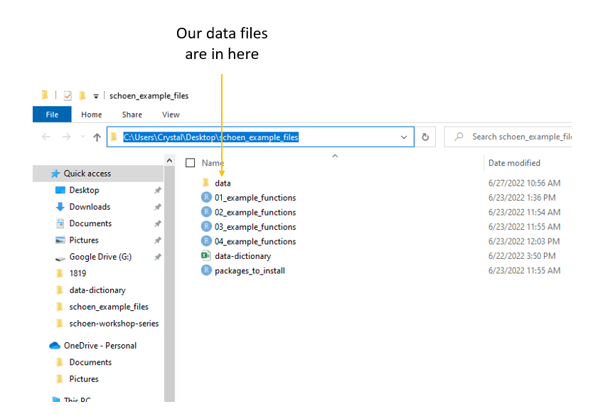

```{r setup, include=FALSE}
options(htmltools.dir.version = FALSE)
knitr::opts_chunk$set(
  fig.width=9, fig.height=3.5, fig.retina=3,
  out.width = "100%",
  cache = FALSE,
  echo = TRUE,
  message = FALSE, 
  warning = FALSE,
  hiline = TRUE,
  comment = NA
)

xaringanExtra::use_tile_view()
xaringanExtra::use_panelset()

```


```{r xaringan-themer, include=FALSE, warning=FALSE}

library(xaringanthemer)

style_duo_accent(
  secondary_color = "#782F40",
  primary_color = "black", 
  background_color = "#CEB888",
  code_inline_color = "black",
)
```


class: inverse, left, middle

background-image: url(img/cover2.png)

# Data Management Overview: Session 5
## Training for Schoen Research

----

## Crystal Lewis

Slides available on [`r fontawesome::fa("github", fill = "white")`](https://cghlewis.github.io/schoen-workshop-series/)

---

# Plan for this series

.pull-left[

Session 3
* ~~Why R?~~
* ~~Getting acclimated with R and RStudio~~
* ~~Understanding objects, functions, and packages~~
* ~~Code writing best practices~~

Session 4
* ~~Packages and functions for data wrangling~~
]

.pull-right[

Session 5
* Packages and functions for data wrangling cont.
* Setting up a reproducible syntax file
* Cleaning and validating data with R

Session 6
* Additional data wrangling with R

```{r, echo = FALSE, out.width = "300px", fig.align='center'}

```
]

???

Last week we started learning functions to read in and wrangle our data

Today we are going to do some recap of last week and then pick up where we left off since we didn't finish going through all of our functions

And then last we will have a chance to write a short data cleaning script from scratch and learn some tips that will help make our work reproducible


Next week we will cover more complicated topics like restructuring and merging data, as well as any thing else we still haven't covered by that point

---

# Recap Tidy Evaluation

.center[Most of the functions we are learning come from the Tidyverse (an opinionated collection of packages)

One great reason to use the Tidyverse is that most of the functions use **Tidy Evaluation**

Tidy evaluation allows us to simplify the way we grab and manipulate variables/vectors within datasets]

<br>

.pull-left[

Tidy Evaluation: Select variables

```{r, eval = FALSE}

select(sch_data, test_score, grade_level)

```

]

.pull-right[
Base R: Select variables

```{r, eval = FALSE}

sch_data[ , c("test_score", "grade_level")]

```
]

???

Last week we talked about how ...

Notice here, using Tidy Evaluation, if I wanted to select certain variables I would first call the dataframe, then name any variables I want to keep. No quotes needed.

But if we had to use Base R, there is a somewhat more complicated way to work with columns involving brackets and quotes, and this row, column format.

And so we can see that Tidy Evaluation simplifies things for us

---

# Recap Pipe Operator

The pipe, **%>%**, which comes from the `magrittr` package, allows us to forward an object or a result of a function, into the next function

.pull-left[

Without the pipe: 
  + More steps
  + The data frame is called multiple times
  + Have to create multiple objects

```{r, eval = FALSE}

sch_data2 <- select(sch_data, id, test_score)

sch_data_final <- filter(sch_data2, 
                    test_score > 300)

```


]

.pull-right[

With the pipe: 
  + Less steps
  + The data frame is only called once
  + The data frame is pulled out the function and becomes the first step in the process
  + Only need to create one object

```{r, eval = FALSE}

sch_data_final <- sch_data %>%
  select(id, test_score) %>%
  filter(test_score > 300)

```

]

???

The other thing we introduced was the pipe operator

...

Without the pipe, if we wanted to select and filter variables from a data frame (called sch_data), we would first use the select function, and then within the function call the data frame and the variables we wanted to select, and then read the results into an object

We would then have to start a new line where we would use the filter function, and we would call the new data frame within this function, apply our filter, and then read that result back out into another object and so on

With the pipe, we pull the data frame out of the function and use it as our first input, followed by any other functions we want to perform on that data frame

You can see here, we only have to call the data frame once, at the top, and then that dataframe flows through any future steps we add

And using this method, we only have to create one object, not multiple

---

# Recap Reading in Data

Read in a csv

```{r, eval = FALSE}

read_csv(
  file = #<<
    "file_name.csv")

```


Read in an xlsx

```{r, eval = FALSE}

read_excel(
  path = #<<
    "file_name.xlsx")

```

Read in an sav


```{r, eval = FALSE}

read_sav(
  file = #<<
    "file_name.sav")

```


???

Last week we also talked about several functions, the first ones we covered were functions to read in your data

The first step to any data cleaning process is most likely going to be to read in some raw data file

Unlike programs like Excel, we can't just open the data file in R

We have to load the data into R to work with it. But remember this is just a copy of the data. Anything we do to the data in R is not actually happening to the raw file on your computer.

And if we want to save any of the changes we make to the data in R, we have to export a copy of the data back out to a folder on our computer

So last week we learned 3 functions we can use to read in data

One function was to read in csv files, one to read in Excel files, and one was to read in SPSS files

We learned several arguments for each of these functions, but the thing I wanted to point out today, that I think was a point of confusion last session, was that each of these functions have a different name for their file or path argument

...

All of these functions come from different packages, and the authors just happened to name the arguments different things

---

# Naming Arguments

It is a good practice to name arguments, especially as beginners, but many times we don't need to name our first argument

.pull-left[



]

.pull-right[

Before:

```{r, eval = FALSE}

read_csv(file = "file_name.csv", 
         col_names = FALSE, skip = 2)

```

With the **file = ** removed:

```{r, eval = FALSE}

read_csv("file_name.csv", 
         col_names = FALSE, skip = 2)

```

]

???

To reduce confusion, you can just remove the name of path/file argument from our import functions since the arguments are different across each function

...

R has a system to cleverly guess which argument you are referring to

First it looks for named arguments

If you didn't name an argument, it goes by order of arguments

You will see throughout my examples, I don't always name the first argument, because it's usually assumed

So notice for read_csv, file is the first argument

And you can see in my second example here, I am no longer naming the first argument, I only named the subsequent arguments for clarity. So it's totally fine to remove the name for the first argument, R will know what's going on.

---

# Recap Working Directory

.center[**What is a working directory?**]

.center[Default location where R will look for files you want to load and where it will put any files you save or export. You usually want this to be your top folder level (ex: schoen_example_files)].


.center[**How can we check our working directory?**]

.pull-left[



]

.pull-right[

```{r, eval = FALSE}

getwd()

```

`"C:/Users/Crystal/Desktop/schoen_example_files"`

]

???

..

You can think of it as, which folder are you working in?

All of our import examples assumed that the data we wanted to read in was in our working directory.

How do I know that, because I only put the name of the file, I did not put any additional information to tell R where to look, like dig deeper into another folder where the data exists


---

# Recap Changing your Working Directory

.pull-left[

**Option 1:**

Use `setwd()` function to change your working directory

Reminders:
  + You cannot use `\` in R. They will need to be changed to `/`
  + The path must be in ""

```{r, eval = FALSE}

setwd("C:/Users/Crystal/Desktop/
      schoen_example_files")

```

]

.pull-right[

**Option 2:**


]

???

If when you check your working directory, you are not in the top level folder you want to be in (ex: Schoen Example Files), there are several ways you can change your working directory

Which is the default that Windows uses


---

class: center, inverse

# Recap Navigating to your data files

AWESOME! `r emo::ji("star")` We are in the correct working directory now (our top level folder).

But what if our data is not in the same folder as our working directory?

```{r, echo = FALSE, out.width = "600px", fig.align = "center"}


```

???

Which is typically what happens, you don't usually throw everything (syntax, data, output) all into the same folder. 

Our data files in our Schoen Example Files folder are one path deeper in a "data" folder. How do we tell R to grab our files from this folder when we import data?

---

# Recap Absolute vs Relative Paths

.pull-left[

**Option 1: Absolute full file path**

Issues:
  + You will need to change all `\` to `/` 
  + If other people use your syntax, they will need to change this file path

```{r, eval = FALSE}

svy_csv <- read_csv(
  "C:/Users/Crystal/Desktop/
  schoen_example_files/data/tch_survey.csv")

```

On Windows: Right click on file -> Properties -> Security -> Object name

]

.pull-right[

**Option 2: Relative file path**

Last week we learned about the `path` function from the `fs` package
  + You build paths starting at your current working directory, then add any folders or files below that
  + `.` means your current working directory
  + `..` means go back one level from your current working directory

```{r, eval = FALSE}

svy_csv <- read_csv(
  path(".", "data","tch_survey.csv"))

```

]

???

Leaves room for error, also just a pain

Not reproducible

Option 2 which is what is recommended for both reproducibility and for reducing errors

We also learned about the here function but people were having issues with that function so we are just ignoring that for now

---

# Recap Functions

.pull-left[

**Read in data**

|Task | Package | Function |
|-----|---------|----------|
|read in csv file | readr | read_csv |
|read in xlsx file | readxl | read_excel |
|read in sav file | haven | read_sav |

**Set relative path**

|Task | Package | Function |
|-----|---------|----------|
|check working directory | base | getwd |
|set relative path | fs | path |

]

.pull-right[

**Rename variables**

|Task | Package | Function |
|---------|-----------|-----------|
|rename variables | dplyr | rename |
|rename all variables | purrr | set_names|
|modify variable names | dplyr | rename_with |

**Review data**

|Task | Package | Function |
|-----|---------|----------|
|review data structure | base |str|
|transposed printed data | dplyr | glimpse |
|summarize data | base | summary |
|table variables | janitor | tabyl|

]


???

I want to quickly review the other functions we covered last session. I'm not going to go into much detail, but I just want to remind everyone what functions we have covered already.

I want to say 2 reminders, as I go through these functions, I do not expect you to memorize each of these functions, what package they come from, or what all the arguments are

To this day, I still do not remember every function and I forget the arguments ALL the time

But what I do want you to get out of this overview, is an understanding that these transformations are possible and that functions do exist to make them happen. Once you have that understanding, you can always go back to these slides to look up the functions or you can even just google, R function to rename variables and you will find these functions

The second reminder I want to draw your attention to, is the fact that it is important to remember that each of these functions come from a package. And that if you try to use a function and it gives you an error, like, can't find this function, it's because you probably forgot to load the package. Remember last session I said, each time you open R, the first thing you need to do is "library" all of the packages you need for your functions.

You can see in these tables, I always list what package each function comes from. You don't have to memorize this, you can come back to this table at any point.

---

# Name variables

.panelset[
.panel[.panel-name[rename]

Formula is `new name = old name`

```{r, eval = FALSE}

data %>%
  rename(new_name = old_name)

```

If the old name has spaces in it, you need to surround the name in backticks ` `

```{r, eval = FALSE}

data %>%
  rename(tch_gender = x1, tch_race = `teacher race`)

```


]

.panel[.panel-name[set_names]


The number of names must equal the number of variables in the data frame, in the same order

Names must be in ""

```{r, eval = FALSE}

data %>%
  set_names("new_name1", "new_name2", "new_name3")


```
]

.panel[.panel-name[rename_with]

.pull-left[

```{r, eval = FALSE}

data %>% 
  rename_with(~ function, variables)

```

* `~` = as a function of

* function = any function you want to use to rename your variables

* variables = any variables you want to rename with your function

]

.pull-right[
A common function to include is `paste0` which is a base function

This transformation below would add `_1819` to the end of variable names

The `.` means paste my variable name **first**, then add my string.

```{r, eval = FALSE}

data %>% 
  rename_with(~ paste0(., "_1819"), 
              c(variable1, variable2))

```

]
]
]

???

1. rename

This is a function you can use to rename one or more variables

The formula was new name = old name

Any variable name with spaces need to be surrounded by back ticks. R cannot handle spaces in variable names.

This was also where we first introduced the pipe operator. And talked about how we will always use the pipe in this format. Where we start by calling our data frame and then we pipe that data into a function


2\. set_names

You would use this function to rename ALL of your variables

The number of variable names you provide must equal the number of variables in your data frame, and they must be in the same order

Names must be in ""


3\. rename_with

This one is good for modifying variable names. A particular use case for this one was, when you need to concatenate something like time to your variable names.

In our example we used the base R paste0 within our rename_with function, to concatenate the year _1819 to the end of our variable names.


---

# Review Data

Data

.panelset[
.panel[.panel-name[str]

```{r, eval = FALSE}

data %>%
  str()

```

```{r, echo = FALSE}

library(tidyverse)

svy <- tibble::tribble (~`SurveyDate`, ~id, ~consent, ~dist_sch_name, ~degree,~ `yrs teach`,
                         "2022-05-15", 1234, 1, "Kirkwood - Nipher Middle School", 1, "5 yrs",
                         "2022-05-15", 1234, NA,"", NA, "",
                         "2022-05-16", 1235, 1, "Webster - Webster Groves High School", 2, "4",
                         "2022-05-17", 1236, 1, "Kirkwood - Nipher Middle", 6, "1 year",
                         "2022-05-17", 1237, 2, "" , NA, "")

svy %>%
  purrr::set_names("start_date", "tch_id", "consent", "dist_sch_name", "degree", "yrs_teach") %>%
  str()

```

]
.panel[.panel-name[glimpse]

```{r, eval = FALSE}

data %>%
  glimpse()

```

```{r, echo = FALSE}

svy %>%
  purrr::set_names("start_date", "tch_id", "consent", "dist_sch_name", "degree", "yrs_teach") %>%
  glimpse()

```

]

.panel[.panel-name[summary]

.pull-left[
```{r, eval = FALSE}

data %>%
  summary()

```
]

.pull-right[
```{r, echo = FALSE}

svy %>%
  purrr::set_names("start_date", "tch_id", "consent", "dist_sch_name", "degree", "yrs_teach") %>%
  summary()

```

]
]

.panel[.panel-name[tabyl]

.pull-left[
```{r, eval = FALSE}

data %>%
  tabyl(variable name)

```

```{r, echo = FALSE}

svy %>%
  purrr::set_names("start_date", "tch_id", "consent", "dist_sch_name", "degree", "yrs_teach") %>%
  janitor::tabyl(degree)

```

]

.pull-right[

```{r, eval = FALSE}

data %>%
  tabyl(variable1, variable2)

```

```{r, echo = FALSE}

svy %>%
  purrr::set_names("start_date", "tch_id", "consent", "dist_sch_name", "degree", "yrs_teach") %>%
  janitor::tabyl(dist_sch_name, degree)

```

]
]
]

???

1. str

You get the structure of your data frame as well as the structure of each variable

2\. glimpse 

A transposed version of print. Allows you to see the number of rows and columns as well as the class of your variables. Much more simplified look at your data compared to a function like str()

3\. summary

Gives you descriptive statistics of your variables

4\. tabyl

Gives you counts of your variables 

You can table one variable or two variables to get a cross tab

---

class: center, middle

# `r fontawesome::fa("question", fill = "#782F40")` Let's Practice This Again `r fontawesome::fa("question", fill = "#782F40")`

---

# Recap Functions

.pull-left[

**Find and remove duplicates**

|Task | Package | Function |
|-----|---------|----------|
|find duplicates| janitor | get_dupes |
|remove duplicates | dplyr | distinct |

**Filter data**

|Task | Package | Function |
|-----|---------|----------|
|filter rows of data | dplyr | filter |

]

.pull-right[

**Select variables**

|Task | Package | Function |
|-----|---------|----------|
|select variables | dplyr | select |

**Create new variables**

|Task | Package | Function |
|-----|---------|----------|
|create new variable|dplyr | mutate|
]

---

# Remove duplicates

.panelset[
.panel[.panel-name[find-duplicates]

An example identifier variable would be a student or teacher id

```{r, eval = FALSE}

data %>%
  get_dupes(identifier variable/s)

```

```{r, echo = FALSE}

svy %>%
  purrr::set_names("start_date", "tch_id", "consent", "dist_sch_name", "degree", "yrs_teach") %>%
  janitor::get_dupes(tch_id)

```

]

.panel[.panel-name[remove-duplicates]

.pull-left[

```{r, eval = FALSE}

data %>%
  distinct(identifier variable/s, 
           .keep_all = TRUE)

```

* .keep_all = TRUE means that I want to keep all of my variables in the data

Using distinct will keep the first instance and drop all remaining duplicates. 

Depending on how your data is organized, this may not be what you want.
]

.pull-right[

Consider using the `arrange` function from the `dplyr` package to arrange the data how you want before dropping the duplicates

For example, if date was collected, you may want to arrange by descending date to keep the most recent case 

```{r, eval = FALSE}

data %>%
  arrange(tch_id, desc(date)) %>%
  distinct(tch_id, .keep_all = TRUE)

```
]
]
]

???

To find duplicates you can use this function get_dupes

An example identifier variable would be a student or teacher id, and it would print out the duplicate rows

And then when you want to remove those duplicates, you can use the distinct function

You can simply list the identifier variable you want to remove duplicates for

Reminder to use the .keep_all = TRUE argument for this function, the default of this function is false and it basically drops all of your variables except your identifier variable, which is not helpful for our purposes

I also mentioned that using distinct keeps the first instance of an identifier and drops all remaining cases. If this is not what you want, maybe you want to keep the most recent instance of the duplicate, you can use the arrange function to order your data in the way you want before dropping duplicates.


---

# Filter data

.panelset[
.panel[.panel-name[filter-operators]

.pull-left[
Filtering/Comparison operators include 
 - `>`
 - `<`
 - `>=`
 - `<=`
 - `==`
 - `!` or `!=`
 - `%in%`
 - `between`
]

.pull-right[
Logical operators used to filter on multiple columns:

|Operator|Meaning          |
|--------|-----------------|
| &#124;   | AND/OR          |
|  &     | AND             |
| ,      | AND             |
| xor    | OR (not both)   |
]
]

.panel[.panel-name[filter-numeric]

.pull-left[


```{r, eval = FALSE}

data %>%
  filter(logical expression)

```
]

.pull-right[
Here you would use a variable in your data and a comparison operator

```{r, eval = FALSE}

data %>%
  filter(numeric variable == 1)

```

```{r, eval = FALSE}

data %>%
  filter(numeric variable >= 50)

```
]

]

.panel[.panel-name[filter-character]

.pull-left[
I can also filter on non-numeric variables

```{r, eval = FALSE}

data %>%
  filter(logical expression)

```
]

.pull-right[

```{r, eval = FALSE}

data %>%
  filter(character variable == "some string")

```

```{r, eval = FALSE}

data %>%
  filter(character variable %in% 
           c("some string", 
             "some other string"))

```

]
]

.panel[.panel-name[filter-na]

I can filter based on NA values

The function `is.na` is a base function that returns either TRUE or FALSE which the filter function uses to determine who to filter on

```{r, eval = FALSE}

data %>%
  filter(!is.na(variable))

```

]

.panel[.panel-name[filter-multiple-vars]

I can also filter using multiple variables

```{r, eval = FALSE}

data %>%
  filter(variable1 == 1 & variable2 == 5)

```

```{r, eval = FALSE}

data %>%
  filter(variable1 == "some text" | variable2 == "other text")

```

]
]

???

We talked about filtering data based on certain criteria. There were several comparison operators you can use to filter data. Most of these are straightforward but
+ Remember that we can't use = in filtering, we have to use == (because in filtering we are using logical comparisons and == provides a true/false statement)
+ ! means "not" and != means not equal to
+ %in% means "within"

And if you are filtering on more than one column, you can use these operators to separate between multiple variables

We learned that you can use the filter function with any type of variable

Numeric

Character

You can filter on NA values

And you can filter using multiple variables


---

# Select Variables

.panelset[
.panel[.panel-name[select-to-keep]

You can either select the variables you want to keep 

```{r, eval = FALSE}

data %>%
  select(variable1:variable3)

```

```{r, eval = FALSE}

data %>%
select(variable1, variable2, variable3)

```


]

.panel[.panel-name[select-to-remove]

Or select the variables you want to remove (using "-")

```{r, eval = FALSE}

data %>%
  select(-variable4)

```

```{r, eval = FALSE}

data %>%
  select(-c(variable4, variable5, variable6))

```

]

.panel[.panel-name[select-with-tidy-select]

You can also select variables using selection helpers.

These include: `starts_with`, `ends_with`, and `contains`.

```{r, eval = FALSE}

data %>%
  select(contains("bmtl"))

```

```{r, eval = FALSE}

data %>%
  select(ends_with("_1819"))

```

]
]

???

We covered how to select variables

We learned we can select the variables we want (either by listing them out explicitly or using the : if they are in sequential order)

We learned we can remove the variables we don't want by adding a negative sign in front of them

And we learned that there are special statements within the tidyverse, called selection helpers, that help you do things quicker and more efficiently. So if we want to grab all variables with the word bmtl in them, we can use the selection helper "contains" to grab just those variables. You can imagine if we had 50 bmtl variables, not all in sequential order, using these selection helpers could save us a lot of time.


---

# Create new variables

.pull-left[

Any time you want to create a new variable within a data frame, you use `mutate`

This may be creating an entirely new variable or it may be recalculating, transforming, or recoding an existing variable

```{r, eval = FALSE}

data %>%
  mutate(new variable name = 
           a constant or some expression)

```

* `new variable name` = this can either be a completely new name, or you can use an existing name and write over the existing variable

]

.pull-right[

```{r, eval = FALSE}

data %>%
  mutate(cohort = 1)

```

```{r, eval = FALSE}

data %>%
  mutate(age_months = age_years*12)

```

```{r, eval = FALSE}

data %>%
  mutate(sch_name = recode(
    sch_name, 
    `nipher middle school` = "Nipher Middle"))
  ))
```
]

???

We learned that to create a new variable, we need to use this function mutate

And the word create is used loosely. We also use mutate when we are recalculating, transforming or recoding an existing variable.

In our examples here we created an entirely new cohort variable (where the cohort is equal to 1 for everyone)

We also used mutate to create a new variable where we multiply an existing variable by 12

And then we created the variable sch_name which wrote over our existing sch_name variable. Someone misspelled a school name in the old variable so we recoded that school name to the correct spelling

---

class: center, middle

# `r fontawesome::fa("question", fill = "#782F40")` Let's Practice This Again `r fontawesome::fa("question", fill = "#782F40")`

---

# Recap Functions

.pull-left[

**Edit strings in variables**

|Task | Package | Function |
|-----|---------|----------|
|remove strings | stringr | str_remove_all |
|replace strings | stringr | str_replace_all |

**Change class**

|Task | Package | Function |
|-----|---------|----------|
|change to numeric | base | as.numeric |
|change to character| base | as.characater|
|change to date|lubridate|several functions|

]

.pull-right[

**Split variables**

|Task | Package | Function |
|-----|---------|----------|
|separate into more than one variable | tidyr | separate |

**Recode variables**

|Task | Package | Function |
|-----|---------|----------|
|recode a variable|dplyr | recode|
|conditional function to regroup/recode a variable|dplyr|case_when|
|conditional function to regroup/recode a variable|dplyr|if_else
]

???

And then the last functions we covered at the very end of our last session were these. So I may take a little more time to cover these again.

---

# Edit Strings in Variables

.panelset[
.panel[.panel-name[str_remove]

.pull-left[

This function is used to remove strings in variables

```{r, eval = FALSE}

data %>%
  mutate(new variable name = 
           str_remove_all(variable, 
                          pattern))

```

* variable = the variable that has the string/s we want to remove
* pattern = any pattern you want removed from a variable (could be words, symbols, or numbers)

]

.pull-right[

The pattern must be in quotes

```{r, eval = FALSE}

data %>%
  mutate(variable1 = 
           str_remove_all(
             variable1, pattern = "$"))

```

]
]

.panel[.panel-name[str_replace]

.pull-left[
This function is used to replace strings in variables

```{r, eval = FALSE}

data %>%
  mutate(new variable name = 
           str_replace_all(
             variable, pattern, 
             replacement))

```

* variable = the variable that has the string/s we want to replace

* pattern = any pattern you want to replace in a variable

* replacement = what you want to replace the pattern with
]

.pull-right[

The pattern and replacement must be in quotes

```{r, eval = FALSE}

data %>%
  mutate(variable1 = 
           str_replace_all(
             variable1, pattern = "yr",
             replacement = "YEAR"))

```

]
]
]

???

...

Remember that we have to use mutate because we are transforming a variable and we have to write that transformation into a new variable


---

# Change class

.panelset[
.panel[.panel-name[class-numeric]

```{r, eval = FALSE}

data %>%
  mutate(new variable = as.numeric(character variable))

```

Note: If your character variable still has character values in it (letters, symbols, spaces), those values will be coded to NA when you change the class to numeric. You should deal with those values before recoding to numeric.

]

.panel[.panel-name[class-character]


```{r, eval = FALSE}

data %>%
  mutate(new variable = as.character(numeric variable))

```

]

.panel[.panel-name[class-date]

.pull-left[

`lubridate` has many functions to deal with character variables whose class needs to be date. 

A few of those include:

`mdy()` : The character variable is in the format of month-day-year

`ymd()` : The character variable is in the format of year-month-day

`dmy()` : The character variable is in the format of day-month-year
]

```{r, eval = FALSE}

data %>%
  mutate(new variable = function(character date))

```

If our character date variable had values like "03-22-2022" then we could use `mdy()`

```{r, eval = FALSE}

data %>%
  mutate(date = mdy(date))

```

```{r, echo = FALSE}

tibble::tribble(~date, "03-22-2022", "04-15-2022") %>%
  mutate(date = lubridate::mdy(date))

```

]
]

???

1. class-numeric:

Say I have a character variable and I want to convert it to numeric, I can use mutate to create a new variable and then use the function as. numeric to transform my existing character variable

2\. class-date:

Changing variables to dates can be a little more complicated because there is no one catch-all way to do this. It more so depends on how your existing variable is formatted

Notice that after we ran the mdy() function, our date variable looks like this now: YYYY-MM-DD

And that is because date variables are always formatted as YYYY-MM-DD

The mdy() only told R the format that our character date variable was in so it knew how to interpret it. Once the character variable is transformed to a date, it will appear in the R date format of YYYY-MM-DD

---

# Split Variables

.pull-left[
Sometimes a variable contains more than one piece of information and needs to be split into 2 or more variables

```{r, eval = FALSE}

data %>%
  separate(variable, 
           into,
           sep)

```

* into = what will the new variable names be after your variable is split

* sep = what separates the pieces of information

The default is to remove the input column after separating. If you do not want this, you can add the argument `remove = FALSE`
]

.pull-right[
```{r, eval = FALSE}

data %>%
  separate(city_state,
           into = c("city", "state"),
           sep = ",")

```

]

???

...

This is a special circumstance where we don't have to use mutate because we aren't creating a new variable. We are splitting a variable into multiple variables and we will name those new variables within the separate function.

---

# Recode Variables

.panelset[
.panel[.panel-name[recode]

.pull-left[
The formula for `recode` is `old value = new value`

The old value is a named value. If it is a number it needs to be surrounded in backticks.

Any value you do not recode will be copied over as is.
```{r, eval = FALSE}

data %>%
  mutate(new variable = 
           recode(variable, 
                  old value = new value))

```
]

.pull-right[

```{r, eval = FALSE}

data %>%
  mutate(variable1_r = 
           recode(variable1, `2` = 0))

```

```{r, eval = FALSE}

data %>%
  mutate(variable2 = recode(variable2, 
                            f = "free",
                            r = "reduced"))

```

]
]
.panel[.panel-name[case_when]

.pull-left[

```{r, eval = FALSE}

data %>%
  mutate(new variable =
           case_when(
             condition ~ value,
             TRUE ~ value
           ))

```

* condition = a logical condition, usually comparing a variable to a value or another variable

* `~` = "then replace with" 

* value = character, numeric, NA, date value, or an existing variable

* `TRUE` = "if it doesn't meet the criteria already given then"

]

.pull-right[
```{r, eval = FALSE}

data %>%
  mutate(school_name =
    case_when(
      school_name == 
        "sch a" ~ 
        "School A", 
      school_name == 
        "schoola" ~
        "School A",
      TRUE ~ school_name
    )
  )

```

]
]

.panel[.panel-name[if_else]

.pull-left[

```{r, eval = FALSE}

data %>%
  mutate(new variable = 
           if_else(condition, true, false))
```

* condition = a logical condition, usually comparing a variable to a value or another variable

* true = if the condition is true, use this value

* false = if the condition is false, use this value

]

.pull-right[

```{r, eval = FALSE}

data %>%
  mutate(collapsed_variable = 
           if_else(variable == 5, 0, 1))

```

]
]
]

???

1. recode

...

Note that this is the opposite of the formula we saw for rename earlier. So it gets quite confusing.

2\. case_when

This is much more complicated to understand as a beginner than using recode, but it is way more efficient and powerful if you can wrap your head around it

3\. if_else

This is similar to case_when, but should only be used when there is really only like one criteria to recode. Otherwise, use recode or case_when

---

class: center, middle

# `r fontawesome::fa("question", fill = "#782F40")` Let's Practice `r fontawesome::fa("question", fill = "#782F40")`

---

# Functions for Data Cleaning

.pull-left[

**Recode NAs**

|Task | Package | Function |
|-----|---------|----------|
|recode to NA | dplyr | na_if |
|recode NA to a value | tidyr | replace_na |

**Add value labels**

|Task | Package | Function |
|-----|---------|----------|
|add value labels | labelled | set_value_labels |
|review value labels| labelled | val_labels|
|add labelled missing values|labelled|set_na_values|
|review missing value labels | labelled | na_values|

]

.pull-right[

**Add variable labels**

|Task | Package | Function |
|-----|---------|----------|
|add variable labels | labelled | set_variable_labels|
|review variable labels | labelled | var_label |

**Export data**

|Task | Package | Function |
|-----|---------|----------|
|export csv | readr | write_csv|
|export xlsx| openxlsx|write.xlsx|
|export sav | haven | write_sav

]

???

These are the last 4 functions we ran out of time to cover last session

---


# Recode NA

.panelset[
.panel[.panel-name[recode-to-na]

.pull-left[
```{r, eval = FALSE}

data %>%
  na_if(value)

```

* value = the value you want to replace with NA

This function as is will apply to the entire data frame
]

.pull-right[
If you want to only apply this to certain variables, then you need to use the `across` function from `dplyr` to select variables

```{r, eval = FALSE}

data %>%
  mutate(across(c(variable1:variable3),  
                ~na_if(., -999))

```

* `~` = as a function of
* `.` = refer to the variables referenced earlier for where to replace with NAs


]
]

.panel[.panel-name[replace-na]

.pull-left[
```{r, eval = FALSE}

data %>% 
  mutate(variable = replace_na(
    variable, value))

```

]

.pull-right[
```{r, eval = FALSE}

data %>%
  mutate(iss = replace_na(iss, 0))

```

You can also replace NA values for multiple variables using the function `across` from the `dplyr` package.

```{r, eval = FALSE}

data %>% 
  mutate(across(c(variable1:variable10), 
                ~ replace_na(., -999))

```

* `~` = as a function of

* `.` = refer to the variables referenced earlier for where to replace the NAs

]
]
]

???

1. na_if:

Sometimes we might want to recode a certain value to NA

2\. replace_na: 

Sometimes we might want to recode NAs to certain values that have meaning to us

...

I'm not sure if you remember me talking a while back ago, how sometimes a certain district would send me a file of ISS counts for students and when a student had no ISS referrals, they would leave the cell blank, this is a way for me to take care of that

---

# Add Value Labels

.panelset[
.panel[.panel-name[add-value-labels]

.pull-left[
Value labels are helpful if you are exporting to a software that can support them, such as SPSS

```{r, eval = FALSE}

data %>% 
  set_value_labels(
  variable = c("label1" = value, 
               "label2" = value))

```

```{r, eval = FALSE}

data %>%
  set_value_labels(
    q1 = c( "no" = 0, "yes" = 1),
    q2 = c("no" = 0, "yes" = 1)
  )
```

```{r, echo = FALSE}

library(labelled)

data <- tibble::tribble(~q1, ~q2,
                0, 1,
                1, 0) %>%
  labelled::set_value_labels(q1 = c("no" = 0, "yes" = 1),
                             q2 = c("no"= 0, "yes" = 1))

```
]

.pull-right[
You can review your value labels

```{r}

data %>% 
  val_labels()

```
]
]

.panel[.panel-name[set-missing-values]

.pull-left[
Setting missing values are helpful if you are exporting to a program that can support them, like SPSS

If you have missing values like -99 or -98, those will not be recognized as missing values in programs like SPSS unless you label them as missing values before exporting

Be aware that R will not consider your labelled missing values as NA when conducting calculations

```{r, eval = FALSE}

data %>% 
  set_na_values(Variable = value)

```
]

.pull-right[

You can have one or more values labelled as missing

```{r, eval = FALSE}

data %>%
  set_na_values(variable1 = c(-97, -98))

```


You can review your missing value labels

```{r, echo = FALSE}

data <- tibble::tribble(~variable1, ~variable2,
                250, 300,
                -97, 220) %>%
  set_na_values(variable1 = c(-97, -98))

```

```{r}

data %>%
  na_values()

```

]
]
]

???

Show SPSS example file

---

# Add Variable Labels

Variable labels can be very helpful if you are exporting your data to a program that supports them, like SPSS

```{r, eval = FALSE}

data %>%
  set_variable_labels(variable = "label")

```

You can review variable labels

```{r, echo = FALSE}
data <- tibble::tribble(~variable1, ~variable2,
                250, 300,
                -97, 220) %>%
  set_variable_labels(variable1 = "Why does my dog stare at me?", variable2 = "Is my dog happy?")

```


```{r}

data %>%
  var_label()
```

---

# Export Data

.panelset[
.panel[.panel-name[export-csv]

```{r, eval = FALSE}

write_csv(object, file)

```

* object name = the final data frame or tibble to be exported

* file = the path to write the file to (which includes the name and extension of your file)

Same as when we imported data, if you are not exporting your file to your working directory, you will need to include your path in the file argument.

Notice I am using the `path` function from the `fs` package again to create a relative path to where I want to export my data

```{r, eval = FALSE}

write_csv(data, path(".", "data", "my-data-clean.csv"))
```

]


.panel[.panel-name[export-xlsx]

```{r, eval = FALSE}

write.xlsx(object, file)

```

* object name = the final data frame or tibble to be exported

* file = the path to write the file to (which includes the name and extension of your file)

Same as when we imported data, if you are not exporting your file to your working directory, you will need to include your path in the file argument.

Notice I am using the `path` function from the `fs` package again to create a relative path to where I want to export my data


```{r, eval = FALSE}

write.xlsx(data, path(".", "data", "my-data-clean.xlsx"))
```

]
.panel[.panel-name[export-sav]

```{r, eval = FALSE}

write_sav(object, path)

```

* object name = the final data frame or tibble to be exported

* path = the path to write the file to (which includes the name and extension of your file)

Same as when we imported data, if you are not exporting your file to your working directory, you will need to include your path in the "path" argument.

Notice I am using the `path` function from the `fs` package again to create a relative path to where I want to export my data

```{r, eval = FALSE}

write_sav(data, path(".", "data", "my-data-clean.sav"))
```

Bonus: When you export labelled data to SPSS using `write_sav` it will export your variable and value labels as well as your missing values into the file

]
]

---

class: center, middle

# `r fontawesome::fa("question", fill = "#782F40")` Let's Practice `r fontawesome::fa("question", fill = "#782F40")`

---

# Reproducible Data Cleaning Workflow

.pull-left[

**Preliminary Steps before Syntax Creation:**

1. Have your data cleaning plan ready

1. Have your data dictionary ready

1. Set up a consistent folder structure according to your Style Guide

1. Name your files consistently and according to your Style Guide


]

.pull-right[

**Tips for a Reproducible Syntax File:**

1. Use comments to organize and communicate each step of your data cleaning plan
  - Consider using R Notebooks to make file more readable
2. Put all cleaning steps into syntax
3. Use relative file paths to import and export data
  - Don't set your working directory in your syntax
  - Consider using R projects to set your working directory
4. Integrate your data dictionary into your syntax
5. Record Session Info
  + Operating system info
  + R Version info
  + Package versions

]

???

So now I'd like to talk about putting this all together and creating this reproducible workflow

If you follow these steps, you should make a reproducible workflow for yourself, that you can run as many times as you want without errors, and reduces time and effort when changes are made to your data or cleaning process.

And it should make a reproducible syntax file that you can share with others and they should be able to run on their machine as well.

No intermediary steps between the raw data and your cleaning process should happen. It should all be in the syntax (just read in the raw file directly). Removing participants, removing variables, etc. should all happen in syntax so your process is reproducible. If the project coordinator has any info to tell you about who should be dropped, it should be written in a Readme for you to write into your syntax.

...

Remember data cleaning plans? This is a plain text document where you write out the transformations you want to do to the data, in order of how you plan to do them. This will be your syntax guide. 

In addition to your data cleaning plan, your data dictionary will be your guide and way for you to validate each data cleaning step.

We will hopefully get to talking about how to integrate your data dictionary into your syntax next session

You can record SessionInfo into a plain text file so that future users of your syntax can know all of the requirements needed for running your syntax. They may never run into issues using your syntax, but what if one of your functions doesn't work for them when they try to run your syntax on their computer.

They might look at your SessionInfo and find out you have a newer version of a certain package than they have and it provides additional functionality. So the SessionInfo helps solve these problems. We will look at an example of this in a minute.


---

# Setting up your Syntax File

```{r, eval = FALSE}

1. Add your libraries

2. Check your working directory

3. Change your working directory if needed (in console or drop-down)

4. Import data using relative paths

5. For each step of your data cleaning plan
  - Comment
  - Code
  - Check

6. Validate data

7. Export data using relative paths

8. Write out a Session Info file

```

???

The general order of your syntax file will look like this. This is subject to variation depending on the task.


If you recall the session on data cleaning plans, validating data includes all your final checks to make sure no mistakes exist in the data.

  - Number of cases matches what you see in tracking database
  - Number of variables in your data match what you see in your data dictionary
  - No duplicate rows
  - No missing IDs and all IDs are real IDs
  - All variable classes match your data dictionary
  - All variables fall within the ranges laid out in your data dictionary
  - Cross validation for impossible values
  - All variables contain necessary labels

You won't record session info until the entire syntax is finished. It will capture all of the packages you used for the session.

---

.pull-left[
```{r, eval = FALSE}

library(magrittr)
library(fs)
library(readr)
library(dplyr)
library(janitor)

# Check working directory 

getwd()

# (01) Read in data ----

tch_svy <- read_csv(
  path(".", "data", "tch_survey_raw.csv"))

# Check: Review your data

str(tch_svy)

# (02) Identify duplicates ----

tch_svy %>%
  get_dupes(tch_id) # No duplicates found

# (03) Remove identifier variables ----

tch_svy <- tch_svy %>%
  select(-first_name, -last_name)


```
]

.pull-right[
```{r, eval = FALSE}

# Check: What variables do I have now?

names(tch_svy)

# (04) Create intervention variable

tch_svy <- tch_svy %>%
  mutate(intervention = if_else(
    sch_id %in% c(101, 103, 105), 1, 0))

# Check: Did intervention calculate correctly?

tch_svy %>% 
  tabyl(sch_id, intervention)

# (05) Data Validation ----

# Various checks

# (06) Export data to a csv ----

write_csv(tch_svy, 
      path("data", "tch_survey_clean.csv"))


# Print out Session Info ----

sessionInfo() %>%
  capture.output(
    file = "tch_survey_sessionInfo.txt")

```
]

???

Review your data: Do I have all the cases I expected? Remember you would want to compare this number to your tracking database.

Do I have all the variables I expected? Compared to the data dictionary?

Do my variable types match my data dictionary?

---

background-image: url(img/session_info.PNG)

---

# Data Cleaning Plan

.pull-left[

1. Import the SPSS file into R **

1. Rename variables based on our data dictionary **

1. Remove any participant who did not **consent** **

1. Check for duplicates

1. Recode **degree** `( 6 -> 0)` **

1. Remove strings from **yrs_teach** and make it a numeric variable

]

.pull-right[

7\. Convert **tch_id** to a character variable

8\. Remove identifier variables (**survey_date**)

9\. Add variable labels for **degree** and **yrs_teach**

10\. Add value labels for **degree** **

11\. Validate data

12\. Export data to SPSS **
]

???

What I would like to have us do is to try to clean a file start to finish (minus validation)

We are just going to use the small dataset we already have, but we are going to practice running through a data cleaning plan

I am going to live code with you and walk you through the process of setting up a reproducible syntax file. I want everyone to follow along and do everything with me. So we are going to move back over to RStudio. I am going to move slowly to give everyone time to follow my steps.

---

class: center, middle

# `r fontawesome::fa("question", fill = "#782F40")` Let's Practice `r fontawesome::fa("question", fill = "#782F40")`

---

class: inverse, center, middle

# Questions?

