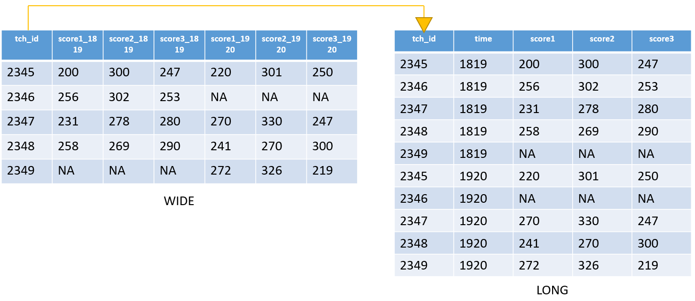

```{r setup, include=FALSE}
options(htmltools.dir.version = FALSE)
knitr::opts_chunk$set(
  fig.width=9, fig.height=3.5, fig.retina=3,
  out.width = "100%",
  cache = FALSE,
  echo = TRUE,
  message = FALSE, 
  warning = FALSE,
  hiline = TRUE,
  comment = NA
)

xaringanExtra::use_tile_view()
xaringanExtra::use_panelset()

```


```{r xaringan-themer, include=FALSE, warning=FALSE}

library(xaringanthemer)

style_duo_accent(
  secondary_color = "#782F40",
  primary_color = "black", 
  background_color = "#CEB888",
  code_inline_color = "black",
)
```


class: inverse, left, middle

background-image: url(img/cover2.png)

# Data Management Overview: Session 6
## Training for Schoen Research

----

## Crystal Lewis

Slides available on [`r fontawesome::fa("github", fill = "white")`](https://cghlewis.github.io/schoen-workshop-series/)

---

# Plan for this series

.pull-left[

Session 3
* ~~Why R?~~
* ~~Getting acclimated with R and RStudio~~
* ~~Understanding objects, functions, and packages~~
* ~~Code writing best practices~~

Session 4
* ~~Packages and functions for data wrangling~~
]

.pull-right[

Session 5
* ~~Setting up a reproducible syntax file~~

Session 6
* Validating Data
* Merging and Appending Data
* Restructuring Data

```{r, echo = FALSE, out.width = "300px", fig.align='center'}
knitr::include_graphics("img/r-project.svg")
```
]

???

Last week we started creating a reproducible syntax file from scratch

Today we are going to pick up where we left off and finish that syntax

Then we are going to learn a few more functions for data validation, data merging and appending and 
restructuring

---

# Data Cleaning Plan

.pull-left[

1. Import the SPSS file into R **

1. Rename variables based on our data dictionary **

1. Remove any participant who did not **consent** **

1. Check for duplicate **tch_id** **

1. Recode **degree** `( 6 -> 0)`

1. Remove strings from **yrs_teach** and make it a numeric variable

1. Convert **tch_id** to a character variable


]

.pull-right[

8\. Collapse misspellings of **dist_school_name**

9\. Calculate/Create all variables on the second tab of the data dictionary

10\. Remove identifier variables (**survey_date**, **dist_school_name**, **dist_name**, **sch_name**)

11\. Add variable labels for all variables

12\. Add value labels for **consent**, **degree**, **cohort**, **any_degree**

13\. Validate data

14\. Export data to SPSS **
]

???

Last week we had a fictitious scenario where we were given this data cleaning plan and we needed to implement it

I have since updated the plan a little bit. I've included more steps. We still are not going to do all of the steps but I wanted to realistically lay out everything I would actually do. And give this to you in case you want to run through it on your own at a later time.


---

class: center, middle

# `r fontawesome::fa("question", fill = "#782F40")` Let's Practice `r fontawesome::fa("question", fill = "#782F40")`

---

class: inverse, center, middle

# Validation

---

# Validation

Let's remember what data validation might include

.pull-left[

* Number of cases matches what you see in tracking database

* Number of variables in your data match what you see in your data dictionary

* No duplicate IDs

* No missing IDs and all IDs are real IDs
]

.pull-right[
* All variable classes match your data dictionary

* All variables fall within the ranges laid out in your data dictionary

* Cross validation for impossible values

* All variables contain necessary labels
]

<br>

.center[You want to validate your data **BEFORE** you export it for the world to use]

???

This is the last step in your syntax before you export your data

---

# Your Clean Data and Your Data Dictionary

Clean Data
```{r, echo = FALSE}

library(kableExtra)
library(pointblank)
library(tidyverse)

svy <- tibble::tribble(
  ~tch_id, ~any_degree, ~yrs_teach, ~enjoy_teach,
  1234, 0, 1, 1,
  1235, 1, 2, 2,
  1263, 1, 6, 1
)

kable(svy, format = "html") %>%
    kable_styling("striped", full_width=T)


```

Data Dictionary

```{r, echo = FALSE}

dict <- tibble::tribble(
  ~name, ~ label, ~type, ~values,
  "tch_id", "study teacher id", "character", "1230-1240",
  "any_degree", "does the participant have a degree?", "numeric", "1 = yes, 0 = no",
  "yrs_teach", "how many years have you taught school?", "numeric", "0-100",
  "enjoy_teach", "do you enjoy teaching?", "numeric", "1 = yes, 0 = no"
)

kable(dict, format = "html") %>%
    kable_styling("striped", full_width=T)

```

  
---

# Checking the Number of Rows and Columns

```{r}

glimpse(svy)

```

```{r}

str(svy)
```


---


# The pointblank Package

.center[**You can do basic tests using "test_" functions**]

.pull-left[
1. Test for duplicates

`test_rows_distinct()`

2\. Test no IDs are missing

`test_col_vals_not_null()`

3\. Test continuous values within range

`test_col_vals_between()`

]

.pull-right[

4\. Test categorical values within a set

`test_col_vals_in_set()`

5\. Test the variable types

`test_col_is_numeric()`

`test_col_is_character()`

`test_col_is_date()`
]

???

There are many other ways to validate data. Using tables, and cross tabulations and correlations and graphs and other packages and functions. But today I am going to teach you about one package, called pointblank, that is a straight-forward, nicely packaged up way to do a good chunk of your data validation. And the extra nice thing is, you can make this into a report to share with others for review.

---

# Validation

.panelset[
.panel[.panel-name[test-distinct]

Test that there are no duplicate IDs in the data

```{r, eval = FALSE}

data %>%
  test_rows_distinct(columns = vars())

```

You need both the *columns = * argument and the *vars* function which allows you to select variables using tidy evaluation (without "" around the variable name)

```{r}

svy %>%
  test_rows_distinct(columns = vars(tch_id))

```
]

.panel[.panel-name[test-not-null]

Test that no IDs are missing

```{r, eval = FALSE}

data %>%
  test_col_vals_not_null(columns = vars())

```

<br>

```{r}

svy %>%
  test_col_vals_not_null(columns = vars(tch_id))

```


]

.panel[.panel-name[test-continuous]

.pull-left[

Test that continuous variables fall within an expected range

```{r, eval = FALSE}

data %>%
  test_col_vals_between(columns = vars(), 
                        left = value,
                        right = value, 
                        na_pass = value)

```

* If your variable has NA values and you expect it to have NA values, na_pass = TRUE. If you do not want NA values in your variable, na_pass = FALSE. Default is FALSE.

]

.pull-right[

```{r,  highlight.output=c(1)}

svy %>%
 test_col_vals_between(
   columns = vars(tch_id), 
   left = 1230, right = 1240)

```

**What happened here?**

```{r, highlight.output=c(6)}

print(svy)

```
]
]

.panel[.panel-name[test-categorical]

Test that categorical variables fall within a set of expected values

```{r, eval = FALSE}

data %>%
  test_col_vals_in_set(columns = vars(), 
                       set = c())

```

* If your variable may have NA values and you are okay with it having NA values, add NA values to your set. Otherwise, you will get "FALSE" when your variable has NAs.

```{r}

svy %>%
  test_col_vals_in_set(columns = vars(any_degree),
                       set = c(NA, 0, 1))

```

]

.panel[.panel-name[test-col-type]

Test that variables are the types we expect

.pull-left[
```{r, eval = FALSE}

data %>%
  test_col_is_character(columns = vars())

data %>%
  test_col_is_numeric(columns = vars())

```

<br>

```{r, highlight.output = c(1)}

svy %>%
  test_col_is_character(columns = 
                          vars(tch_id))
  

```
]

.pull-right[

**What happened here?**

```{r, highlight.output = c(3)}

print(svy)

```

]
]
]

---

# Generating a Report

.pull-left[

"test_" works great when working with one variable at a time

```{r, highlight.output = c(1)}

svy %>%
  test_col_vals_in_set(columns = 
                          vars(enjoy_teach),
                      set = c(NA, 0, 1))
  

```
]

.pull-right[
But what if you want to validate multiple variables at the same time

```{r, highlight.output = c(1)}

svy %>%
  test_col_vals_in_set(columns = 
                          vars(any_degree, 
                               enjoy_teach),
                      set = c(NA, 0, 1))
  
  

```

How do I know which variable/s the FALSE applies to? Which rows are having the issues?
]

---

# Create a Report

.pull-left[
Add the `create_agent()` function and the `interrogate()` function

You will remove the "test_" from all of your functions. These are new functions.

```{r, eval = FALSE}

svy %>%
create_agent() %>%
  col_vals_in_set(columns = 
                    vars(any_degree, 
                         enjoy_teach),
                      set = c(NA, 0, 1)) %>%
  interrogate()

```

]

.pull-right[

<br>

```{r, echo = FALSE}

svy %>%
create_agent() %>%
  col_vals_in_set(columns = 
                    vars(any_degree, 
                         enjoy_teach),
                      set = c(NA, 0, 1)) %>%
  interrogate()

```
]

???

create_agent() creates an object which is used in the data quality reporting workflow

interrogate() assesses our object based on our evaluation plan. All the things we asked it to check. It is the function that creates this output.

If you add this code to your syntax, it will output in your Viewer window (in the bottom left corner RStudio Pane)

---

# Create a Report

.pull-left[
You can also add multiple steps to your report. Each step chained using the %>%

```{r, eval = FALSE}

svy %>%
create_agent() %>%
  col_vals_in_set(columns = 
                    vars(any_degree, 
                         enjoy_teach),
                      set = c(NA, 0, 1)) %>%
  col_is_numeric(columns = 
                   vars(any_degree, 
                        enjoy_teach)) %>%
  col_is_character(columns = 
                     vars(tch_id)) %>%
  interrogate()

```
]

.pull-right[
```{r, echo = FALSE}

svy %>%
create_agent() %>%
  col_vals_in_set(columns = 
                    vars(any_degree, 
                         enjoy_teach),
                      set = c(NA, 0, 1)) %>%
  col_is_numeric(columns = 
                   vars(any_degree, 
                        enjoy_teach)) %>%
  col_is_character(columns = 
                     vars(tch_id)) %>%
  interrogate()

```

]

---

# What do you do with this information?

1. **Go back to your raw data**
  + Did the data not come in the way I expected it to? Did I miss something in my initial review of the raw data?
  + If the raw data does not look as expected, you may need to go back to the source to find out why
      - Was the Qualtrics survey built differently than you expected?
      - Was the data exported differently than you expected? 
  
2. **Review your code**
  + Did I miss a recoding or transformation step from my data cleaning plan?
  
3. **Review your data dictionary**
  + Were the ranges I set for variables incorrect? Did I mess up the expected variable type?

4. **Begin to make your changes** in your code and/or data dictionary based on the information you collect. Re-run your cleaning code.

5. **Run your validation syntax again**

???

Think about how Qualtrics has options to fill missing values with -99 or 0. Were one of those options selected and you did or did not want those options selected?

---

class: inverse, center, middle

# Merging and Appending

---

# Merging

Binding two datasets together in a wide format, linked by a **unique identifier** across forms. 

You may be merging similar forms across time, or you may be merging different forms within time. Variable names (besides your identifier) **must be unique**

We can merge data using the `*_join()` functions from the `dplyr` package in R.


---

# Merging

.panelset[
.panel[.panel-name[full_join]

All rows are included in the merged data. Those with no data will be filled with NA.

```{r, echo = FALSE}

test_1819 <- tibble::tribble(~ tch_id, ~score1_1819, ~score2_1819, ~ score3_1819,
                            2345, 200, 300, 247,
                            2346, 256, 302, 253,
                            2347, 231, 278, 280,
                            2348, 258, 269, 290)

test_1920 <- tibble::tribble(~ tch_id, ~score1_1920, ~score2_1920, ~score3_1920,
                            2345, 220, 301, 250,
                            2347, 270, 330, 247,
                            2348, 241, 270, 300)

```

.pull-left[
```{r, eval = FALSE}

data1 %>%
  full_join(data2, by = identifier)

```
]

.pull-right[
```{r, eval = FALSE}

test_1819 %>%
  full_join(test_1920, by = "tch_id")

```
]

.center[]

]

.panel[.panel-name[left_join]

Only rows for IDs from the left dataset are included

.pull-left[
```{r, eval = FALSE}

data1 %>%
  left_join(data2, by = identifier)

```
]

.pull-right[
```{r, eval = FALSE}

test_1819 %>%
  left_join(test_1920, by = "tch_id")

```
]

.center[]

]

.panel[.panel-name[inner_join]

Only rows for IDs that are in BOTH dataset are included

.pull-left[
```{r, eval = FALSE}

data1 %>%
  inner_join(data2, by = identifier)

```
]

.pull-right[
```{r, eval = FALSE}

test_1819 %>%
  inner_join(test_1920, by = "tch_id")

```
]

.center[]

]

]

---

# Appending

Stacking datasets on top of each other.

Variable names **must be identical**.

We can append data using the `bind_rows()` functions from the `dplyr` package in R.

Used for the instances such as:

1. For people who want to analyze long datasets.

2. For combining similar forms within time (ex: Two Qualtrics survey links used and forms need to be combined)

3. For combining groups of data across time (ex: Stacking Cohort 1 and Cohort 2).

---

# Appending

.pull-left[

Qualtrics link 1


Qualtrics link 2


]

.pull-right[

When appending data using `bind_rows()`:

1. Variable names must be the same. Columns are appended based on variable names.

2. The variable classes **have** to be the same type. If they are not, you will get an error. 
  - Ex: item 1 is numeric in both datasets
  
3. If one dataset has additional variables the other dataset does not have, those values will be filled with NAs for the rows that don't have data for that variable.

]

---

# Appending

```{r, echo = FALSE}

qual1 <- tibble::tribble(~tch_id, ~qualtrics_link, 
                         ~item1, ~item2,
                         2345, 1, 4,3,
                         2346, 1, 5, 2,
                         2347, 1, 6, 3)

qual2 <- tibble::tribble(~tch_id, ~qualtrics_link, 
                         ~item1, ~item2,
                         2348, 2, 3, 1,
                         2349, 2, 2, 5,
                         2350, 2, 2, 6)

```


```{r, eval = FALSE}

qual1 %>%
  bind_rows(qual2)

```


.center[]

---

class: inverse, center, middle

# Restructure

---

# Restructure

.pull-left[

Wide Data: One row per case


]

.pull-right[

Long Data: Repeating rows per case


]

???

The reasons for wanting your data in one format or the other all depend on things like the type of analysis you are wanting to do, what the user is most familiar with, best format for data storage, and so forth

But as I've been saying throughout this series, you can always choose one format, and then change your mind. Once you learn the functions to restructure your data, pivoting back and forth between long and wide is a fairly quick process.

---

# Restructure

You can restructure your data from wide to long

.center[]

---

# Restructure

And then back again, from long to wide

.center[]


---

# Restructure Long

.panelset[
.panel[.panel-name[pivot_longer]

.pull-left[
Restructure wide to long using `pivot_longer()` from the `tidyr` package

```{r, echo = FALSE}

library(tidyr)

test_wide <- test_1819 %>%
  full_join(test_1920, by = "tch_id") 


data_wide <- tibble::tribble(~tch_id, ~time1, ~time2,
                             2345, 30, 40,
                             2346, 30, 50,
                             2347, NA, 40,
                             2348, 45, NA)

```

```{r, eval = FALSE}

data %>%
  pivot_longer(
    cols = variables,
    names_to = names,
    values_to = names)

```
]

.pull-right[

* `cols` = the variables you want to pivot
  + These can be selected using 
      - selection helpers (such as starts_with)
      - Using : for consecutive variables
      - Select all except using `-`
      - List multiple variables using c()

* `names_to` = name of your new categorical column/s typically (ex: time)
  + Use quotation marks around this name

* `values_to` = name of the new column/s
  + Use quotation marks around this name

]
]

.panel[.panel-name[example_one]

.pull-left[

Our wide dataset

This is a dataset of test scores by time

```{r, echo = FALSE}

as.data.frame(data_wide)


```


]

.pull-right[

```{r, eval = FALSE}

data_wide %>%
  pivot_longer(
    cols = time1:time2,
    names_to = "time",
    values_to = "score"
  )

```

```{r, echo = FALSE}

x <- data_wide %>%
  pivot_longer(
    cols = time1:time2,
    names_to = "time",
    values_to = "score"
  )

as.data.frame(x)


```

]
]

.panel[.panel-name[your_turn]

**YOUR TURN!**

This is a dataset of school enrollment by grade level

```{r, echo = FALSE}

data_wide <- tibble::tribble(~sch_id, ~sixth, ~seventh, ~ eighth,
                             24, 150, 80, 100,
                             25, 75, 120, 110,
                             27, 50, 65, 70)

as.data.frame(data_wide)

```


```{r, eval = FALSE}

data_wide %>%
  pivot_longer(
    cols = 
      what goes here, #<<
    names_to = 
      what goes here, #<<
    values_to = 
      what goes here #<<
  )

```

]

.panel[.panel-name[your_turn]

.pull-left[
```{r, eval = FALSE}

data_wide %>%
  pivot_longer(
    cols = 
      sixth:eighth,
    names_to = 
      "grade",
    values_to = 
      "enrollment"
  )

```
]

.pull-right[

```{r, echo = FALSE}

x <- data_wide %>%
  pivot_longer(
    cols = c(sixth, seventh),
    names_to = "grade",
    values_to = "enrollment"
  )

as.data.frame(x)


```
]
]
]

???

The variables you want to pivot are the ones that currently repeat across a row. 


---

# Restructure Long

But most of the time our data will not be that simple. It will look more like this. 

Multiple recurring variables across different waves of data.

<br>

```{r, echo = FALSE}

kable(test_wide, format = "html") %>%
    kable_styling("striped", full_width=T)

```

---

# Restructure Long

And our arguments for `pivot_longer()` will change just a little bit

```{r, eval = FALSE}

data %>%
  pivot_longer(
    cols = variables,
    names_to = names,
    names_sep = separator) #<<

```

* `cols` = still the columns we wish to pivot

* `names_to` = is now two pieces of information
  1. the categorical piece (ex: time) to be made into a new variable
  2. .value which indicates to copy over the variable name in the transformed data
  + Provide these two pieces of information in the order in which they appear

* `names_sep` = the separator between the categorical piece (ex: time) and the variable name

---

# Restructure Long

.panelset[
.panel[.panel-name[example_one]

```{r, echo = FALSE}

kable(test_wide, format = "html") %>%
    kable_styling("striped", full_width=T)


```

```{r, eval = FALSE}

test_wide %>%
  pivot_longer(
    cols = -tch_id,
    names_to = c(".value", "year"),
    names_sep = "_"
  )

```

]

.panel[.panel-name[example_one]


```{r, echo = FALSE}

x <- test_wide %>%
  pivot_longer(
    cols = -tch_id,
    names_to = c(".value", "year"),
    names_sep = "_"
  )

kable(x, format = "html") %>%
    kable_styling("striped", full_width=T)


```

]

.panel[.panel-name[your_turn]

```{r, echo = FALSE}

data_wide <- tibble::tribble(~stu_id, ~wave1_q1, ~wave1_q2, ~wave2_q1, ~wave2_q2,
                             444, 3, 4, 4, 6,
                             445, 2, 1, 4, 5,
                             446, 1, 5, 3, 4)

```

**YOUR TURN!**

```{r, echo = FALSE}


kable(data_wide, format = "html") %>%
    kable_styling("striped", full_width=T)

```

```{r, eval = FALSE}

data_wide %>%
  pivot_longer(
    cols = 
      what goes here, #<<
    names_to = 
      c(what goes here, what goes here), #<<
    names_sep = 
      what goes here #<<
)

```


]

.panel[.panel-name[your_turn]

.pull-left[
```{r, eval = FALSE}

data_wide %>%
  pivot_longer(
    cols = -stu_id,
    names_to = 
      c("wave", ".value"),
    names_sep = 
      "_"
)

```
]

.pull-right[
```{r, echo = FALSE}

x <- data_wide %>%
  pivot_longer(
    cols = -stu_id,
    names_to = 
      c("wave", ".value"),
    names_sep = "_"
)

kable(x, format = "html") %>%
    kable_styling("striped", full_width=T)

```

]
]

]

---

# Restructure Wide

.panelset[
.panel[.panel-name[pivot_wider]

.pull-left[
Restructure long to wide using `pivot_wider()` from the `tidyr` package

```{r, echo = FALSE}

test_long <- test_1819 %>%
  full_join(test_1920, by = "tch_id") %>%
  pivot_longer(
    cols = -tch_id,
    names_to = c(".value", "year"),
    names_sep = "_"
  )


data_long <- tibble::tribble(~tch_id, ~time1, ~time2,
                             2345, 30, 40,
                             2346, 30, 50,
                             2347, NA, 40,
                             2348, 45, NA) %>%
  pivot_longer(
    cols = -tch_id,
    names_to = "time",
    values_to = "score"
  )

```

```{r, eval = FALSE}

data %>%
  pivot_wider(
    names_from = variable,
    values_from = variable)

```
]

.pull-right[

* `names_from` = which column values should be appended to new variable names

* `values_from` = the variables we want to pivot into wide format

]
]

.panel[.panel-name[example_one]

.pull-left[

Our long dataset

```{r, echo = FALSE}

as.data.frame(data_long)


```


]

.pull-right[

```{r, eval = FALSE}

data_long %>%
  pivot_wider(
    names_from = "time",
    values_from = "score"
  )

```

```{r, echo = FALSE}

x <- data_long %>%
  pivot_wider(
    names_from = "time",
    values_from = "score"
  )

as.data.frame(x)


```

]
]

.panel[.panel-name[your_turn]

.pull-left[
**YOUR TURN!**

This is a dataset of school enrollment by grade level

```{r, echo = FALSE}

data_long <- tibble::tribble(~sch_id, ~sixth, ~seventh, ~ eighth,
                             24, 150, 80, 100,
                             25, 75, 120, 110,
                             27, 50, 65, 70) %>%
  pivot_longer(
    cols = 
      sixth:eighth,
    names_to = 
      "grade",
    values_to = 
      "enrollment"
  )

as.data.frame(data_long)

```
]

.pull-right[

```{r, eval = FALSE}

data_long %>%
  pivot_wider(
    names_from = 
      what goes here, #<<
    values_from = 
      what goes here, #<<
  )

```

]
]

.panel[.panel-name[your_turn]

.pull-left[
```{r, eval = FALSE}

data_long %>%
  pivot_wider(
    names_from = 
      grade,
    values_from = 
      enrollment
  )

```
]

.pull-right[

```{r, echo = FALSE}

x <- data_long %>%
  pivot_wider(
    names_from = 
      grade,
    values_from = 
      enrollment
  )

as.data.frame(x)


```
]
]
]

---

# Restructure Wide

But again, most of the time our data will not be that simple. It will look more like this. 

Multiple recurring variables across different waves of data.

<br>

```{r, echo = FALSE}

kable(test_long, format = "html") %>%
    kable_styling("striped", full_width=T)

```

---

# Restructure Wide

And our arguments for `pivot_wider()` will change just a little bit

```{r, eval = FALSE}

data %>%
  pivot_wider(
    names_from = variable,
    values_from = variable,
    names_glue = pieces of information to create new variable names)

```

* `names_from` = which column values should be appended to new variable names

* `values_from` = the variables we want to pivot into wide format

* `names_sep` = If your names_from contains multiple variables, what should separate the names

---

# Restructure Wide

.panelset[
.panel[.panel-name[example_one]

.pull-left[
```{r, echo = FALSE}

kable(test_long, format = "html") %>%
    kable_styling("striped", full_width=T)


```

]

.pull-right[

```{r, eval = FALSE}

test_long %>%
  pivot_wider(
    names_from = variable,
    values_from = year,
    names_sep = "_"
  )

```

]
]

.panel[.panel-name[example_one]


```{r, echo = FALSE}

x <- test_long %>%
  pivot_wider(
    names_from = year,
    values_from = contains("score"),
    names_sep = "_"
  )

kable(x, format = "html") %>%
    kable_styling("striped", full_width=T)


```

]

.panel[.panel-name[your_turn]

```{r, echo = FALSE}

data_long <- tibble::tribble(~stu_id, ~wave1_q1, ~wave1_q2, ~wave2_q1, ~wave2_q2,
                             444, 3, 4, 4, 6,
                             445, 2, 1, 4, 5,
                             446, 1, 5, 3, 4) %>%
    pivot_longer(
    cols = -stu_id,
    names_to = 
      c("wave", ".value"),
    names_sep = 
      "_"
)

```

**YOUR TURN!**

.pull-left[
```{r, echo = FALSE}


kable(data_long, format = "html") %>%
    kable_styling("striped", full_width=T)

```
]

.pull-right[
```{r, eval = FALSE}

data_long %>%
  pivot_wider(
    names_from = 
      what goes here, #<<
    values_from = 
      what goes here, #<<
    names_sep = 
      what goes here #<<
)

```
]

]

.panel[.panel-name[your_turn]

.pull-left[
```{r, eval = FALSE}

data_long %>%
  pivot_wider(
    names_from = wave,
    values_from = q1:q2,
    names_sep = "_"
)

```
]

.pull-right[
```{r, echo = FALSE}

x <- data_long %>%
  pivot_wider(
    names_from = wave,
    values_from = q1:q2,
    names_sep = "_"
)

kable(x, format = "html") %>%
    kable_styling("striped", full_width=T)

```

]

<br>

Notice that using the `names_sep` argument, the categorical variable (ex: wave or year) is always appended to the end of the variable. If you don't want this, there is a different argument, `names_glue`, that can be used to create custom variable names.

]

]

---

background-image: url(img/wrapping.jpg)
background-size: cover

# Wrapping it up

.footnote[[Source: Susie Ho on Unsplash](https://unsplash.com/s/photos/wrapping-paper)]

---


background-image: url(img/practice.PNG)
background-size: 80%
background-position: 50% 80%

class: center

### The only way to really get better at using R is practice

???

Truly the only way to get better at R is to force yourself to use it. You will fail a bunch, and 
you will learn from those failures. And as you see your code finally start working, you'll feel so
accomplished because it will eventually start clicking.

---

# Ways to Practice!

.pull-left[

Try to complete the rest of the data cleaning plan.

Write code, on your own, for Steps 5 - 13 in the cleaning syntax we started.

If you get stuck:

1. Refer to the slides
2. Google it!
3. Use the help in RStudio: ?functionname
4. Email me!
]

.pull-right[


]

.footnote[Source: [meowguide](https://www.meowguide.com/should-you-wash-your-cat/)]

---

# Keep Learning

.pull-left[
1. **Learn additional reproducibility practices**
  - Using R projects
  
2. **Learn automation practices**
  - Integrating your data dictionary
  - Writing your own functions
  - Automating your reporting (documentation)

]

.pull-right[
3\. **Learn more functions!**
  - Creating row sums and means (for scoring)
  - Functions to iterate processes (read multiple files, display tables for multiple variables)
  - More functions to work with strings
  - More functions to work with dates
  - Other joins such as anti_joins
  
4\. **Learn other R document types you can work with**
  - R Markdown
  - R Notebooks
]

???

The more data you work with, the more you realize no dataset is the same. The functions we've covered will get you half way there, but there are going to be additional functions you need to learn, or additional arguments you need to add to work with your particular data.

---

class: center, middle

# THANK YOU!!

If you have 5 minutes, please take this workshop survey to help me improve trainings in the future.

## https://forms.gle/9wE47TTjvBqK7G819


