```{r setup, include=FALSE}
options(htmltools.dir.version = FALSE)
knitr::opts_chunk$set(
  fig.width=9, fig.height=3.5, fig.retina=3,
  out.width = "100%",
  cache = FALSE,
  echo = TRUE,
  message = FALSE, 
  warning = FALSE,
  hiline = TRUE
)
```

```{r xaringan-tile-view, echo=FALSE}
xaringanExtra::use_tile_view()
```

```{r xaringan-themer, include=FALSE, warning=FALSE}

library(xaringanthemer)

style_duo_accent(
  secondary_color = "#782F40",
  primary_color = "black", 
  background_color = "#CEB888",
  code_inline_color = "black"
)
```


class: inverse, left, middle

background-image: url(img/cover2.png)

# Data Management Processes: Session 1
## Training for Schoen Research

----

## Crystal Lewis

Slides available on [`r fontawesome::fa("github", fill = "white")`](https://cghlewis.github.io/schoen-workshop-series/)

---

# About me

* Data Manager for Missouri Prevention Science Institute for 8 years. Oversaw data management for 8 large-scale federally funded RCTs.

* Developed a passion for learning about and teaching others best practices in data management.

* Created a **[website](https://cghlewis.github.io/mpsi-data-training/)** with a series of modules around data management in education research. Now turning the website into a open-source book.

* I am also an R enthusiast. I am a co-organizer for the **[St. Louis chapter of R-Ladies](https://www.meetup.com/rladies-st-louis/)**, a worldwide organization whose mission is to promote Gender Diversity in the R community.

* I also lead the Data Management group for **[POWER](https://www.womeninedresearch.com/)**, providing opportunities for women in education research. 

* You can read more about me and my projects on **[GitHub](https://github.com/Cghlewis)**.

---
background-image: url(img/greeting.jpg)
background-size: cover

# Introductions

<br>
<br>
<br>
<br>
<br>
<br>
<br>
<br>
<br>
<br>
<br>
<br>
<br>
<br>
<br>
<br>
<br>

[Photo by Bundo Kim on Unsplash](https://unsplash.com/photos/NIKl5WwL-RE)


---

# Plan for this series

.pull-left[
Session 1
* Overview
* Lifecycle
* Roles and Responsibilities
* Documentation

Session 2
* Tracking data
* Capturing data
* Storing data
* Cleaning and validating data
* Putting it all together
]

.pull-right[

Session 3-6
* Getting acclimated with R and RStudio
* Understanding objects and functions
* Setting up a reproducible syntax file
* Cleaning data with R
* Validating data with R

```{r, echo = FALSE, out.width = "300px", fig.align='center'}
knitr::include_graphics("img/r-project.svg")
```

]

---

# Disclaimers and Expectations

.pull-left[
Disclaimers:

* You may already know a lot of this

* Some examples may feel familiar

* We all make mistakes. The hope is to create a culture of owning up to, learning from, and correcting mistakes.
  + **[*Error Tight: Exercises for Lab Groups to Prevent Research Mistakes*](https://psyarxiv.com/rsn5y)**, Julia Strand

]

.pull-right[
Expectations:

* Please ask questions

* Please share your ideas

* A second monitor will be helpful for the R portion

```{r, echo = FALSE, out.width = "400px", fig.align='center'}
knitr::include_graphics("img/homer-thinking.png")
```
Source: [dohiy.com](https://www.dohiy.com/2016/03/31/wiring-level-acceptable/)
]
---

class: center, middle, inverse

# Overview

---

# What is Research Data Management?

*Research data management involves the planning, documentation, organization, storage, and dissemination of research study data*

.pull-left[
Research data can include:

* participant tracking databases
* survey responses
* measurements
* assessments
* recordings
* code
* transcripts
* statistics
]

.pull-right[
Formats may be:

* text (.pdf, .txt., .docx)
* tabular (.xlsx, .csv, .sav, .dta) 
* multimedia (.mpeg, .wav)
* databases (.fmp12, .accdb, .csv)
]


---
class: inverse

<br>
<br>

.pull-left[
> If the data you need still exists;  
If you found the data you need;  
If you understand the data you found;  
If you trust the data you understand;  
If you can use the data you trust;  
Someone did a good job of data management.  

> `r tufte::quote_footer('--- Rex Sanders ‐ USGS‐Santa Cruz')`

]

.pull-right[

```{r, echo = FALSE, out.width = "800px", fig.align='center'}
knitr::include_graphics("img/scriberia-1.PNG")
```

Source: [<span style="color:white">Scriberia</span>](https://the-turing-way.netlify.app/reproducible-research/overview.html)
]


---

# Why care about data management?

1. Required by funders
  - Most federal agencies require the submission of a data management and sharing plan as an appendix to a grant proposal (ex: IES, NSF, NIH, NIJ)
  - Journal publishers may also require data sharing
  
2. Creates reproducible work
  - "Reproducible research is the by-product of careful attention to data management practices throughout the entire lifecycle of a project" - **[A Beginner's Guide to Conducting Reproducible Research](https://esajournals.onlinelibrary.wiley.com/doi/full/10.1002/bes2.1801)**, Alston & Rick
  - Replication Crisis that has been going on for over a decade 
      - Ex: A **[2015 study](https://www.science.org/doi/10.1126/science.aac4716)** conducted replications of 100 psychology studies and was only able to replicate 39 of them  
  - Practices that contribute to reproducibility include  
      - Data Dictionary  
      - Style Guide  
      - Creating a data cleaning plan  
      - Syntax writing  

---

# Why care about data management?

3\. Creates reliable work
  - Humans are fallible
  - [**The Role of Human Fallibility in Psychological Research: A Survey of Mistakes in Data Management**](https://journals.sagepub.com/doi/full/10.1177/25152459211045930), Kovacs, Hoekstra & Ackzel
  
.pull-left[
Mistake Types and Their Reported Causes
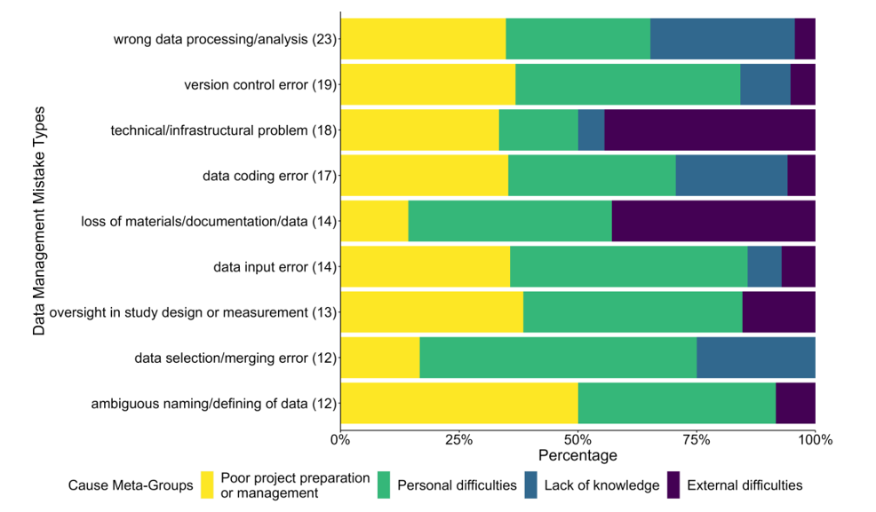
]

.pull-right[
Mistake Types and Their Reported Outcomes
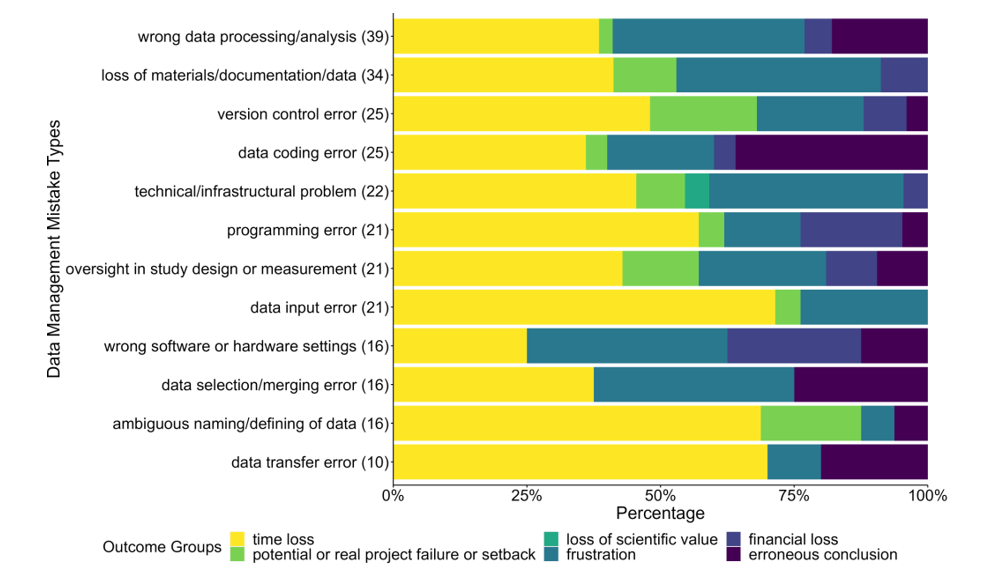
]
  
---

# Why care about data management?

3\. Creates reliable work
  - There is an entire blog, **[Retraction Watch](https://retractionwatch.com/)**, dedicated to monitoring scientific journal retractions
      - While there are varying reasons to retract an article, unreliable data is a top reason for article retractions
  - Practices that contribute to reliable data include:
      - Participant data tracking
      - Versioning of data
      - Validity checks

4\. Keeps data secure
  - Data security is required by both the IRB and funders
  - Incidents where data is not stored properly could lead to lost, destroyed, or unusable data as well as breaches of confidentiality
  - Practices to support data security include:
      - Storing paper and electronic data according to IRB rules
      - De-identifying data
      - Training staff on data security and require data access and use agreements
      - Assigning roles and responsibilities

---

class: center, middle, inverse

# Lifecycle

---

background-image: url(img/lifecycle.PNG)
background-size: cover

<br>
<br>
<br>
<br>
<br>
<br>
<br>
<br>
<br>
<br>
<br>
<br>
<br>
<br>
<br>
<br>
<br>
<br>
<br>
<br>

[Project Planning](pm_check.html)   
[Data Planning](dm_check.html)

---

background-image: url(img/cycle.PNG)
background-position: cover


---

# Data Management Cycle

- <span style = 'font-size: 150%;'>`r fontawesome::fa("repeat", fill = "#782F40")`</span>  All of the phases that occur in the cyclical portion of the lifecycle happen every data collection phase.

- <span style = 'font-size: 150%;'>`r fontawesome::fa("exclamation-triangle", fill = "#782F40")`</span>  It is best practice to do each step **EVERY** cycle.

- <span style = 'font-size: 150%;'>`r fontawesome::fa("times-circle", fill = "#782F40")`</span>  Waiting until the end of the study to track, document, clean and validate your data can have consequences.

  - You miss out on the opportunity to discover missing data and the chance to still collect that data
  
  - You miss the chance to revise any errors in your data collection instruments, and therefore may be creating unusable data
  
  - You won't be able to access data when you need it. You will need to notify someone of your need and then wait for the data to be prepared.

---

# Data Management Planning - Roles

- It is important that roles are assigned, not just presumed

- Create a table with roles and responsibilities and attach names to it

|Name | Role | Responsibilities|
|-----|------|-----------------|
|Rob  | PI   | Oversight of project, project approval, choose measures, recruit participants, randomization of participants|
|Amanda|Research Coordinator | Creates project documentation, builds surveys, sends surveys to participants, downloads raw surveys, tracks participant surveys, submits materials to IRB|
|Nancy| Database Coordinator| Builds tracking databases, builds data entry files|
|Naomi|Data Manager|Creates data documentation, cleans and de-identifies raw data, validates clean data, monitors data security|

---

# Data Management Planning - Roles

- Develop a system for how these roles will communicate with and notify each other when they are ready to hand off tasks

```{r, echo = FALSE, out.width = "500px", fig.align='center'}
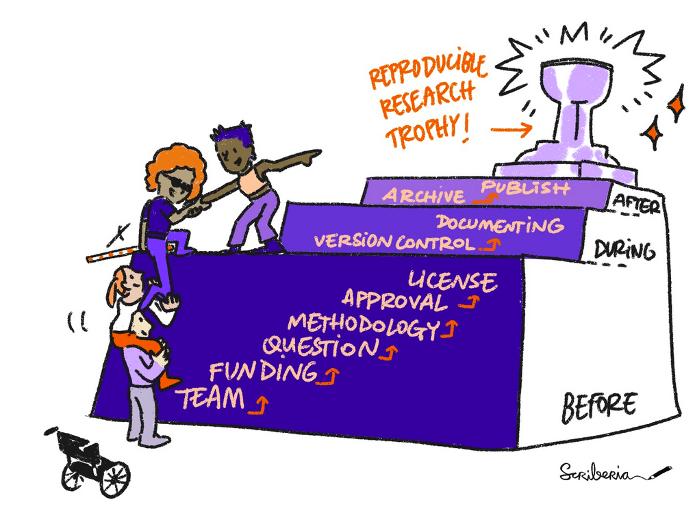
```

Source: [<span style="color:white">Scriberia</span>](https://the-turing-way.netlify.app/project-design/pd-overview.html)

---

# Data Management Planning - Roles

The best way to assign responsibilities may be by developing a flow chart for each project and each task

Add these roles and responsibilities to your protocol

**Simple flowchart for a Qualtrics survey**

<br>

```{r, echo = FALSE, out.width = "850px", fig.align='center'}
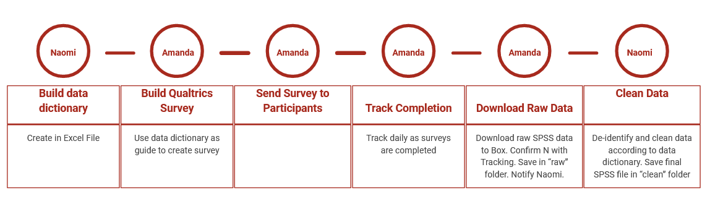
```

---

# Data Management Planning - Roles

**Simple flowchart for a paper survey**

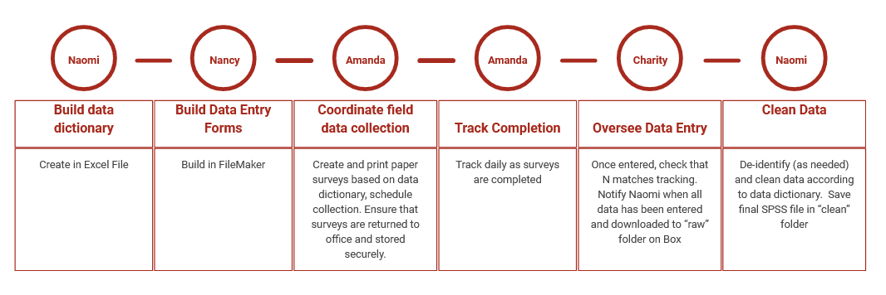
---

# Data Management Planning - Roles

**Simple flowchart for receiving district data**

<br>

```{r, echo = FALSE, out.width = "800px", fig.align='center'}
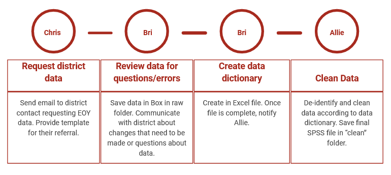
```


---

class: center, middle, inverse

# Document

---

# Why Document?

.pull-left[
**Internally**:
* It is a roadmap for where you are going.
* Make decisions/analyses replicable
  - Hand over documentation to new team members
* Helps with recall 
  - What decisions did you make, when, and why
* Creates standardization
  - Consistent naming and coding across forms and time
  - Consistent processes to gather data
* Helps you discover errors in your data
  - Catch missing data or values out of range
* Reduces data rot
  - With so many transformations over time, data becomes unusable if you don't track that information
]

.pull-right[
**Externally**:
* Required in DMP
  - Project level metadata also needed for pre-registration
* Ensure others use and interpret data accurately
]
---

background-image: url(img/pen-to-square-solid.svg)
background-size: 300px 300px
background-position: 95% 15%

# Types of Documentation

There are 4 levels of documentation/metadata.

Within each of these levels, are different types of documentation.

1. Team level
  - Lab Manual
  - **Style Guide**
  - Wiki
2. Project level
  - Project Documentation
  - Supplemental Materials
  - **Standard Operating Procedures (SOPs) or Protocols**
3. Dataset level
  - **ReadMe**
4. Variable level
  - Codebook
  - **Data Dictionary**

---

class: inverse, middle, center

# Team Documentation

---

# Lab Manual

*A lab manual creates common knowledge among team members.*

Samuel Mehr, a Researcher from Harvard University, [summarized the contents of 25 lab manuals](https://thebiologist.rsb.org.uk/images/biologist/2020/Apr_May_2020_67-2/67.2_Handbook.pdf) and came up with 20 common elements included.

.pull-left[
- Administrative elements
  - Mission of lab
  - Culture and values
  - Expectations of lab members
  - HR information
  - Communication
]
.pull-right[
- A lab manual can also contain data management guidelines:
  - Expectations for data access, sharing, use
  - Intellectual property and reuse
  - Saving and archiving of data
  - Protection of data privacy
  - Open science practices
]

<br>

|Who creates it|When to create | Formats| Type |Other terms|
|-------------|---------------|--------|-------|-----------|
|PI, Project Coordinators |When lab is formed|Markdown, PDF, Word| Internal|Handbook|

---

# Style Guide - A Scenario

You need to access the data dictionary for Project A, so you start to look around in the Project A directory

<br>

```{r fig.align="center", echo=FALSE, out.width='50%'}

```
Source: [tenor.com](https://tenor.com/view/batman-hmmm-thinking-one-second-let-me-think-gif-5454647)

---

class: inverse

# Style Guide - A Scenario

Project A Directory

What folder do you look in? What questions do you have?

* `r emo::ji("folder")` project-a
  * `r emo::ji("folder")` Mary's Dissertation
  * `r emo::ji("folder")` Entry Files
  * `r emo::ji("folder")` From Data Computer
  * `r emo::ji("folder")` IOA re-entry for Volunteers
  * `r emo::ji("folder")` project-a
  * `r emo::ji("folder")` project-a data2
  * `r emo::ji("folder")` video coding
  * `r emo::ji("folder")` Catherine
  * `r emo::ji("folder")` propensity scoring
  * `r emo::ji("folder")` Frank's dissertation
  * `r emo::ji("page facing up")` Measures Documentation.docx
  * `r emo::ji("page facing up")` Measures for papers_in progress by Terrance.docx
  * `r emo::ji("page facing up")` Timeline for projects.xlsx


---

class: inverse

# Style Guide - A Scenario

You make your way into the *project-a data2* folder and you find a *data documentation* folder

What file do you choose?


* `r emo::ji("folder")` data documentation
  * `r emo::ji("page facing up")` data dictionary_backup.xlsx
  * `r emo::ji("page facing up")` data dictionary_backup backup.xlsx
  * `r emo::ji("page facing up")` data dictionary_FINAL.xlsx
  * `r emo::ji("page facing up")` data dictionary_11.05.2020.xlsx
  * `r emo::ji("page facing up")` data dictionary_11.05.2020_AS edits.xlsx
  * `r emo::ji("page facing up")` data dictionary 11.06.2020_AS edits FINAL.xlsx
  * `r emo::ji("page facing up")` data dictionary 11.07.2020_AS JT edits_FINAL.xlsx

---

class: inverse

# Style Guide - A Scenario

You open the data dictionary

Are these variable names clear without the dictionary?

Are the value codes clear without the dictionary?

<br>

```{r echo=FALSE, out.width='10%', out.height= '50%'}

library(tidyverse)
library(kableExtra)

tibble::tribble (~ var_name, ~ question, ~value,
                 "Q1", "What is your gender", "0=female, 1=male, 2=non-binary",
                 "Q2", "What is your age?", "0-100",
                 "Q3", "What grade are you in?", "1,2,3,4,5",
                 "Q4_1", "I pay attention in class", "1=SD, 2=D, 15=A, 16=SA",
                 "Q4_2", "I try hard to do well in this class", "1=SD, 2=D, 15=A, 16=SA") %>%
  kable("html") %>%
  kable_styling("striped", full_width=T)
  
```

---


# Style Guide

*A [style guide](https://hwpi.harvard.edu/files/sdp/files/sdp-toolkit-coding-style-guide.pdf) is a document that provides a set of standards for how you work with your data.*

.pull-left[
Purpose:
  - Improves searchability
  - Standardization within and across projects
  - It allows for clear interpretation
  - It contributes to the reproducibility of your work
]
.pull-right[

Categories to include in your style guide:
  - Folder/Directory structure
  - File naming
  - Variable naming
  - Value coding
]

<br>

|Who creates it|When to create | Formats| Type |Other terms|
|-------------|---------------|--------|------|------------|
|PI, Project Coordinators, Data Managers |Before a project begins, When a lab is formed|Markdown, PDF, Word, txt| Internal|Protocol|
  
---

class: inverse

# Style Guide - Directory Structure

* `r emo::ji("folder")` project-new
  * `r emo::ji("folder")` documentation
      * `r emo::ji("page facing up")` project-new_data-dictionary_v05.xlsx
      * `r emo::ji("page facing up")` project-new_codebook_v02.pdf
  * `r emo::ji("folder")` data
      * `r emo::ji("folder")` cohort-1
          * `r emo::ji("folder")` raw
              * `r emo::ji("page facing up")` c1_stu_svy_download_2020-11-05.csv
          * `r emo::ji("folder")` syntax
              * `r emo::ji("page facing up")` c1_stu_svy_cleaning-script_v01.R
          * `r emo::ji("folder")` clean
              * `r emo::ji("page facing up")` c1_stu_svy_clean_v01.csv
  * `r emo::ji("folder")` tracking
      * `r emo::ji("folder")` cohort-1
          * `r emo::ji("folder")` participant-database
              * `r emo::ji("page facing up")` c1_particpant-db_v01.sqlite

---

class: inverse

# Directory Structure - File Paths

### Every document has a file path

* `r emo::ji("folder")` project-new
  + `r emo::ji("folder")` documentation
      + `r emo::ji("page facing up")` project-new_data-dictionary_v05.xlsx
      + `r emo::ji("page facing up")` project-new_codebook_v02.pdf


--

In Windows:

* project-new\documentation\project-new_data-dictionary_v05.xlsx
* project-new\documentation\project-new_codebook_v02.pdf

--

On Mac:

* project-new/documentation/project-new_data-dictionary_v05.xlsx
* project-new/documentation/project-new_codebook_v02.pdf

---

# Directory Structure - File Paths

Your file paths live within a home directory

* If you are storing files on your computer, your home folder is most likely your username. 
  * **Windows**: C:\Users\username
  * **Mac**: Users/username
  
So the full file path for our previously mentioned data dictionary may be:
  * C:\Users\username\project-new\documentation\project-new_data-dictionary_v05.xlsx  
  
  OR  
  
  * /Users/username/project-new\documentation\project-new_data-dictionary_v05.xlsx

---

# Directory Structure - File Paths

To find your full file paths

.pull-left[
On Windows you can simply click into the *address bar* to see your path

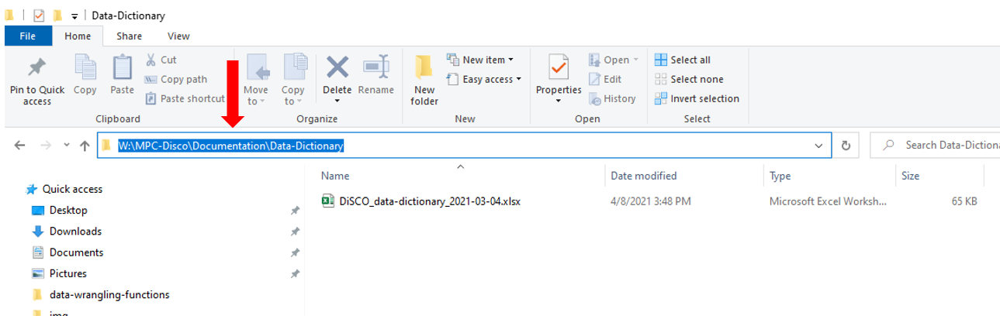

]

.pull-right[
Or right click on a document and go to *properties* and then *security*
<br>


]

---

# Style Guide - Directory Structure

--

* Allow you to find files easier
  + Which path is more descriptive?
      - **SG**: W:\project-a\data\cohort-1\student\survey\raw
      - **No SG**: W:\Project-a\data2 New

--

* Allow your computer to find files easier
  + Which path is more machine readable?
      - **SG**: W:\project-a\data\cohort-1\student\survey\raw
      - **No SG**: W:\Project A\Data\Cohort 1\student\Survey.raw

--

* Maintain reproducibility in your data management tasks (consistent file paths)
  + Which file paths maintain reproducibility across time?
      - **SG**: W:\project-a\data\cohort-1\stu\svy **and** W:\project-a\data\cohort-2\stu\svy
      - **No SG**: W:\project-a\data\cohort-1\stu\svy **and** W:\project-a\data\cohort-2\<span style="color: blue; ">svy</span>\<span style="color: blue; ">stu</span>

--

* Data security (limiting carte blanche access)
  + Which path is easier to maintain security?
      - **SG**: W:\project-a\data
      - **No SG**: W:\project-a


---

# Style Guide - Directory Structure - Rules

* Strike a balance between deep and shallow

  + Too shallow leads to many files in one folder
  + Too deep leads to too many clicks and file paths that are too long
  
--

* Create folders that are specific enough to limit access

--

* Folder names should be human readable (meaningful and easy to understand)

--

* Folder names should be machine readable

  + No spaces or punctuation
  + `_` or `-` to separate within and between pieces of metadata

--

* Be consistent with capitalization

--

* Consider the use of an *archive* folder for old versions of files

--

* Don't keep duplicate copies of a document across different locations
  
    + It's too easy to forget to update all copies of a document

---

# Style Guide - Directory Structure - Example

1. All project directories follow this hierarchical metadata structure  
      - Level 1: Name of project  
      - Level 2: Life cycle folders  
      - Level 3: Time period/Data collection wave folders (if relevant)  
      - Level 4: Participant specific folder
      - Level 5: Specific content folder  
      - Level 6: Archive folders  
2. All folders should be named according to these rules  
      - Meaningful name but no longer than 20 characters  
      - No spaces or periods in folder names  
      - Only use lower case letters  
      - Use `-` to separate words  
3. All previous versions of files must be placed into their respective *archive* folder
      - README_changelog.txt placed in each folder to document changes between versions
4. Keep only one copy of a file. Never duplicate a file in multiple locations.

      
---

class: inverse

# Style Guide - Directory Structure - Example

* `r emo::ji("folder")` project-new
  * `r emo::ji("folder")` data
      * `r emo::ji("folder")` cohort-1
          * `r emo::ji("folder")` student
              * `r emo::ji("folder")` assessment
                  * `r emo::ji("folder")` raw
                      * `r emo::ji("page facing up")` README_changelog.txt
                      * `r emo::ji("folder")` archive
                  * `r emo::ji("folder")` syntax
                      * `r emo::ji("page facing up")` README_changelog.txt
                      * `r emo::ji("folder")` archive
                  * `r emo::ji("folder")` clean
                      * `r emo::ji("page facing up")` README_changelog.txt
                      * `r emo::ji("folder")` archive

---

# Style Guide - File Naming 

.pull-left[
### **We are all subject to "mood based naming"**
]

.pull-right[
```{r fig.align="center", echo=FALSE,out.width='65%', out.height= '55%'}
knitr::include_graphics("img/phd.png")
```
Source: [PhD Comics](http://phdcomics.com/comics/archive.php?comicid=1531)
]

---


# Style Guide - File Naming

* Allow you to locate files easier and prevent errors
  + Which file names are more human readable and ensure you select the most recent document?
      - **SG**: fs_stu_svy-proto_2020-10-01.docx **and** fs_stu_svy-proto_2020-10-22.docx
      - **No SG**: survey protocol(1) FINAL.docx **and** survey protocol(1) CE edits.docx

--

* Allow your computer to find files easier
  + Which path is more machine readable?
      - **SG**: fs_stu_svy-protocol_2020-10-01.docx
      - **No SG**: Student survey protocol(1).docx

--

* Maintain reproducibility in your data management tasks (consistent file names)
  + Which file names maintain reproducibility across time?
      - **SG**: tch_form_cohort1_time1.xlsx **and** tch_form_cohort1_time2.xlsx
      - **No SG**: tch\_form\_cohort1\_time1.xlsx **and** cohort1\_time2\_<span style="color: blue; ">tch</span>\_<span style="color: blue; ">form</span>.xlsx
      - **No SG**: tch\_form\_cohort1\_time1.xlsx **and** tch\_form\_cohort1<span style="color: blue; ">-</span>time2.xlsx
      - **No SG**: tch\_form\_cohort1\_time1.xlsx **and** tch\_form\_cohort1\_<span style="color: blue; ">T</span>ime2.xlsx


---

# Style Guide - File Naming - Rules

* Don't use spaces between words

  + They can often break a URL when shared
  
--

* Don't use special characters **except** `-` and `_`
 
  + No `.` `!` `\` `/` `"` `|` `*` `#` `:` `>` `<` `?` `^`
  + They can have meaning within programming languages
  
--

* Don't use file extensions in the name of the file (ex: renaming_csv_files.xlsx)

  + Can cause confusion when searching for files

    
--

* Be intentional with capitalization 

  + Use all lower case, or use capital letters at the start of all new words
  

---

# Style Guide - File Naming - Rules

* Make names descriptive

  + A user should understand the contents without opening the file

--

* Pay attention to the number of characters to prevent hitting your path limit
  + Ex: SharePoint has a path limit of 260 characters
  + This is a real file name created by Qualtrics for a downloaded survey `r emo::ji("shocked")`: `Rural+Center+Montana+Study+(EIS+first)+2020-+Exemplar+Schools_March+19,+2021_07.49.sav`

--

* Consider keeping redundant metadata in the file name (ex: project name, wave)
  
  + Reduces confusion if you ever move the file
  + Helps make your files searchable

--

* Don't use `\` or `.` in dates. Format dates in one of two sortable ways:
  
  + [ISO-8601](https://en.wikipedia.org/wiki/ISO_8601) or [RFC-3339](https://medium.com/easyread/understanding-about-rfc-3339-for-datetime-formatting-in-software-engineering-940aa5d5f68a) format: YYYY-MM-DD
  + YYYYMMDD (this way reduces the number of characters but may be more difficult to read)

---

# Style Guide - File Naming - Rules

* When adding versions, pick a format and stick to it. Consider left padding with 0.
  
  + v01, v02
  
--

* If your files need to be run in sequential order, add the order number to the beginning of the file, again with leading zeros.

  + 01\_ , 02\_, 03\_

--

* Choose abbreviations to use for common names (ex: stu = student)

--

* Pick an order for metadata

  1. Project Name
  2. Time
  3. Participant
  4. Measure
  5. Version
  
```{r filenames, include=FALSE, results='hide'}
"fs`_`1819`_`teach`_`pinfo`_`v03.csv"
```


```{r, results='asis', echo=FALSE}

library(flair)

decorate("filenames") %>% 
flair("fs") %>%
flair("1819") %>%
flair("teach") %>%
flair("pinfo") %>%
flair("v03") %>%
knit_print.with_flair()
```

---

# Style Guide - File Naming - Example

1. Never use spaces or special characters between words.
1. Use `_` between metadata and `-` to separate words within metadata
1. Use the following metadata file naming order:
    - Order of use (if relevant--and always add a 0 before single digits)
    - Cohort/Wave (if relevant)
    - Participant
    - Measure
    - Further description
    - Date (always add)--Note some schools of thought are to add this as #1 for sortability
    - Version (if necessary--add version with v# and a leading 0)
1. Format dates as YYYY-MM-DD
1. Only use lower case letters
1. Use the following abbreviations
    - student = stu
    - survey = svy
    - cohort = c
    - wave = w
    - protocol = proto

---

# Style Guide - File Naming - Example

* `01_c1_w1_stu_svy_cleaning-syntax_2021-01-22.R`
* `01_c1_w1_stu_svy_cleaning-syntax_2021-01-22v02.R`
* `02_c1_w1_stu_svy_report-syntax_2021-01-23.R`
* `02_c1_w1_stu_svy_report-syntax_2021-02-05.R`

<br>

* `c1_w1_stu_svy_raw-download_2021-01-07.xlsx`
* `c1_w1_stu_svy_clean-data_2021-01-10.sav`

<br>

* `stu_svy_proto_2021-02-08.docx`
* `stu_svy_proto_2021-02-10.docx`

<br>

**Notice how easy these are to read** `r emo::ji("smiling face with heart-eyes")` 

---

# Style Guide - Versioning

**Some sort of versioning of files is always necessary!**

You have one of two options:

1. Use versioning software/platform (Git, SharePoint, Box, OneDrive)

  + No need to add version or date to your file name (or to your style guide)
  + Every time you save a new copy you can add comments to explain the differences between versions
  + You can go back into your history and restore previous versions

--

2. Create your own manual versioning

  + By adding a date and/or a version number to your documents you can track the most recent versions of documents
      - **I recommend to always manually version your data no matter what**
  + Adding a README to your folders (ex: ReadME_changelog.txt) where you add comments explaining the document updates each time you save a new version

---

# Style Guide - Variable Naming


* Improves interpretation and reduces human error
  + Which variable name is more human readable?
      - **SG**: *s_gender*
      - **No SG**: *q5*

--

* Allows your computer to manipulate variables easier
  + Which variable is more machine readable?
      - **SG**: *toca33*
      - **No SG**: *Family_problems_negatively_affect_this_childs_behavior_in_school*

--

* Maintain reproducibility in your data management tasks (consistent variable names)
  + Which variable names maintain reproducibility across time?
      - **SG**: <span style="color: blue; ">Time 1</span>: *toca1* **and** <span style="color: blue; ">Time 2</span>: *toca1*
      - **No SG**: <span style="color: blue; ">Time 1</span>: *toca1* **and** <span style="color: blue; ">Time 2</span>: *toca_1*

--

* Improves data management across projects 
  + Which variable names allow you to combine data across projects?
      - **SG**: <span style="color: blue; ">Project A</span>: *toca1* **and** <span style="color: blue; ">Project B</span>: *toca1*
      - **No SG**: <span style="color: blue; ">Project A</span>: *toca1* **and** <span style="color: blue; ">Project B</span>: *toca_1*

---

class: center, inverse

# Choosing variable names is hard

```{r fig.align="center", echo=FALSE,out.width='40%', out.height= '55%'}
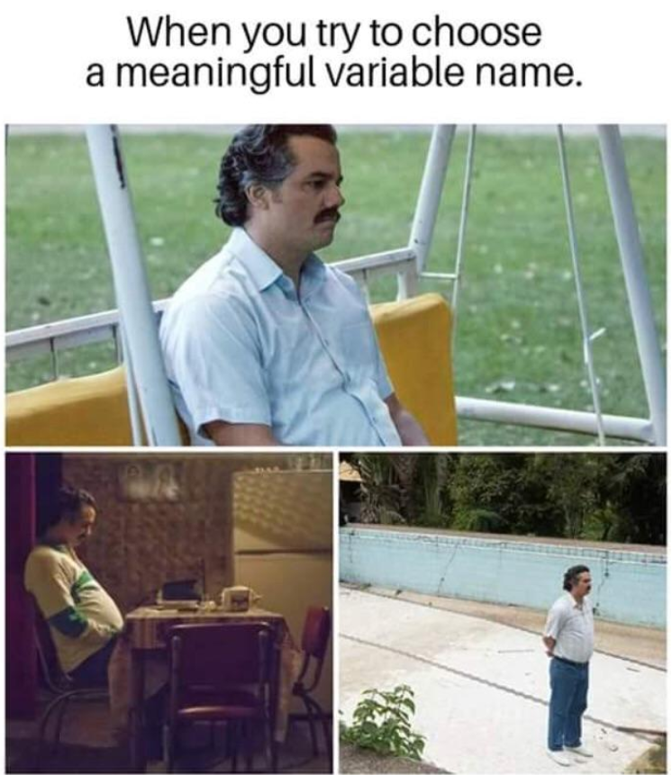
```
Source: [<span style="color: white; ">Reddit</span>](https://www.reddit.com/r/ProgrammerHumor/comments/8k9cmu/indeed_everytime/)


---

# Style Guide - Variable Names - Rules

* Names should be meaningful
  
  + Instead of *q1* use *gender*

--

* Set a character limit

  + Most statistical programs have limits (SPSS = 64, Stata = 32, SAS = 32)

--

* If part of a measure, use the scale abbreviation in the name, plus the item number

  + *bmtl01*
  + *bmtl_fctsfirst_sum*

--

* Keep variable names the same across time in a project

  + *bmtl01* in the fall and *bmtl01* again in the spring

--

* Keep variable names the same across projects

  + Some people would like to keep variable names the same across the field
  
---

# Style Guide - Variable Names - Rules

* Don't use spaces or special characters (except `-` or `_`)

--

* Be consistent with delimiters and capitalization

  + Pascal case (*ScaleSum*)
  + Snake case (*scale_sum*)--preferred method for variable names
  + Camel case (*scaleSum*)
  + Kebab case (*scale-sum*)
  + Train case (*Scale-Sum*)

--

* Don't start a variable name with a number

  + Most statistical programs won't even allow this

--

* All variable names in a study should be unique 

  + *d_gender* = student gender reported by the district
  + *s_gender* = student gender self-reported
  + *t_gender* = teacher gender self-reported

---


# Style Guide - Variable Names - Rules

* Denote reverse coding in the variable name
  
  + *scale01* and *scale01_r*

--

* Choose abbreviations to use for common scale names and phrases

  + scaled score = ss
  + percentil rank = pr
  + woodcock johnson test of cognitivie abilities = wj
  
--

* Track different versions of variables

  + If a question wording significantly changes or response options change for a variable mid-project after you've collected data, version that variable
  + Ex: revised *scale1* becomes *scale1_v02*
  
--

* Consider including an indication of the instrument in your variable name

  + Ex: s = student self-survey, r = teacher rating of student, t = teacher self-survey
  + *s_anxiety01* and *r_toca01*
  + This also helps make your variable names unique (ex: t_gender, s_gender)
  
---

# Style Guide - Variable Names - Time

If your data is longitudinal, you need to consider time in your variable naming

Depending on how you plan to merge your data, there are 2 ways to account for time:

1. **Concatenate time to your variables.**

  + You do this if you plan to merge your data in wide format
  + Every participant has one row of data
  + For example for 3 waves of scale1 on the student self-survey
      + *s_fall_bmtl01*, *s_wint_bmtl01*, *s_spr_bmtl01* 
      + *s_w1_bmtl01*, *s_w2_bmtl01*, *s_w3_bmtl01*
  + If you are collecting cohorts, you may still want *cohort* added as a separate variable

--

2. **Create time variables and add them to your data.**

  + You do this if you plan to append your data in long format.
  + Every participant occurs in your data more than once for each wave of data collection.
  + Ex: Add a *cohort* variable and a *wave* variable to your data and *s_bmtl01* stays the same variable name for every wave of data collection
  

---

# Style Guide - Variable Names - Time

Wide Format

```{r echo=FALSE, out.width='10%', out.height= '50%'}
tibble::tribble (~ stu_id, ~ cohort, ~s_w1_bmtl01, ~s_w2_bmtl02, ~s_w1_btml01, ~s_w2_bmtl02,
                 30415, 1, 1, 1, 1, 0,
                 30524, 1, 3, 0, 1, 1,
                 30530, 2, 2, 2, 0, 0) %>%
  kable("html") %>%
  kable_styling("striped", full_width=T)
  
```

Long Format

```{r echo=FALSE, out.width='10%', out.height= '50%'}
tibble::tribble (~ stu_id, ~ cohort, ~wave, ~s_bmtl01, ~s_bmtl02,
                 30415, 1, 1, 1, 1,
                 30415, 1, 2,1,0, 
                 30524, 1, 1, 3, 0,
                 30524, 1, 2, 1, 1) %>%
  kable("html") %>%
  kable_styling("striped", full_width=T)
  
```

---

# Style Guide - Variable Names - Time

You do not need to decide any of this right away:

  * How you want to merge your data
  * How you want to account for time
  * How you want to account for the survey instrument

--

As you collect data, account for all relevant metadata in your file name:

  * c1_w1_stu_svy_clean-data_2021-01-10.sav
  * Because of my style guide, I know this file is cohort 1, wave 1, student, self-report survey
  * When I go to finally merge my data, I can make my decisions then about how to account for time

--

<br>

If you choose to merge in a long format and later want your data in wide format, it is very easy to switch back and forth between long and wide format in statistical programs. Don't worry!

Whatever you finally decide on, document your rule in your **style guide**

---

# Style Guide - Variable Names - Example

```{r fig.align="center", echo=FALSE, out.width='50%'}
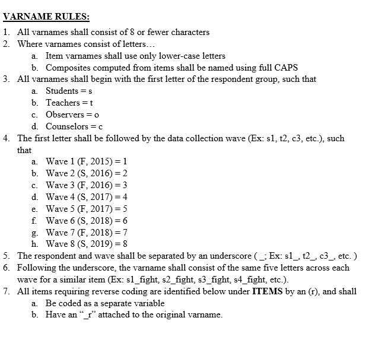
```
Source: Dr. Aaron Thompson, STARS study, [MPSI](http://moprevention.org/)

---

# Style Guide - Value Coding - Rules


* Keep values consistent across the project
  
  + **Do**: Always use 1=yes; 0=no
      + **Don't**: For some variables use 2=yes; 1=no, for other variables 1=yes; 0=no
  + **Do**: Always use m=male, f=female, n=non-binary
      + **Don't**: Switch between 'M', 'm', and 'male' to denote male
    
--

* Make sure scale response option ordering makes sense

  + **Do**: Strongly Disagree = 1; Disagree = 2; Agree =3; Strongly Agree = 4
      + **Don't**: Strongly Disagree = 1; Disagree = 3; Agree = 4; Strongly Agree = 2
    
--

* Define missing values

  + You can decide to leave all missing values as NA or NULL
  + Or you can assign missing values based on their properties
      - Use extreme values that do not actually occur in your data
      - Do not use character values in numeric fields
      
---

# Style Guide - Missing Values - Example

<br>

```{r, echo=FALSE, fig.align="center"}
knitr::include_graphics("img/missing.png")
```
Source: [NCES](https://nces.ed.gov/pubs2015/2015074.pdf)

<br>

---

# Wiki

*A [site](https://osf.io/mdh87/wiki/Applying%20to%20PhD%20Programs/) that is designed for groups of people to quickly capture and share ideas by creating simple pages and linking them together*

* Think Wikipedia: anyone on your team can add/edit content and then can link to referenced documents for easy access
* Easily built in tools such as Microsoft SharePoint, Teams, OSF, or Notion

.pull-left[
* You can make project level wikis to house important reference materials
  + Protocols
  + Style Guide
  + Participant Payment Forms
]
.pull-right[
* Or you can make a team wiki to house more general information
  + Lab manual
  + Meeting notes
  + Organization charts
  + Style Guide
]

|Who creates it|When to create | Formats| Type|
|-------------|---------------|--------|------|
|Anyone |Before a project begins, When a lab is formed|Tool of choice| Internal|

---

class: inverse, middle, center

# Project Documentation

---

# Project Level Documentation

*A living document to record information about your project.  Contains detailed description of procedures, methods, measures, and sample*

Purpose:
  * To provide context for your data and improve interpretation

The bones of this document can be initially populated from your pre-registration but it should include an overview of the following:
  * Project and Study Design
  * Participants
  * Intervention
  * Procedures (will come from SOPs)
  * Measures - including citations for measures


|Who creates it|When to create | Formats| Type|Other terms|
|-------------|---------------|--------|------|-----------|
|PI, Project Coordinator |At any point during the project|PDF, Word, Markdown| External|Methods and Measures|

Source: [IES](https://ies.ed.gov/ncee/pubs/2022004/pdf/2022004.pdf)

---

# Supplemental Materials

*These are materials that may be added to your project level documentation that provide a service for you internally and can provide further clarification for external users as well*

1. **Timeline**: What data is collected at what time points throughout the year and across the years?
  + This information is best displayed in table format (or spreadsheet)
  + It’s helpful to add a column that shows how this data is collected (ex: Qualtrics, observation, etc.)
  
2. **Instruments**: Copies of all IRB approved data collection instruments used. These can also be annotated to show how you renamed items.

3. **Consort Diagram**: A flow diagram that shows participant flow through an RCT, from enrollment, to allocation to treatment, and up to analysis. 


|Who creates it|When to create | Formats| Type|
|-------------|---------------|--------|------|
|PI, Project Coordinator, Data Managers |At any point during the project|PDF, Word, Markdown, Excel| Internal & External|

---

# Supplemental Materials - Timeline

```{r, echo=FALSE, fig.align="center", out.width = "700px"}
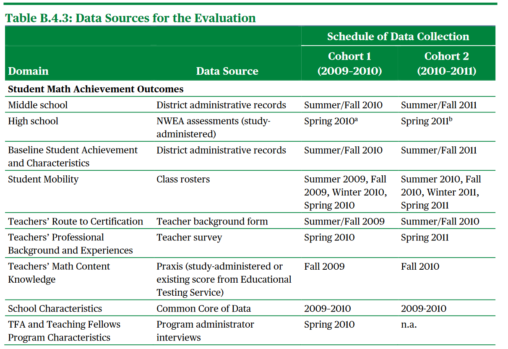
```

Source: [IES](https://ies.ed.gov/ncee/pubs/2022004/pdf/2022004.pdf)
---

# Supplemental Materials - Consort Diagram

```{r, echo=FALSE, fig.align="center", out.width = "400px"}
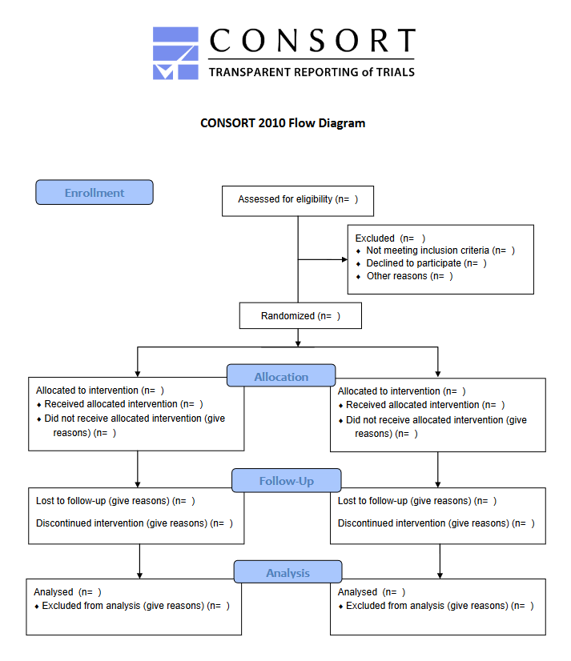
```

Source: [Consort](http://www.consort-statement.org/consort-statement/flow-diagram)
---

# Standard Operating Procedures

*SOPs or Protocols are document/s to record all your procedures as well as changes made to those procedures throughout the grant.*

Purpose:

* For you to document every decision you make so that over time you both **remember what you did and why** as well as **implement your procedures with fidelity**.

* To document roles and responsibilities for each procedure

* You will eventually summarize these protocols and add them to your project level documentation

<br>

|Who creates it|When to create | Formats| Type|Other terms|
|-------------|---------------|--------|------|-----------|
|Whoever oversees the procedure |Before the procedure occurs|PDF, Word, Markdown| Internal & External|Protocols|

Source: [CITI Program: Good Clinical] Practice(https://about.citiprogram.org/series/good-clinical-practice-gcp/)

---

background-image: url(img/file-pen-solid.svg)
background-size: 300px 300px
background-position: 90% 65%

# Standard Operating Procedures

These SOPs should cover both project administration procedures as well as data management procedures

Project administration:
- Recruitment
- Consenting/Assenting Participants
- Inclusion/Exclusion criteria
- Randomization
- Payments/Incentives
- Intervention implementation
- Data Collection
- Training

Data management:
- Data Entry
- Data scoring
- How to deal with missing data

---

# Standard Operating Procedures

The SOP can either be one large document, with a table of contents, or stand alone documents.

Each SOP should *begin* with:

* Title
* Date the protocol was made   
* Who made the protocol  
* Purpose of the protocol  
* Any related documents or research behind this protocol  

**Then write up the details about the procedure/protocol.**

--

For any *changes* to the protocol after the project has begun add the following below the original protocol section:  
 * Revision date  
 * Who decided on the revision  
 * Any rationale behind the revision  
 * Any related documents or research behind the revision 

---

# Recall this Qualtrics Flowchart


---

background-image: url(img/sop_combined.PNG)
background-size: cover

---

class: center, inverse, middle

Dataset Documentation

---

# ReadMe

**A plain text document that contains information about your files. May also be seen written as README.** 

They are most known for their use in computer science, but have become more prevalent in research. 

Can serve many purposes:
- Descriptive information about the purpose and organization of a dataset
- Information about a set of files in a directory
- **Changelog of differences between versions of a file**
- Steps and/or files in a process

<br>

|Who creates it|When to create | Formats| Type|Other terms|
|-------------|---------------|--------|------|-----------|
|Anyone associated with the process|Before a project, As it is required|txt, PDF, Word, Markdown| Internal & External|Metadata|

---

# ReadMe - Dataset

```{r, echo=FALSE, fig.align="center", out.width = "650px"}
knitr::include_graphics("img/metadata.PNG")
```
Source: [University of Portland](https://libguides.up.edu/datamanagement/documentation)

---

# ReadMe - Set of Files

```{r, echo=FALSE, fig.align="center", out.width = "800px"}
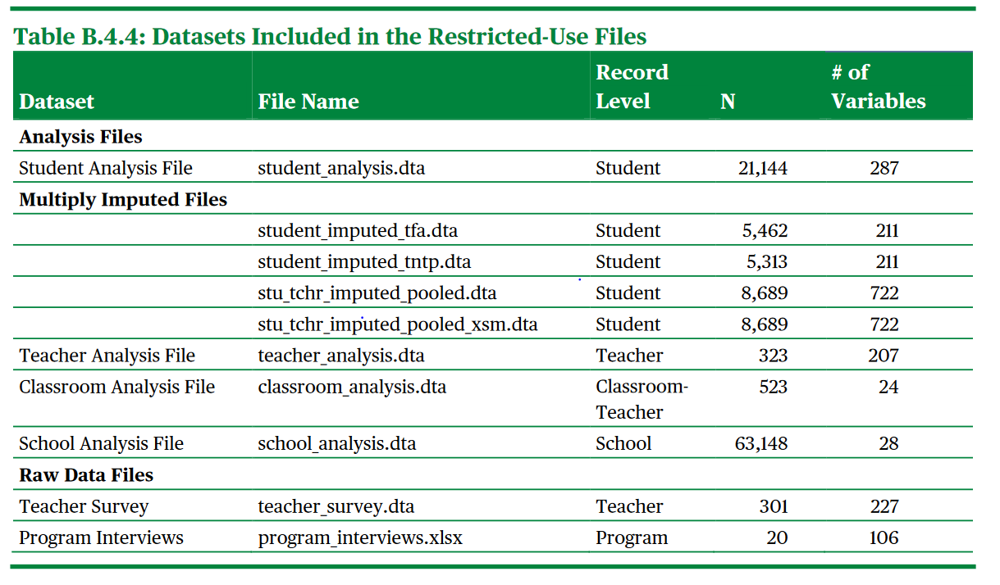
```
Source: [IES](https://ies.ed.gov/ncee/pubs/2022004/pdf/2022004.pdf)

---

# ReadMe - Changelog

```{r, echo=FALSE, fig.align="center", out.width = "1000px"}
knitr::include_graphics("img/changelog.PNG")
```
<br>
Source: [Wheel of Names](https://wheelofnames.com/changelog)

---

class: inverse, center, middle

# Variable Documentation

---

# Codebook

*A well-documented codebook contains information intended to be complete and self-explanatory for each variable in a data file, such as the wording and coding of the item, and the underlying construct* [FORRT](https://forrt.org/glossary/codebook/)

Purpose:
  * Without ever having to open the data file, a user can see summary statistics about the data and make decisions based on that information.

<br>

|Who creates it|When to create | Formats| Type| Other terms|
|-------------|---------------|--------|------|------------|
|Data Managers |Before sharing data |PDF, Word, Markdown| External| Summary Statistics|


---

# Codebook - Example

```{r, echo=FALSE, fig.align="center", out.width = "550px"}
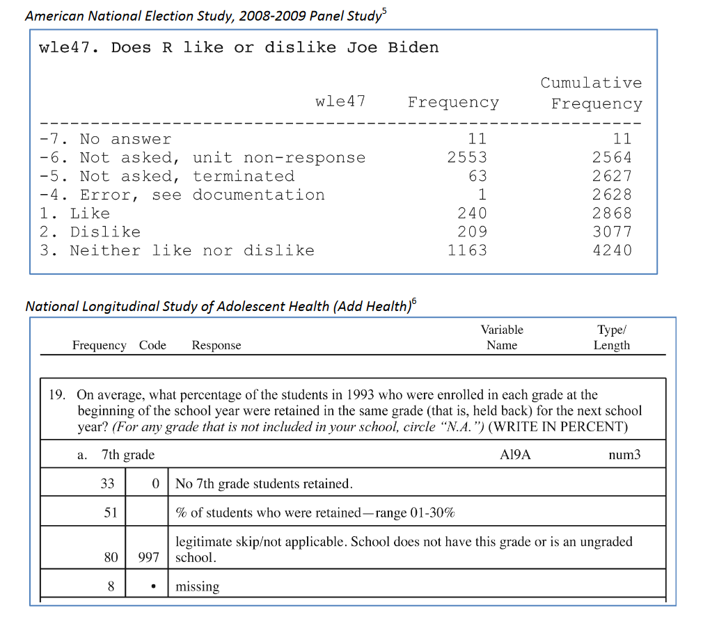
```
Source: [ICPSR](https://www.icpsr.umich.edu/files/deposit/Guide-to-Codebooks_v1.pdf)

---

# Data Dictionary

*A collection of names, definitions, and attributes about data elements that are being used or captured in a database, information system, or part of a research project*

Purpose:
* Enforces data standards
* Creates consistency across the members of the team and across the project over time
* Provides a roadmap for instrument creation
  - Tells you how to name variables and code values in an instrument like Qualtrics
* Can be integrated into data cleaning
* Assists in data validation
* Communicates the contents of dataset

<br>

|Who creates it|When to create | Formats| Type| Other terms|
|-------------|---------------|--------|------|------------|
|Data Managers |**Before a project begins**, When extant data is received|Excel, Other rectangular format| Internal & External| Codebook|

---

# Data Dictionary - Elements

- Variable Name
- Variable Label
- Associated scale/measure
  + Group your variables by scale/measure
- Associated form (Student survey, teacher rating of student)
- Value range or value codes ([1-99] or 0=No, 1=Yes)
- Measurement unit (numeric, string, date, etc.)
- Missing data codes
- Variable universe (Who gets this question? Is there skip logic?)
- What time periods does this variable exist
- Reverse coding
- Calculations (composite variables, scores)
- Notes (such as versions/changes to this variable)
- Order number of the question on the form

---

# Data Dictionary 

In order to start a data dictionary, you should gather the following information:

- What measures are we collecting? (Ex: Student Assessment, Teacher Observation, Teacher Survey, Principal Interview)
- What are the items/scales included?
  + Get a copy of the original measure and make sure the question wording is accurate. Make sure the subscale you've assigned the question to is accurate
- What is your variable naming protocol? (Check your style guide)
- Do your items/scales have pre-determined value coding rules or can we assign our own? What is our value coding protocol? (See value coding)

--

It’s good to also consider starting to document the variables you aren’t collecting but you are assigning or deriving.

- Cohort/Group
- Time period
- Treatment
- What variables do you plan to derive (ex: Mean Scores)? 

---

# Data Dictionary - Example

|measure|subscale|var_name|label|type|values|recode|
|------|--------|--------|-----|----|------|------|
|cip|Individual Teacher Instructional Practices| CIP_StudWork| Used student work to plan for mathematics instruction | numeric | 1 = Never, 2 = Less than once a month, 3 = 2 or 3 times a month, 4 = Once or twice a week, 5 = Daily | NA |
|cip|Individual Teacher Instructional Practices| CIP_TeachMat | Examined your teaching materials/assignments in relation to the Math | numeric | 1 = Never, 2 = Less than once a month, 3 = 2 or 3 times a month, 4 = Once or twice a week, 5 = Daily | NA|

```{r, echo=FALSE, fig.align="center", out.width = "500px"}
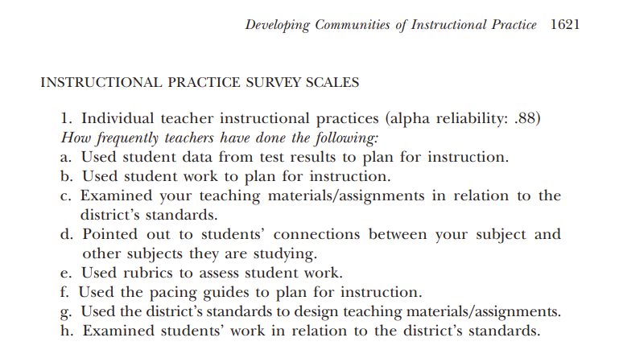
```

---

background-image: url(img/data-dictionary.PNG)
background-size: contain

---

class: inverse, center, middle

# Questions?


