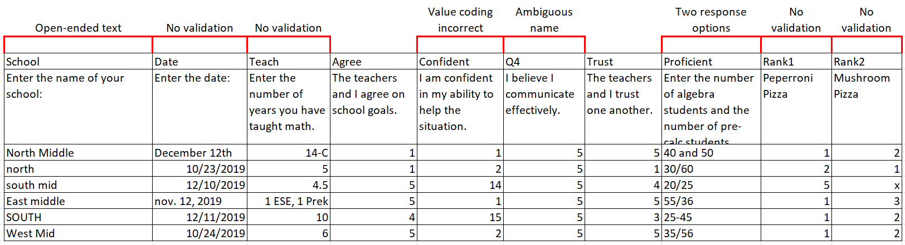
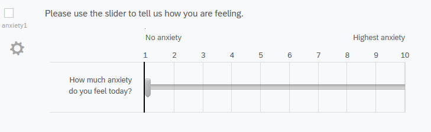
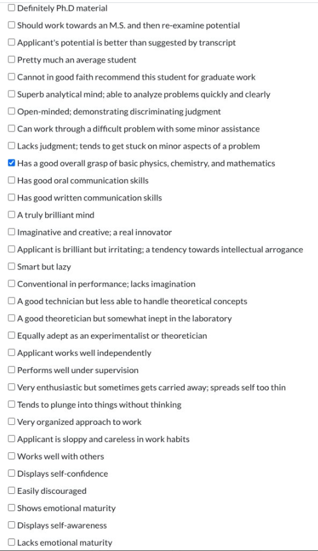
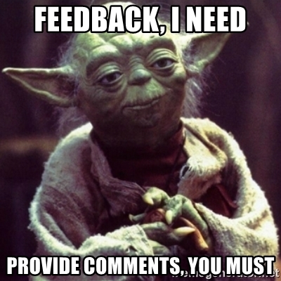
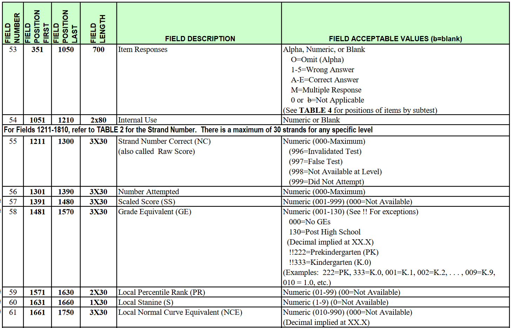
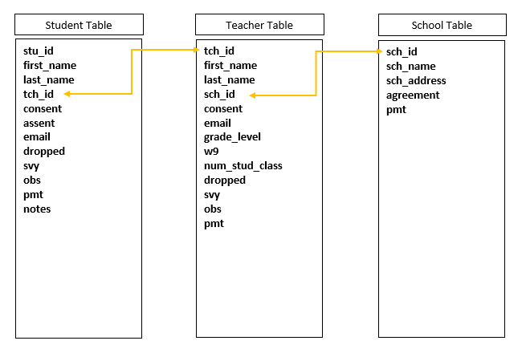
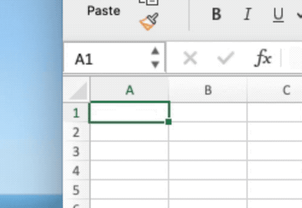
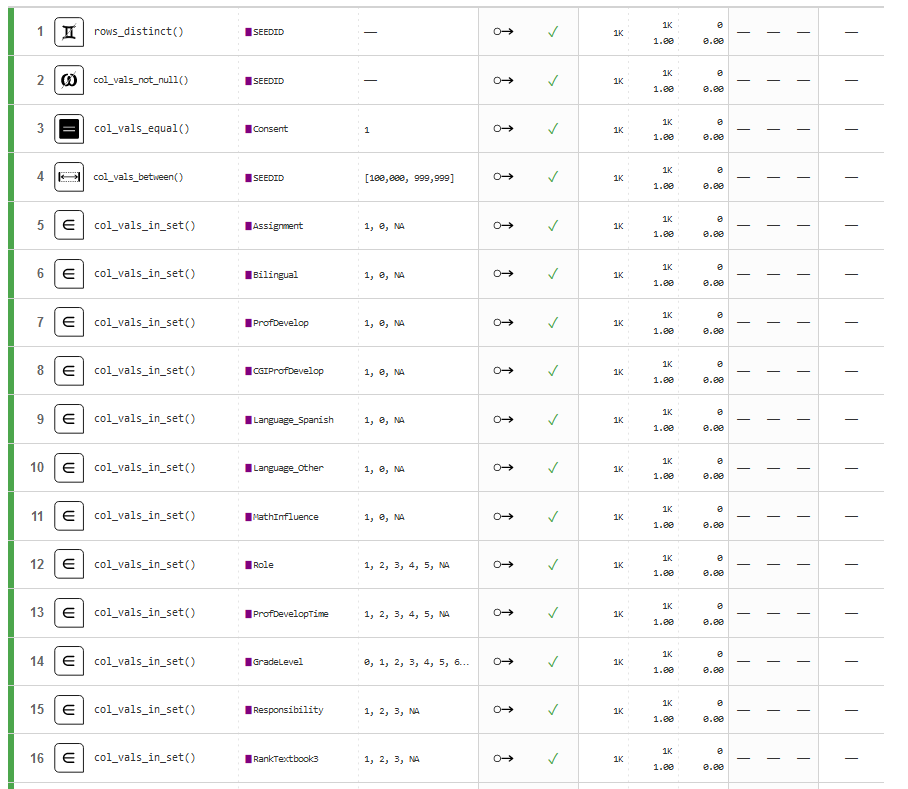

```{r setup, include=FALSE}
options(htmltools.dir.version = FALSE)
knitr::opts_chunk$set(
  fig.width=9, fig.height=3.5, fig.retina=3,
  out.width = "100%",
  cache = FALSE,
  echo = TRUE,
  message = FALSE, 
  warning = FALSE,
  hiline = TRUE
)
```

```{r xaringan-tile-view, echo=FALSE}
xaringanExtra::use_tile_view()
```

```{r xaringan-themer, include=FALSE, warning=FALSE}

library(xaringanthemer)

style_duo_accent(
  secondary_color = "#782F40",
  primary_color = "black", 
  background_color = "#CEB888",
  code_inline_color = "black"
)
```


class: inverse, left, middle

background-image: url(img/cover2.png)

# Data Management Overview: Session 2
## Training for Schoen Research

----

## Crystal Lewis

Slides available on [`r fontawesome::fa("github", fill = "white")`](https://cghlewis.github.io/schoen-workshop-series/)


---

# Plan for this series

.pull-left[
Session 1  
* ~~Data flow~~  
* ~~Documentation~~  

Session 2
* Creating instruments
* Tracking data
* Capturing and storing data
* Preparing to clean and validate data
]

.pull-right[

Session 3-6
* Getting acclimated with R and RStudio
* Understanding objects and functions
* Setting up a reproducible syntax file
* Cleaning data with R
* Validating data with R

```{r, echo = FALSE, out.width = "300px", fig.align='center'}
knitr::include_graphics("img/r-project.svg")
```

]

---

class: inverse, middle, center

# Creating Instruments

---

# Electronic Surveys

#### **Consider how your data will translate into a spreadsheet**




---

# Electronic Surveys - Best Practices

1. Pull out your data dictionary and enter all items into your survey platform

2. Name all of your survey items according to your data dictionary
  + Ex: Q1 = bmtl01
  + Ex: Q2 = bmtl02
  
3. Don't add time to your variables in Qualtrics
  + Ex: Do **not** name Q1 = pinfo_Teach1819
  + This will only create more work for you if you copy surveys each wave
  + Time can be added after data is downloaded
  
4. Correctly code all of your values
  + 1 = strongly disagree, 2 = disagree, 3 = agree, 4 = strongly disagree
  + If you add another option to your scale, check that your values weren't recoded by the survey platform

---

# Electronic Surveys - Best Practices

5\. Use data validation
  + Content validation
      - Restricting birth date to date only field (and choose format - YYYY-MM-DD)
      - Restricting age to a numeric entry with min and max cutoffs (18-90)
      
  + Choice validation
      - In a rank question, restrict the response options as values are entered.
          - In a 1-3 ranking question, once a 1 has been used, only 2 and 3 are allowable values, and so on.
          
  + Response validation
      - Force response
      - Request response

---

# Electronic Surveys - Best Practices

6\. Only ask one piece of information per question

  + Don't ask: Provide the % proficient in math and comm arts
  + Do ask:  
      (1) Provide the % proficient in math.  
      (2) Provide the % proficient in comm arts.

7\. Use the same question format across and within studies

  + If anxiety1 was a slider 1-10 in the fall, keep it as a slider 1-10 in the spring 
  
```{r, echo = FALSE, out.width = "600px", fig.align='center'}

```


---

# Electronic Surveys - Best Practices

8\. Make your question wording abundantly clear.

  + Don't ask: Are you from this state?
  + Do ask: Do you currently live in this state?
  
9\. Make your response options abundantly clear.

  + Don't ask: Which parent are you? (m/f)
  + Do ask: Which parent are you? (mother/father/legal guardian/other)
  
10\. If there is a finite number of response options (< ~ 20), use a drop down.

  + School Name: South Middle, North Middle, West Middle, East Middle
  
---

# Electronic Surveys - Best Practices

.pull-left[
11\. If there is an infinite number of response options, use an open text box

  + Do not make people select from a massive list of options

]

--

.pull-right[

```{r, echo = FALSE, out.width = "250px", fig.align='center'}

```

]

.footer[[Twitter](https://twitter.com/niais/status/1352759154939633664)]

---

# Electronic Surveys - Best Practices - Why

1. Reduces errors in data cleaning
  + When your variable names are named correctly in your survey, you remove the chance that you accidentally rename Q12 to the wrong question after downloading

2. Reduce effort
  + You no longer have to rename, recode, add labels every time point. You build these correctly into your survey once, and it downloads correctly each time.
  + Allows you to focus on important data cleaning such as de-identification, reverse coding, data validation, calculating scores

3. Creates more usable data
  + If response options are restricted to the values within your specified range, you no longer have values out of range that you have to consider
  
---

# Electronic Survey Feedback

.pull-left[
**Always get feedback before sending your survey out!**

* Send the survey to colleagues to test out
* Have them use a name such as "test"
* You can always delete this out in the platform or during data cleaning later


You want to know things like:

* Was any language unclear?
* Was there any funky skip logic?
* Was a response option left out or maybe an entire question from a measure?
* Were your response options restricted?

Download that test data:

* When you download their test data, does it look as you expected?
]

.pull-right[
<br>

```{r echo=FALSE, fig.align = "right", out.width='70%'}

```
.footnote[Source: [memegenerator.net](https://memegenerator.net/instance/80945126/yoda-star-wars-feedback-i-need-provide-comments-you-must)]

]

---

# Offline Instruments

Your best line of defense to reducing data errors is checking data early and often

1. Check for missing data in the field and again when you get to the office
2. Check for duplicate responses to a question in the field and again when you get to the office
3. Check for out of range responses to a question in the field and again when you get to the office

--

And also setting by setting up an error-proof data entry protocol

1. Set up a data entry station
2. Have clear instructions for handling paper data (where and how to store it securely)
3. Set up clear databases for entry
  - Restrict entry fields (numeric vs text vs date, specific range, drop-down option)
  - Name fields the same as form
4. Clear instructions for data entry
  - How to handle missing data
5. Set up a system for error checking
  - Double entry of data
  - How to denote that a form has been entered once/twice
  - System to check and remedy errors across double entry
  
---

# Online Assessments and Extant Data

Your best line of defense is to receive a data dictionary/codebook from the source

.pull-left[
A document that tells you:

1. The name of every variable in the file
2. The meaning of every variable
3. How variables are calculated
4\. The meaning of any value codes  
5\. The expected range of variables  
6\. Any missing value codes  
]

.pull-right[
```{r echo=FALSE, fig.align = "right", out.height='300%'}

```
]

.footnote[Source: [Pearson](https://www.pearsonassessments.com/store/usassessments/en/Store/Professional-Assessments/Academic-Learning/Comprehensive/Stanford-Achievement-Test-Series-%7C-Tenth-Edition/p/100000415.html)]

---

# Study IDs

* Researchers should be concerned with two things: Participant confidentiality and accurate data
  
* If your study is longitudinal or you are collecting multiple forms, maintaining accurate study IDs is crucial for linking

```{r echo=FALSE, out.width='20%'}

library(tidyverse)
library(kableExtra)

tibble::tribble (~ stu_id, ~ s_w1_item1, ~s_w2_item1, ~s_w3_item1, ~s_w4_item1,
                 1268, 5,4,NA, 3,
                 1286, NA, NA, 3, NA,
                 1306, 2, 3, 5, 1,
                 1245, 5,4,3,4) %>%
  kable("html") %>%
  kable_styling("striped", full_width=T)
  
```

--
<br>

* Is 1286 a real ID? Or did 1268 get transposed/entered incorrectly?

---

# Study IDs

As best you can, build IDs directly into the system. This helps prevent any situation where:

1. Someone completes a form who isn't in the study
2. You accidentally link an ID to the wrong participant
3. You are unable to link an ID to a participant

--

Electronic Data Options:

1. Upload IDs and names into the system and send unique links to inviduals
2. Use same link for everyone but provide participants with their ID to enter into the system
  + Build in a check that confirms they are who the ID is associated with

Paper Data Options:

1. Write IDs on forms and also place a label with name on the form that can be removed for de-identification purposes later
  + Double check the ID and name before entering data


---

class: inverse, middle, center

# Tracking Data

---

# Participant Database

A sole source of truth that houses information such as

1. Who your participants are
2. The **only** link between their study IDs and their true identity (Ex: Name, Contact Information)
3. The place where you update any information about your participants
  - Name change
  - Location change
  - Email change
4. Where you track all incoming pieces of data/information from your participants
  - Consents/assents
  - Incentives/Payments
  - Data collection completion
  
**Typically built in a database tool such as FileMaker or Microsoft Access, or an online tool such as RedCap or QuickBase**

**Stored with limited access and your highest security**

---

# Participant Database

This system is vital for the following reasons related to Data Management:

* Data de-identification - only linking key
* Ensuring you collect all your data
* Understanding what happened during data collection
  - Notes on why data was not collected, tracking movement
* Consort diagram creation
  - Who dropped out, when and why
* Final dataset verification
  - Does the N in your dataset match the N in your participant tracking database for that form and wave
  
---
class: center, inverse

# Setting up a Participant Database

At the most basic level you want to create one table per entity (student table, teacher table, school table).  
Each table should have a primary and foreign key.



---

# Fields to Include

.pull-left[
**Fields that are added once and updated as needed:**

* StudyID (Primary Key)
* Foreign Keys (TeacherID, SchoolID)
* Participant/Site Name
* Contact Information
* Other IDs necessary for linking data 
* + Ex: State ID for linking district data
* Relevant collected identifiable information
* + Birthdate, grade level, SSN for payment info
* Consent/Assent received
* Randomization information (cohort, group)
* Consent rate information (# of consents sent out, # of students in class)
* Condition (treatment/control)
* Movement/Dropped
]

.pull-right[
**Fields to track over time:**

* Data collected
  - A field for each form collected across time
* Payment/Incentive provided
* Notes
  - Track ANYTHING that you may need to remember at a later time
    + Reasns for missing data
    + Errors in the data
    + Why someone moved or dropped from the study
    + When someone changed their name
]  

---

class:inverse

background-image: url(img/form-view.PNG)
background-size: contain

---
class: inverse

background-image: url(img/datasheet-view-new.PNG)
background-size: contain

---

# Participant Tracking - Takeaways

#### **Plan and build your participant database early**
* You want this database built before you ever collect a single piece of information, including consent

#### **Keep one single source of truth**
* It's okay to download tables from your participant tracking to use as rosters or data collection tools, but ONLY make updates to your one source of truth.
  - Track in the participant database
  - Update in the participant database
  - Make notes in the participant database
  
#### **Track daily during data collection**
* Don't wait to track until the end of data collection
* Track every single thing you collect
  
---

class: inverse, center, middle

# Data Capture and Storage

---

# Electronic Data Capture and Storage

This data will most likely be downloaded. Decisions to be included in a protocol:

1. Who will download this data?
  - Project Coordinator?
2. When will it be downloaded?
3. What format will it be downloaded in?
  - Decided by the data team
4. Where will it be downloaded?
  - ALWAYS in a **"raw"** data folder following your Style Guide naming conventions
5. What checks need to be completed before notifying the team that the data is ready?
  - Check that the N in the file matches the N in Participant Tracking
      + If it does not, start detective work to see where the discrepancy is happening
6. What document should the Project Coordinator document any notes about the data?
  - File ReadME
      + Participant X only completed half the survey because of Y
      + Participant Z completed the survey twice
          - Refer to protocol for duplicate data
7. What is the process to notify the data team that the data is ready to be cleaned?

---

# Paper Data Capture and Storage

This data will most likely be entered and then exported. Decisions to be included in a protocol:

1. How will double entered data be checked for data entry errors?
  + Checked that all participants are in the data (Check N against Participant Tracking)
  
2. Who will confirm that all errors have been corrected?

3. Who will download the final data?

4. When will it be downloaded?

5. What format will it be downloaded in?

6. Where will it be downloaded?
  - ALWAYS in a "raw" data folder following your Style Guide naming conventions
  
7. What document should the Project Coordinator document any notes about the data?

8. What is the process to notify the data team that the data is ready to be cleaned?

---

# Extant Data

Decisions to be included in a protocol:

.pull-left[
1. Who will be in charge of receiving the data?
  - Reach out if data is not received
2. How will the data be received?
  - Secure email
  - Dropped in cloud storage
3. What format will the data be in?
4. Is there associated documentation?
5. Who will review the data for errors, questions?
  + Missing variables
  + Missing participants
  + Unclear variables
]

.pull-right[
6\. Who will contact the owner for additional information as needed?
7\. Where will additional notes about the data be tracked?
  + Data dictionary
  + ReadMe
8\. Where will the data be stored after it is reviewed and deemed good to go?
  - ALWAYS in a "raw" data folder following your Style Guide naming conventions
]

---

class: center, middle, inverse

# Data Cleaning Plan

> Quality data beats fancy algorithms

> `r tufte::quote_footer('--- Omar Elbabry')`

---

background-image: url(img/clean.jpg)
background-size: 40%
background-position: 90% 65%

# Data Cleaning Plan

*Data cleaning is the process of organizing and transforming raw data into a format that can be easily accessed and analyzed*. 

Clean data should be:

* Valid

--

* Accurate

--

* Complete

--

* Consistent

--

* Uniform

.footnote[Source: meowguide(https://www.meowguide.com/should-you-wash-your-cat/)]

---

# Data Cleaning Plan

**A data cleaning plan is a written proposal outlining how you plan to transform your raw data into the clean, usable data.**

.pull-left[

This is distinct from a syntax file where you comment your work or even pseudocode where you write simplified functions in plain text.

A data cleaning plan includes no code and is not code or technical skills dependent. 

Anyone from a project coordinator to a programmer should be able to read and understand this file and provide feedback if needed. 
]

.pull-right[

> 1. Review data structure
> 1. Remove no consent
> 1. Add SEEDID
> 1. Remove personally identifiable information
> 1. Remove duplicate SEEDID rows
> 1. Remove unfinished surveys
> 1. Drop unnecessary variables
> 1. Rename variables
> 1. Recode variables
> 1. Add variable and value labels
> 1. Check for out of range values
]

---

# Data Cleaning Plan

To effectively clean data you need to have an understanding of 5 things:

.pull-left[
1. Data Literacy

2. Domain Knowledge

3. Software Knowledge

4. Stakeholder Knowledge

5. Understanding of Data Structure

6. Knowledge of PII
]

.pull-right[


]

.footnote[[Source: Mika Baumeister on Unsplash](https://unsplash.com/photos/Wpnoqo2plFA)]

---

background-image: url(img/data-literacy.png)
background-position: 95% 90%
background-size: 35%

# Data Literacy

Ways to build data literacy:

1. Believe that data errors are inevitable and always be looking for them.

2. Know the type of data you are working with (qualitative, quantitative)

3. Understand the source of where your data comes from
  - Primary sources, secondary sources
  - Raw or calculated
  
4. Understand data structure

5. Know how to look for patterns and outliers in data

6. Use exploratory data analysis to get to know your data

7. The more data you work with, the more you learn

.footnote[[TDS](https://towardsdatascience.com/what-is-data-literacy-9b5c3032216f)]
---

# Domain Knowledge

A lot of data literacy relies on domain knowledge, or **ghost knowledge**, information you only learn from being immersed in a field.

.pull-left[
1. A broad example: If a researcher plans to collect data over time, I know to start accounting for time some way in my documentation. Or if researchers are clustering data, I know to start accounting for that cluster in the data.

2. Another broad example: I know from years of experience and learning hard lessons, that things don't always stay the same. Someone exports their data differently, or someone changes the way a variable is coded without knowing it. I never assume that data will come to me the same way over time.
]

.pull-right[
3\. A specific example: I learned from working with a specific district, that when they sent us discipline data (ex: OSS or ISS referrals) they will leave a cell blank when a student has had 0 referrals. I know this from having conversations with them. Using this knowledge, I document that I need to recode blank referrals to 0.
]

---

# Software Knowledge

The person who cleans the data needs both an understanding of the software used **to collect** data as well as the software that will be used **to clean or analyze** the data

**Questions to ask about data collection software**

.pull-left[
* Is the data hand entered? How is the data entered/exported?
  + Should I expect any funky formatting (think Excel autocorrect)
  + Should I expect any discrepancies in entry values
]

.pull-right[


]

.footnote[Source: [The Verge](https://www.theverge.com/2020/8/6/21355674/human-genes-rename-microsoft-excel-misreading-dates)]

---

# Software Knowledge


.pull-left[
**Questions to ask about data collection software**

* Is the data collected through online software?

  + Is the data exported? What file type?
  
  + What additional variables does this software add to the export file that we did not create?
  
  + How are "select all" questions exported?
    + Extract a sample of data to get a feel for this
]

.pull-right[

Select all question (Q1) downloaded from Qualtrics 

```{r echo=FALSE, message=FALSE, warning=FALSE, out.width='500%', out.height= '500%'}

library(tidyverse)

tibble::tribble (~ Q1_option1, ~ Q1_option2, ~Q1_option3, ~Q1_option4,
                 NA, 1, NA, NA,
                 NA, 1, 1, 1,
                 NA, NA, NA, NA,
                 1, 1, 1, NA) %>%
  kable("html") %>%
  kable_styling("striped")
  
```
]


---

# Software Knowledge

**Questions to ask about data cleaning software**

* Is the software case sensitive?
* Does it have variable name character limits?
* Does it have other variable name limitations?

**What software do stakeholders plan to use to analyze data?**

* Is there a certain file type required for data import?
  + Mplus - ASCII text files
* What missing values are allowed?
  + Mplus - No blanks allowed
* Ultimately though, **don't tailor your output file to a particular user**
  - Make a general file that is clear to understand and accessible to a broader audience
  - If an internal user needs a very specific format, make two files
      + General user file accessible to most people, a file specific to that user

---

# Stakeholder Knowledge

Prior to the project starting, take time to sit down with PIs, project coordinators, and other stakeholders to ask about and plan for the following questions:

1. What types of data will you be receiving (surveys, observations, assessments)?
2. What format will it be in (csv, xlsx, spss)?
3. How reliable will the data be (hand entered, double entry checks, is the data collected by your team/an outside source)?
4. What is the timeline for data collection? When should you expect to receive data? How will you be notified?
5. How do researchers intend to use the data?
6. Do researchers want their final data in long or wide format? What are the units of analysis?
7. Do researchers need missing data coded in any specific way?
8. Are any specific file formats needed for final data?
9. Are there any additional calculations or transformations that need to be done in the final data?
10. What is the timeline for when researchers need clean data?

**You can add all of this information to your documentation (protocols, timelines, data dictionaries). All of this information will help inform your data cleaning plan.**

---

# Stakeholder Knowledge

You can consider adding a data accounting table to your protocol to track the flow of data. 

<br>

| Instrument | Download format | Assigned To | Download Name | Download Due Date | Clean Format | Assigned To | Clean Name | Clean Due Date |
|------------|-----------------|-------------|---------------|-------------------|--------------|------------|---------|----------------|
|CIP_SelfEff | SPSS            | Amanda      | fs_cipself_year_raw| May 30 | SPSS | Naomi | fs_cipself_year_clean | June 30 |
|PInfo       | CSV             | Nancy       | fs_pinfo_year_raw | April 30 | SPSS | Naomi | fs_pinfo_year_clean | May 30 |


---

background-image: url(img/cycle.PNG)
background-position: 95% 90%

# Stakeholder Feedback Loop

In addition to planning before a project starts, there should be stakeholder meetings after every wave of data collection.

Topics to cover in a data review:

1. Have there been any changes to data collection instruments, <br> expectations, or timelines? 

2. Were there any errors the data team caught during cleaning <br> that can be fixed in data collection instruments or data capture processes?

3. How did the data hand off go? Was there anything the team <br> could have done better? 

Again, update your documentation based on these meetings.

---

# Data Structure

In the world of quantitative education research, we are typically working with rectangular data (rows and columns).

If you are collecting data across time, you can merge your data in one of two ways. 

.pull-left[
.center[**Wide format**]

```{r echo=FALSE, message=FALSE, warning=FALSE, out.width='10%', out.height= '50%'}

tibble::tribble (~ stu_id, ~w1_stress1, ~w1_stress2, ~w2_stress1, ~w2_stress2,
                 56987, 3, 4, 2, 3,
                 54882, 1, 1, 1, 2,
                 55574, 2, 1, 4, 1) %>%
  kable("html") %>%
  kable_styling("striped", full_width=T)
  
```
]

.pull-right[
.center[**Long format**]

```{r echo=FALSE, message=FALSE, warning=FALSE, out.width='10%', out.height= '50%'}

tibble::tribble (~ stu_id,  ~wave, ~stress1, ~stress2,
                 56987, 1, 3, 4,
                 56987, 2, 2, 3,
                 54882, 1, 1, 1, 
                 54882, 2, 1,2,
                 55574, 1, 2, 1, 
                 55574, 2, 4, 1) %>%
  kable("html") %>%
  kable_styling("striped", full_width=T)
  
```

]

---

# Data Structure

If you are merging distinct forms within time, you will always merge wide.

<br>

```{r echo=FALSE, message=FALSE, warning=FALSE, out.width='10%', out.height= '50%'}

tibble::tribble (~ stu_id, ~formx_stress1, ~formx_stress2, ~formy_mathscore, ~formy_readscore,
                 56987, 3, 4, 250, 300,
                 54882, 1, 1, 140, 220,
                 55574, 2, 1, 280, 190) %>%
  kable("html") %>%
  kable_styling("striped", full_width=T)
  
```


---

# Data Structure

Recommendation for managing data over time:

1. Within time, go ahead and merge data at any point to create wave level dataset (ex: wave 1 student data).

2. Across time, don't merge data until you have to. It is much simpler, in terms of data management and syntax writing, to keep variable names consistent over time.

3. Don’t append any time periods to variable names or add a time variable to your data until you have to (this can all be added very easily in your syntax). You will know what time period is associated with the data file based on the file name and storage location.

Another tip: **Don't stress too much about the way you merge your data. It is very easy to restructure data from one way to another.** 

---

# Data Cleaning: Global Rules

1. Never make edits to the raw data

2. Keep **everything** (except identifying variables and completely irrelevant variables)

3. Always de-identify the clean data.

.pull-left[
**Direct Identifiers:**

* Name
* Email
* SSN
* Address
* School Name
* District Name
* State/District issued student IDs
]

.pull-right[
**Indirect Identifiers:**

* Date of Birth
* Geographical Identifiers (zip code)
* IP Address
* Dates associated with data collection
* Open-ended text questions
* Small cell sizes for groups (race/ethnicity, specific learning disability)
]

---

background-image: url(img/analysis_dataset.PNG)
background-size: 80%

.footnote[Source: [J-PAL](https://www.povertyactionlab.org/sites/default/files/Data_Security_Procedures_December.pdf)]

---

# Data Cleaning Steps

1. Read your raw data into a statistical program
  + May be one file in a folder, may be all files in a folder, may reading a file from the web or connecting to an API

--

2. Review your data
  + Pull out your data dictionary and start comparing, pull up your participant tracking database and start comparing
  + Check the number of rows, check the number of columns
  + Check the values of columns
  + Check for missing data
  + Check your variable types

--

3. Remove any cases who don't belong
  + Anyone not consented
  + Duplicate cases

---

# Data Cleaning Steps

4\. De-identify your data (Names)
  + Read in a roster from your participant database and join on name
  + Drop name

--

5\. Drop all irrelevant columns
  + Example: Metadata collected by Qualtrics
  + You can utilize your data dictionary for this purpose

--

6\. Split columns as needed
  + If a column allowed participants to indicate multiple responses, those responses need to be split out into multiple columns
  

.pull-left[

|subject|
|-------|
|math, reading, science|
|music, art|
|math, science|
]

.pull-right[

|subject1|subject2|subject3|
|--------|--------|--------|
|math | reading | science|
|music | art | NA |
|math | science| NA |
]

---

# Data Cleaning Steps

.pull-left[

7\. Rename columns to match your data dictionary

--

8\. Transform/Normalize variables
  + Remove symbols (% or $)
  + Remove white space from strings (" m" and "m")

--

9\. Standardize
  + According to your data dictionary
    + Ex: "school a", "School A", "schA" -> School A

--

10\. Update any variable types as needed
  + Ex: string to numeric

]

.pull-right[

<br>

|yrs_teach|  ->  | yrs_teach|
|---------|----|---------|
| 1       | ->   |  1      |
| 5       |  ->  | 5       |
| 2.5       |   -> | 3     |
| "4 yrs"   |  ->  | 4    |


]

---

# Data Cleaning Steps

.pull-left[

11\. Recode variables
  + If you know all -99 should be 0 for select all questions
  + Reverse code Likert scale questions

--

12\. Construct any variables as described in the data dictionary
  + Create sum and mean scores
  + Create standardized scores
  + Collapse existing variable/s into a new variable
  + Add variables such as cohort or treatment

--

13\. Add missing values as needed
  + Base this on your data dictionary missing value schema
]

.pull-right[

<br>

|cert1 | cert2 | cert3 | -> | multi_cert |
|------|-------|-------|----|------------|
| 1    |1      |   1  |  -> |  1         |
| 0    |1     |  0 |  ->   | 0 |
| 0    |1     |  1 |  ->   | 1 |


]

---

# Data Cleaning Steps

.pull-left[

14\. Add metadata following your data dictionary
  + Add variable labels
  + Add value labels

--

15\. Validate data
  + Values out of ranges
  + Variable types not as expected
  + Missing columns
  + Duplicate cases
  + Study IDs are all valid
  + Cross validation for impossible values
    - Age & Grade

--

16\. Export clean data to specified format
  + Save in a "clean" folder with the word "clean" associated with it
]

.pull-right[



Source: [pointblank](https://rich-iannone.github.io/pointblank/)
]

---
class: inverse

background-image: url(img/data-cleaning.PNG)
background-size: contain

---

# Data Cleaning Steps

* Merge and/or append data
  * Across time, forms, data sources
  * Again do validation checks - do you have the correct number of rows/columns after merge
  
* Transform data
  * Wide to long
  * Long to wide
  
* Version data
  + At some point, someone **WILL** find an error
      - Either in the original raw data or in the clean data
  + You need to track your data versions (both raw and clean) - Defer to your Style Guide
      - `fs_pinfo_1819_rawv01.sav` - > `fs_pinfo_1819_rawv02.sav`
      - `fs_pinfo_1920_cleanv01.sav` -> `fs_pinfo_1920_cleanv02.sav` -> `fs_pinfo_1920_cleanv03.sav`

---
class: inverse
background-image: url(img/changelog2.PNG)

# ReadMe Changelog

---

# Syntax

*Machine readable programming instructions written in a text editor that are processed by your computer*

**Why should we avoid manually cleaning data?**

* It is not reproducible
* It leads to errors
* It is time consuming

--

**Recommendation**: Clean your data, no matter how small the task, with syntax. While it may seem time consuming up front, it helps you:

* Be more thoughtful in your process
* Remember what you did
* Save you enormous amounts of time in the future
* Allow others to check your work

---

background-image: url(img/ghost.jpg)
background-position: 90% 15%
background-size: 27%

## Personal Horror Story

* I was sent a clean SPSS data file with 200 variables

* I found a few small errors
  + One variable name was wrong
  + One variable calculated incorrectly
  + One variable was missing value labels
  
* I decide to clean this all manually
  + I don't document anything
  
* One month later, I am sent the same file - updated
  + Errors were found in the original file

* Not only do I have to re-do my manual work, but I don't remember any of the errors <br> I found a month ago or what I did to fix them
  + I have to start all over

.right[Source: [Karsten Winegeart on Unsplash](https://unsplash.com/photos/IeT84oak7HQ)]

---

background-image: url(img/r-project.svg)
background-position: 91% 75%
background-size: 40%

# Next Session


* Install R and RStudio[link here]

* Complete the free course [Getting Started with R](https://rfortherestofus.com/courses/getting-started/)

* Try your best to have a second monitor set up

---

class: inverse, center, middle

# Questions?


  