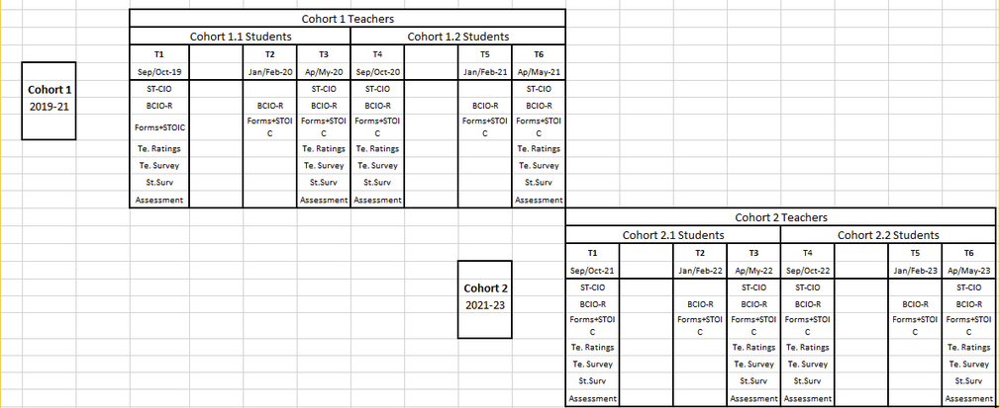
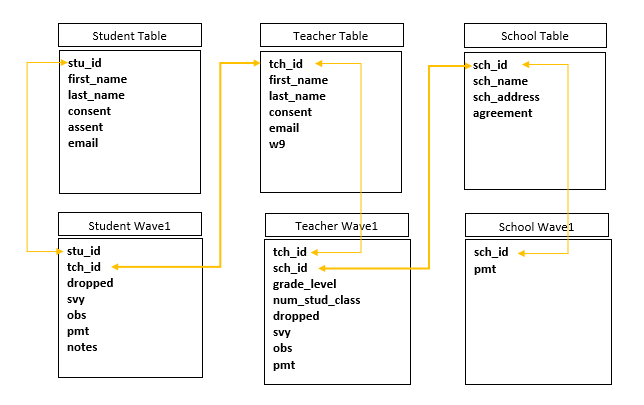

```{r setup, include=FALSE}
options(htmltools.dir.version = FALSE)
knitr::opts_chunk$set(
  fig.width=9, fig.height=3.5, fig.retina=3,
  out.width = "100%",
  cache = FALSE,
  echo = TRUE,
  message = FALSE, 
  warning = FALSE,
  hiline = TRUE
)

xaringanExtra::use_tile_view()
xaringanExtra::use_panelset()

```


```{r xaringan-themer, include=FALSE, warning=FALSE}

library(xaringanthemer)

style_duo_accent(
  secondary_color = "#782F40",
  primary_color = "black", 
  background_color = "#CEB888",
  code_inline_color = "black"
)
```


class: inverse, left, middle

background-image: url(img/cover2.png)

# Data Management Overview: Session 2
## Training for Schoen Research

----

## Crystal Lewis

Slides available on [`r fontawesome::fa("github", fill = "white")`](https://cghlewis.github.io/schoen-workshop-series/)


---

# Plan for this series

.pull-left[
Session 1  
* ~~Data flow~~  
* ~~Documentation~~  

Session 2
* Creating instruments
* Tracking data
* Capturing and storing data
* Preparing to clean and validate data
]

.pull-right[

Session 3-6
* Getting acclimated with R and RStudio
* Understanding objects and functions
* Setting up a reproducible syntax file
* Cleaning data with R
* Validating data with R

```{r, echo = FALSE, out.width = "300px", fig.align='center'}
knitr::include_graphics("img/r-project.svg")
```

]

???

* Best practices for creating instruments that export data that is usable
* Tracking data in a way that allows you to confirm the accuracy of what you are seeing in your data
* How to capture and store data in a reproducible and reliable way
* What steps we need to take before we actually clean and validate our data

I'll talk about more about getting ready for that at the end of today's session

---

class: inverse, middle, center

# Quick Recap

---

background-image: url(img/step5.PNG)
background-size: cover

???

This is the data cycle we are covering

Last week we covered the documentation phase and I said that it is preferable, not always possible, to start documentation before we ever collect a single piece of data

We want to use documentation, to inform every step of our data collection, capture and cleaning process


---

# Documentation

.pull-left[
The types of documentation we covered were

1. Style Guide
2. Protocol
3. Timeline
4. ReadMe
5. Data Dictionary
]

.pull-right[
The ones we didn't really dive into:

6. Project level documentation
  * Project and Study Design
  * Participants
  * Consort Diagram
  * Intervention
  * Summary of Procedures (will come from SOPs)
  * Measures - including citations
7. Codebook
  * Summary statistics about the data
]

???

Who your participants are

The flow of participants through your study

If you remember last time, that is summary statistics about what actually exists in your final dataset rather than an internal planning document

And we didn't cover these types of documentation because, while you can start these documents at any time of a project, they are typically documents you put together at the end of your study for data sharing purposes

And we are focused on what needs to happen while the project is still active

---

# Style Guide

.pull-left[
A document you create prior to the start of a project to standardize file structure, file naming, variable naming and value coding. 

Should be created before any other documentation.
]

.pull-right[
```{r, echo = FALSE, out.width = "350px", fig.align='center'}

```
]

.footnote[Source: [Harvard SDP](https://hwpi.harvard.edu/files/sdp/files/sdp-toolkit-coding-style-guide.pdf)]

???

* It will tell you where and how to store all of your other documentation files.

* It will inform your other documentation - such as your data dictionary - because it provides guidance on how to name variables. 

---

# Protocol

Also called Standard Operating Procedures (SOPs) are document/s to record all your procedures as well as changes made to those procedures throughout the grant.

* Create these before a project begins and continue to create new ones as new processes are developed for the project

* Have one protocol for each piece of data that you collect, and include steps from instrument creation all the way through data capture.

* Within your protocol, assign who is in charge of overseeing each step.

* Version your protocol when you make significant changes to processes.

???

So you can see the evolution over time.

---

# Timeline

An planning tool for seeing what data is collected and when. Allows the data team to know when to expect to receive data.

* This is a tool that shows when each instrument is collected, not each measure
  - Example: When is the teacher survey collected? (do not need to know that the cip and self-efficacy measures make up that survey)
  
```{r, echo = FALSE, out.width = "850px", fig.align='center'}

```
  
???

Sometimes one instrument might be made up of multiple measures (for example 3 different scales).

For example we need to know when the teacher survey is collected, not that the cip and self-eff measures make up that survey

You don't need to have that level of detail because our data dictionary will tell us what measures are included in each instrument.

We just want to know high level, what data is coming our way, when and from where?

---

# ReadMe

A plain text document (or another file type) that contains information about your files. Anything you want future users to know.

The readme purpose could be:

1. Explaining anomalies in the raw data that you want the data team to be aware of.
2. Denoting the differences between versions of files.
3. Letting future users know what files are contained in a directory and how to link them.
4. A planning document that provides the steps in a data cleaning or analysis process.

.pull-left[

]
.pull-right[
```{r, echo=FALSE, fig.align="center", out.width = "800px"}

```
]

???

Including future YOU, to know about the files

There is no restriction on what a readme can contain

I put 2 readme examples here

This is an important ReadMe because you'll notice here, that the person downloading the raw data did NOT make these changes to the raw data themselves. And the reason why is, you never want to touch the raw data. We always want to have the raw untouched source data to refer back to. So this allows the data team to make these changes in their clean data only.


---

# Data Dictionary

A rectangular format collection of names, definitions, and attributes about data elements that are captured as part of a research project.

Ideally created before you ever collect data and used to guide the creation of data collection instruments as well as your data cleaning.

Add every instrument you plan to collect to your data dictionary.

.pull-left[

* Variable Name
* Variable Label
* Associated scale/measure
  + Group your variables by scale/measure
* Value range or value codes ([1-99] or 0=No, 1=Yes)
* Measurement unit (numeric, string, date, etc.)
]

.pull-right[

* Missing data codes
* Variable universe (Who gets this question? Is there skip logic?)
* What time periods does this variable exist
* Reverse coding
* Calculations (composite variables, scores)
* Notes (such as versions/changes to this variable)
]

???

Rectangular format meaning rows and columns - spreadsheet format

Assessment, tch survey, student survey, observation

If you used Excel to create your data dictionary, those could all be tabs in a file

The columns you might add

Group by scale for readability

---

# Data Dictionary

.panelset[
.panel[.panel-name[tch_srvy]

|measure|scale|var_name|label|type|values|recode/calc|
|------|--------|--------|-----|----|------|------|
|demos | NA   | YearsTeach | How many years have you been a teacher? | numeric | 0-100 | NA|
|cip|Individual Teacher Instructional Practices| cipitsip01| Used student work to plan for mathematics instruction | numeric | 1 = Never, 2 = Less than once a month, 3 = 2 or 3 times a month, 4 = Once or twice a week, 5 = Daily | yes |
|cip|Individual Teacher Instructional Practices - recode| cipitsip01_r| Used student work to plan for mathematics instruction | numeric | 5 = Never, 4 = Less than once a month, 3 = 2 or 3 times a month, 2 = Once or twice a week, 1 = Daily | t_cipitip01 = 1 -> 5, 2 -> 4, 3 -> 3, 4 -> 5, 5 -> 1 |
]

.panel[.panel-name[stu_srvy]

|measure|scale|var_name|label|type|values|recode/calc|
|------|--------|--------|-----|----|------|------|
|demos | NA   | GradeLev | What grade level are you in? | numeric | 0-100 | NA|
|SelfEff|NA| selfeff01| I believe I can do math | numeric | 1 = Strongly Disagree, 2 = Disagree, 3 = Neither Agree or Disagree, 4 = Agree, 5 = Strongly Agree | NA |
|SelfEff|NA|SelfEffSum |Self Efficacy Sum Score|numeric|0-20|selfeff01 + selfeff02 + selfeff03_r + selfeff04|

]

.panel[.panel-name[emsa]

|scale|var_name|label|type|values|recode/calc|
|------|--------|--------|-----|----|------|------|
| NA | Form   | Which form was given? | numeric |1 = A, 2 = B, 3 = C, 4 = D | NA|
|Math Fractions| emsa01| What is the correct answer? | numeric | open | NA |
|Math Fractions|emsass|Math Fractions Scaled Score|0-100|NA|NA|

]
]

???

So if you set up your data dictionary in an Excel file, you will have a tab for each instrument you collect

---

### Data Dictionary

.pull-left[
For any **existing survey measures**, track down original sources to verify that:
1. You included all relevant questions you want to include
2. Your question wording and coding of values are in line with the original measure

```{r echo=FALSE, fig.align = "right", out.height='800%'}
knitr::include_graphics("img/cip_measure.PNG")
```

]

.pull-right[

The same goes for any **existing non-survey measures** that you plan to use. Track down the original source and make sure you know:
1. What items are included
2. How they are scored/coded

```{r echo=FALSE, fig.align = "right", out.height='800%'}

```
]

???

Such as assessments

You'll usually have your raw items from the assessment, and then most likely you'll have scores that are created from those raw items. 
You'll either be scoring those in house or the assessment company might score them and send you scored data

Either way you want to know what this data will ultimately look like and what will be included

This is a codebook from the Pearson SAT10 assessment that we used for a project I worked on several years ago. It was an assessment we collected on paper and then would send off to Pearson for scoring and then they would mail us back a cd of data.

I was able to request a codebook to see exactly what variables would come in the data file that they send us. This allowed me to prepare for data cleaning because I knew exactly what variables would be in the file and what they represented and I added this information to our data dictionary.

The other thing about taking time to gather these original sources is, you'll eventually want to have citations in your project level documentation for all of your measures anyway, so if you have already tracked them all down and saved them in a measures folder, you'll be that much more prepared when you begin your project level documentation

---

# Data dictionary 

If your data was collected **internally without a data dictionary**, create one as soon as you receive the data to describe what exists in the raw data and how you want to transform it.

```{r echo=FALSE, fig.align = "right", out.height='900%'}

```


If your data is collected **externally and you have no access to information prior to data collection**, plan to add this instrument to your data dictionary as soon as you receive this data. Use this to plan how you will clean and verify your data.


```{r echo=FALSE, fig.align = "right", out.height='900%'}

```

???

Like maybe your data was collected before a data dictionary was a part of your protocol

It's going to look a little different because you might need to add a column that says what the original variable name is and how you plan to rename it.

And you'll most likely have a lot more going on in the recode column because the instrument wasn't built to your exact standards so you'll need to do some additional cleaning. But otherwise it is pretty similar.

For example maybe you are collecting data from a district

If at all possible, ask these outside sources for a data dictionary or codebook that you can use to interpret their data

If that doesn't exist, it may involve a series of conversations to try to figure out how they've encoded their data because most likely not all the variables will be very clear

---

class: inverse, middle, center

# Creating Instruments

---

# Electronic Surveys

#### **Consider how your data will translate into a spreadsheet**


???

Not paper - tools such as Qualtrics, RedCap, etc.

Say you created a Qualtrics survey

You always want to consider how your data will translate into a spreadsheet when it's downloaded

Say this is the raw download of a Qualtrics survey and I am on the data team. Someone just notified me that the raw data is ready to be cleaned and I'm starting to review it and while I'm reviewing it, I start to notice some things that could be improved in the future

* Which is sometimes fine, but in this case it has now created way too many versions of our school names - this is going to require a lot of data cleaning to regroup all of the schools
  - This is something we would want to consider changing to a drop down
  
* Again, this is going to require some data cleaning to get dates all into the same format, but it's even a little worse than that when it comes to dates because it's not always entirely clear which portion is the month and which one is the day and so this can create errors in our data
  - We would want to force this to be inputted as a date format of our choosing in the future

* People were allowed to enter in any information and this will require more than data cleaning, it will require actual decision making on how to handle things that aren't entirely clear
  - We could remove this problem by restricting inputs to only whole numbers
  
* This could have been a strongly disagree to a strongly agree question, but we didn't back end code these values based on our data dictionary. It will require recoding.
  - We could back end code our values based on our data dictionary
  
* It's just a coincidence that everyone put 5, but variable name is Q4 so we will need to rename this
  - We could name all of our variables correctly in Qualtrics
  
* We are hoping that people put the right order (1st number is for algebra, 2nd for pre-calc), but there is no guarantee. We also can't leave this variable like this. We would need to split it out into 2 variables.
  - Only ask one piece of information per question
  
* The last 2 are ranking variables, but no validation stopping them from using numbers outside of 1 and 2
  - We would only allow the values 1 and 2, and we would also not allow duplicates - once you've used 1, 2 is your only option
  
So this is a glimpse into why we want to consider best practices in building our electronic survey, because it saves us a lot of future headaches in data cleaning
  
---

# Electronic Surveys - Best Practices

1. Pull out your data dictionary and enter all items into your survey platform

???

For that instrument

--

2. Name all of your survey items according to your data dictionary
  + Ex: Q1 = bmtl01
  + Ex: Q2 = bmtl02

--

3. Don't add time to your variables in Qualtrics
  + Ex: Do **not** name Q1 = bmtl01_1819 in 1819 and Q1 = bmtl01_1920 in 1920
  + This will only create more work for you if you copy surveys each wave
  + Time can be added after data is downloaded
  
--

4. Correctly code all of your values
  + 1 = strongly disagree, 2 = disagree, 3 = agree, 4 = strongly agree
  + If you add another option to your scale, check that your values weren't recoded by the survey platform

???

Your very first step is always to

If you add another option to your scale at a later point...

---

# Electronic Surveys - Best Practices

5\. Use data validation
  + Content validation
      - Restricting birth date to date only field (and choose format - YYYY-MM-DD)
      - Restricting age to a numeric entry with min and max cutoffs (18-90)

--

  + Choice validation
      - In a rank question, restrict the response options as values are entered.
          - In a 1-3 ranking question, once a 1 has been used, only 2 and 3 are allowable values, and so on.

--

  + Response validation
      - Force response
      - Request response
      
???

Helps to make sure people aren't accidentally skipping questions

---

# Electronic Surveys - Best Practices

6\. Only ask one piece of information per question

  + Don't ask: Provide the % proficient in math and comm arts
  + Do ask:  
      (1) Provide the % proficient in math.  
      (2) Provide the % proficient in comm arts.
--

7\. Use the same question format across and within studies

  + If anxiety1 was a slider 1-10 in the fall, keep it as a slider 1-10 in the spring 
  
```{r, echo = FALSE, out.width = "600px", fig.align='center'}
knitr::include_graphics("img/slider.png")
```

???

Don't change it to a radio button question

---

# Electronic Surveys - Best Practices

8\. Make your question wording abundantly clear.

  + Don't ask: Are you from this state?
  + Do ask: Do you currently live in this state?

???

So they got bad data

--

9\. Make your response options abundantly clear.

  + Don't ask: Which parent are you? (m/f)
  + Do ask: Which parent are you? (mother/father/legal guardian/other)

--

10\. If there is a finite number of response options (< ~ 20), use a drop down.

  + School Name: South Middle, North Middle, West Middle, East Middle


???

It's going to save you so much time in data cleaning and provides more reliable data

---

# Electronic Surveys - Best Practices

.pull-left[
11\. If there is an infinite number of response options, use an open text box

  + Do not make people select from a massive list of options

]


???

Someone posted that they received a recommendation form to complete on a student, and this was one of the questions where they had to select every option that applied to the student they were recommending. It's just too much for someone to take in. It's going to give you bad data.

--

.pull-right[

```{r, echo = FALSE, out.width = "250px", fig.align='center'}

```

]

.footer[[Twitter](https://twitter.com/niais/status/1352759154939633664)]

---

# Electronic Surveys - Best Practices - Why

1. Reduces errors in data cleaning
  + When your variable names are named correctly in your survey, you remove the chance that you accidentally rename Q12 to the wrong question after downloading

--

2. Reduce effort
  + You no longer have to rename, recode, add labels every time point. You build these correctly into your survey once, and it downloads correctly each time.
  + Allows you to focus on important data cleaning such as de-identification, reverse coding, data validation, calculating scores

--

3. Creates more usable data
  + If response options are restricted to the values within your specified range, you no longer have values out of range that you have to consider
  
---

# Electronic Survey Feedback

**Always get feedback before sending your survey out!**

.pull-left[

* Send the survey to colleagues to test out
* Have them use a name such as "test"
* You can always delete this out in the platform or during data cleaning later

You want to know things like:

* Was any language unclear?
* Was there any funky skip logic?
* Was a response option left out or maybe an entire question from a measure?
* Were your response options restricted?

Download that test data:

* When you download their test data, does it look as you expected?
]

.pull-right[
<br>

```{r echo=FALSE, fig.align = "right", out.width='70%'}

```
Source: [memegenerator.net](https://memegenerator.net/instance/80945126/yoda-star-wars-feedback-i-need-provide-comments-you-must)

]

???

Were your response options restricted appropriately? That would look like the survey not allowing you to enter values that you shouldn't but it DOES allow to enter an accurate range of responses.

Then what you want to do with this practice data, is download it

Or do you see those funky things happening like we saw in the downloaded sample Qualtrics data from a few slides ago

This allows you to make revisions to your survey before you collect real data

---

# Offline Instruments

.pull-left[
Your best line of defense for reducing data errors is checking data early and often

1. Check for the following in the field
  - missing data
  - duplicate responses
  - out of range responses
  
And then check all of this again, as soon as you return to the office.

Write this checking system into your data collection protocol.

]

.pull-right[

```{r echo=FALSE, fig.align = "right", out.width='85%'}

```

]

???

Not everything can be built into an online tool

Say you send paper surveys or assessments into the field

Missing data you can see here that someone skipped a question

Someone here circled two answers to one question

Did an elementary school student say their age is 100?

You don't want to wait until the end of data collection to check all of this - if you check in the field and right after you return to the office, it provides you the opportunity to send the form back out for correction

---

# Offline Instruments

Also set up an error-proof data entry protocol

1. Set up a data entry station
2. Have clear instructions for handling paper data (where and how to store it securely)
3. Set up clear databases for entry
  - Restrict entry fields (numeric vs text vs date, specific range, drop-down option)
  - Name fields the same as form
4. Clear instructions for data entry
  - How to handle missing data
5. Set up a system for error checking
  - Double entry of data
  - How to denote that a form has been entered once/twice
  - System to check for and remedy errors across double entry files
  
???

What should people enter when they encounter missing data

It's usually best to double enter your data. Decide if you want to double enter all of it or a percentage of data.
  
---

# Online Assessments and Extant Data

Your best line of defense is to receive a data dictionary/codebook from the source

.pull-left[
A document that tells you:

1. The name of every variable in the file
2. The meaning of every variable
3. How variables are calculated  
4. The meaning of any value codes  
5. The expected range of variables  
6. Any missing value codes  
]

.pull-right[
```{r echo=FALSE, fig.align = "right", out.height='300%'}

```
]

.footnote[Source: [Pearson](https://www.pearsonassessments.com/store/usassessments/en/Store/Professional-Assessments/Academic-Learning/Comprehensive/Stanford-Achievement-Test-Series-%7C-Tenth-Edition/p/100000415.html)]

???

Such as district data

As I mentioned earlier, this was a codebook sent to me by Pearson for an assessment we used

This codebook allowed me to interpret our data and ensure that it was accurate

---

# Study IDs

* Data teams should be concerned with two things: Participant confidentiality and accurate data

* Study IDs are used to cover both of these issues and are typically assigned during the consent process
  
* If your study is longitudinal or you are collecting multiple forms, maintaining accurate study IDs is crucial for linking

```{r echo=FALSE, out.width='20%'}

library(tidyverse)
library(kableExtra)

tibble::tribble (~ stu_id, ~ s_w1_item1, ~s_w2_item1, ~s_w3_item1, ~s_w4_item1,
                 1268, 5,4,NA, 3,
                 1286, NA, NA, 3, NA,
                 1306, 2, 3, 5, 1,
                 1245, 5,4,3,4) %>%
  kable("html") %>%
  kable_styling("striped", full_width=T)
  
```

???

The last thing I want to talk about in this section is Study IDs

Here's an example where we collected "item1" across 4 waves of data collection, and each wave can only be linked through the studyID

This is just to show why it is so important to have accurate study IDs in our data - to reduce confusing situations like this

--
<br>

* Is 1286 a real ID? Or did 1268 get transposed/entered incorrectly?


---

# Study IDs

As best you can, build IDs directly into the data collection tool. This helps prevent any situation where:

1. Someone completes a form who isn't in the study
2. You accidentally link an ID to the wrong participant
3. You are unable to link an ID to a participant

???

Because their name was illegible on the form

--

Electronic Data Options:

1. Upload IDs and names into the platform and send unique links to individuals
2. Use same link for everyone but provide participants with their ID to enter into the system
  + Build in a check that confirms they are who the ID is associated with

Paper Data Options:

1. Write IDs on forms and also place a label with name on the form that can be removed for de-identification purposes later
  + Double check the ID and name before entering data
2. Create scannable labels on forms that allow you to scan in information for the correct participant
p
???

That way you are not having to enter anything - reducing human error

I realize this is not always possible, you all have projects where you passively consent everyone and so you don't necessarily have IDs assigned before you send forms out into the field

There may be other ways to link IDs pre-emptively, like getting class rosters

But if there are no other options, my only recommendation is that as soon as those forms come back to you with names, you check if those participants already exist in your participant database. If they do, you connect these forms to their existing ID. If they don't already exist, you assign those participants new IDs.
Then double check those IDs when they are entered in to your data entry system

---

class: inverse, middle, center

# Tracking Data

---

# Participant Database

A sole source of truth.

1. Contains your entire participant list
2. The **only** link between their study IDs and their true identity (Ex: Name, Contact Information)
3. The place where you update any information about your participants
  - Name change
  - Location change
  - Email change
4. Where you track all incoming pieces of data/information from your participants
  - Consents/assents
  - Incentives/Payments
  - Data collection completion
  
Typically built in a database tool such as FileMaker or Microsoft Access, or an online tool such as RedCap or QuickBase

**Stored with limited access and your highest security**

???

Other people might call this a linking file, master key, study roster

Because it has identifying information


---

# Participant Database

This system is vital for the following reasons related to Data Management:

* Data de-identification - only linking key

* Ensure you collect all your data

* Understand what happened during data collection
  - Notes on why data was not collected
  
* Consort diagram creation
  - Who dropped out, when and why
  
* Final dataset verification
  - Does the N in your dataset match the N in your participant tracking database for that form and wave
  
---
class: center, inverse

# Setting up a Participant Database

At the most basic level you want to create one table per entity (student table, teacher table, school table).  
Each table should have a primary and may also have a foreign key.


???

Primary key meaning the ID for the participant who the table is associated with

Your participant database is probably vastly more complicated than this but I wanted to describe it at the most basic level so that I wasn't confusing

I could probably spend 2 hours alone talking about how to build a participant tracking database for longitudinal complicated projects, but for now I just want to cover the basics of what should be tracked and why

---

# Fields to Include

.pull-left[
**Fields that are added once and updated as needed:**

* StudyID (Primary Key)
* Foreign Keys (TeacherID, SchoolID)
* Participant/Site Name
* Contact Information
* Other IDs necessary for linking data 
  + Ex: State ID for linking district data
* Relevant identifiable information
  + Birthdate, grade level, SSN for payment info
* Consent/Assent received
* Randomization information (cohort, group)
* Consent rate information (# of consents sent out, # of students in class)
* Condition (treatment/control)
]

.pull-right[
**Fields to track over time:**

* Data collected
  - A field for each form collected each wave
* Payment/Incentive provided
* Movement/Dropped
* Notes
  - Track ANYTHING that you may need to remember at a later time
    + Reasons for missing data
    + Errors in the data
    + Why someone moved or dropped from the study
    + When someone changed their name
]  

---

class: inverse, center, middle




---

class:inverse

background-image: url(img/form-view.PNG)
background-size: contain

???

So as you collect information, you may enter it into a form like this
This could be a form for the student table

---
class: inverse

background-image: url(img/datasheet-view-new.PNG)
background-size: contain

???

If you entered in data for several students, the database on the back end might look like this

---

# Participant Database - Rules

1. **Plan and build your participant database early**
  + You want this database built before you ever collect a single piece of information, including consent
  
2. **Keep one single source of truth**
  + It's okay to download tables from your participant tracking to use as rosters for data collection purposes, but ONLY make updates to your one source of truth.
    - Track in the participant database
    - Update in the participant database
    - Make notes in the participant database
    
3. **Track daily during data collection**
  + Don't wait to track until the end of data collection
  + Track every single thing you collect

???

This is the probably the most important

If you don't follow this rule, you will no longer have one source of truth

If people who have knowledge about participants, do not have access to this database, such as data collectors in the field, that's okay. Designate a point person who will update the participant database whenever someone learns new information. So if a data collector in the field, learns that a teacher got married and has a new last name, that person contacts the designated person and asks them to update that information in the database.

Every day when a paper forms comes to me, I'm going to check for missing data, duplicate data and out of range data and if everything looks ok, I'm going to track the form as complete

And every day I am going to check my online platforms and see who completed another survey or assessment and track that as complete as well

I'm also going to make notes about any anomalies I found - example someone completed the survey twice

Don't just track surveys, track consents, observations, payments, assessments, district data

---

class: inverse, center, middle

# Data Capture and Storage

---

# Electronic Data Capture and Storage

This data will most likely be downloaded. Decisions to be included in a protocol:

1. Who will download this data?
  - Project Coordinator?
2. When will it be downloaded?
3. What format will it be downloaded in?
  - Decided by the data team
4. Where will it be downloaded?
  - ALWAYS in a **"raw"** data folder following your Style Guide naming conventions
5. What checks need to be completed before notifying the team that the raw data is ready?
  - Check that the N in the file matches the N in Participant Tracking
      + If it does not, start detective work to see where the discrepancy is happening
6. Where should the Project Coordinator document any notes about the data?
  - File ReadME
      + Participant X only completed half the survey because of Y
      + Participant Z completed the survey twice
          - Refer to protocol for duplicate data
7. What is the process to notify the data team that the data is ready to be cleaned?

???

So let's back up to our participant tracking database

I can run a query to count how many complete surveys do I have

Is it an email, is there another project tool we use to hand off tasks

---

# Paper Data Capture and Storage

This data will most likely be entered and then exported. Decisions to be included in a protocol:

1. How will double entered data be checked for data entry errors? Who does the checking?
  + Do we have a syntax that creates a report for us
  + Check that all participants are in the data (Check N against Participant Tracking)
2. Who will correct errors and confirm that they are corrected?
3. Who will download the final raw data?
4. When will it be downloaded?
5. What format will it be downloaded in?
6. Where will it be downloaded?
  - ALWAYS in a **"raw"** data folder following your Style Guide naming conventions
7. What document should the Project Coordinator document any notes about the data?
8. What is the process to notify the data team that the raw data is ready to be cleaned?

---

# Extant Data

Decisions to be included in a protocol:

.pull-left[
1. Who will be in charge of receiving the data?
  - Reach out if data is not received
  
2. How will the data be received?
  - Secure email
  - Dropped in cloud storage
3. What format will the data be in?

4. Is there associated documentation?

5. Who will review the data for errors, questions?
  + Missing variables
  + Missing participants
  + Unclear variables
]

.pull-right[
6\. Who will contact the owner for additional information as needed?  

7\. Where will additional notes about the data be tracked?
  + Data dictionary
  + ReadMe  

8\. Where will the data be stored after it is reviewed and deemed good to go?
  + ALWAYS in a **"raw"** data folder following your Style Guide naming conventions
]

???

Who is in contact with the district, for instance

---

class: center, middle, inverse

# Data Cleaning Plan

> Quality data beats fancy algorithms

> `r tufte::quote_footer('--- Omar Elbabry')`

---

background-image: url(img/clean.jpg)
background-size: 40%
background-position: 90% 65%

# Data Cleaning

*Data cleaning is the process of organizing and transforming raw data into a format that can be easily accessed and analyzed*. 

Clean data should be:

* Valid

--

* Accurate

--

* Complete

--

* Consistent

--

* Uniform

.footnote[Source: [meowguide](https://www.meowguide.com/should-you-wash-your-cat/)]

???

valid - data conforms to set of rules (ex data type or range)
accurate - data is correct
complete - not missing necessary info
consistent - does information match across sources (gender, race, birthdate)
uniform - standardized (comes in the same way over time)

---

# Data Cleaning Plan

**A data cleaning plan is a written proposal outlining how you plan to transform your raw data into the clean, usable data.**

.pull-left[

This is distinct from a syntax file where you comment your work or even pseudocode where you write simplified functions in plain text.

A data cleaning plan includes no code and is not code or technical skills dependent. 

Anyone from a project coordinator to a programmer should be able to read and understand this file and provide feedback if needed. 
]

.pull-right[

> 1. Review data structure
> 1. Remove no consent
> 1. Add SEEDID
> 1. Remove personally identifiable information
> 1. Remove duplicate SEEDID rows
> 1. Remove unfinished surveys
> 1. Drop unnecessary variables
> 1. Rename variables
> 1. Recode variables
> 1. Add variable and value labels
> 1. Check for out of range values
]

???

Before we clean the data, we need to develop a data cleaning plan

That's how simple and clear a data cleaning plan is. You might have more details than that, but there is no technical language in here. Anyone can read this and understand the plan

---

# Data Cleaning Plan

To effectively clean data you need to have an understanding of 5 things:

.pull-left[
1. Data Literacy

2. Domain Knowledge

3. Software Knowledge

4. Stakeholder Knowledge

5. Understanding of Data Structure

]

.pull-right[


]

.footnote[[Source: Mika Baumeister on Unsplash](https://unsplash.com/photos/Wpnoqo2plFA)]

???

But in order to write a data cleaning plan, you still need to have an understanding of 5 concepts

---

background-image: url(img/data-literacy.png)
background-position: 95% 90%
background-size: 35%

# Data Literacy

Ways to build data literacy:

1. Believe that data errors are inevitable and always be looking for them

2. Know the type of data you are working with (qualitative, quantitative)

3. Understand the source of where your data comes from
  - Primary sources, secondary sources
  - Raw or calculated
  
4. Understand data structure

5. Know how to look for patterns and outliers in data

6. Use exploratory data analysis to get to know your data

7. The more data you work with, the more you learn

.footnote[[TDS](https://towardsdatascience.com/what-is-data-literacy-9b5c3032216f)]

???

Ability to read, write, communicate and understand data within context

It really just comes from experience

---

# Domain Knowledge

A lot of data literacy relies on domain knowledge, or **ghost knowledge**, information you only learn from being immersed in a field.

.pull-left[
1. A broad example: If a researcher plans to collect data over time, I know to start accounting for time some way in the data. Or if researchers are clustering data, I know to start accounting for that cluster in the data.

2. A broad example: I know from years of experience and learning hard lessons, that things don't always stay the same. Someone might export their data differently, or someone might change the way a variable is coded without knowing it. I never assume that data will come to me the same way over time.
]

.pull-right[
3\. A specific example: I learned from working with a specific district, that when they sent us discipline data (ex: OSS or ISS referrals) they would leave a cell blank when a student had 0 referrals. I know this from having conversations with them. Using this knowledge, I documented that I need to recode blank referrals to 0.
]

???

These aren't things that are ever spoken out loud. A PI never says, add a time variable or a group variable, I just know that those variables will be necessary for analyses b/c I've worked with these types of data before.

Because this has happened to me in the past and it created several errors when I tried to rename Q12 to gender but Q12 isn't gender anymore in the survey. Q12 is now race.

Otherwise I would have just assumed they were missing values

---

# Software Knowledge

The person who cleans the data needs both an understanding of the software used **to collect or capture** data as well as the software that will be used **to clean or analyze** the data

**Questions to ask about data collection/capture software**

.pull-left[
* Is the data hand entered? How is the data entered/exported?
  + Should I expect any discrepancies in entry values
      - "m" vs "M"
  + Should I expect any funky formatting (think Excel autocorrect)

]

.pull-right[


]

.footnote[Source: [The Verge](https://www.theverge.com/2020/8/6/21355674/human-genes-rename-microsoft-excel-misreading-dates)]

???

I don't know if you all remember the story from 2020 where scientists had to rename human genes to stop Excel from misreading them as dates because of the autoformatting that Excel does

A 2016 study reviewed about 3,500 published papers using genetic data and found that about 1/5th of them had been affected by Excel errors

And on a personal note, I have seen this kind of bad formatting happen from various Pearson assessments that are exported as txt files but sometimes people would open those in Excel before sending to me and non-date values with dashes in them were formatted into dates.

---

# Software Knowledge


.pull-left[
**Questions to ask about data collection/capture software**

* Is the data collected through online software?

  + Is the data exported? What file type?
  
  + What additional variables does this software add to the export file that we did not create?
  
  + How are questions exported?
      + For example, "select all" questions
      + Extract a sample of data to get a feel for this
]

.pull-right[

Select all question (Q1) downloaded from Qualtrics 

```{r echo=FALSE, message=FALSE, warning=FALSE, out.width='500%', out.height= '500%'}

library(tidyverse)

tibble::tribble (~ Q1_option1, ~ Q1_option2, ~Q1_option3, ~Q1_option4,
                 NA, 1, NA, NA,
                 NA, 1, 1, 1,
                 NA, NA, NA, NA,
                 1, 1, 1, NA) %>%
  kable("html") %>%
  kable_styling("striped")
  
```
]

???

Again, if it is exported to Excel do we need to look out for funky formatting

Think Qualtrics metadata (date, IPAddress)

So in Qualtrics, select all questions start off as one question but export into multiple columns

So exporting that sample data before you send your survey out allows you to get a glimpse of what your future data will look like so you can plan

---

# Software Knowledge

**Questions to ask about data cleaning software**

* Is the software case sensitive?
* Does it have variable name character limits?
* Does it have other variable name limitations?

???

Hopefully you considered all of this when you created your data dictionary

--

**What software do stakeholders plan to use to analyze data?**

* Is there a certain file type required for data import?
  + Mplus - ASCII text files
* What missing values are allowed?
  + Mplus - No blanks allowed
* Ultimately though, **don't tailor your output file to a particular user**
  - Make a general file that is clear to understand and accessible to a broader audience
  - If an internal user needs a very specific format, make two files
      + General user file accessible to most people, a file specific to that user


---

# Stakeholder Knowledge

Prior to the project starting, take time to sit down with PIs, project coordinators, and other stakeholders to ask about and plan for the following questions.

**You will add all of this information to your documentation (protocols, timelines, data dictionaries, data cleaning plan).**

1. What types of data will you be receiving (surveys, observations, assessments)?
2. What format will raw data be in (csv, xlsx, spss)?
3. How reliable will the data be (hand entered, double entry checks, is the data collected by your team/an outside source)?
4. What is the timeline for data collection? When should you expect to receive data? How will you be notified?
5. How do researchers intend to use the data?
6. Do researchers want their final clean data in long or wide format? What are the units of analysis?
7. Do researchers need missing data coded in any specific way?
8. Are any specific file formats needed for final clean data?
9. Are there any additional calculations or transformations that need to be done in the final data?
10. What is the timeline for when researchers need clean data?

???

This will go into your timeline

This will go into your protocol

This will be useful for your data cleaning plan

Timeline

Useful for your data cleaning plan


---

# Stakeholder Knowledge

You can consider adding a data accounting table to your protocol to track the flow of data after it is collected. 

<br>

| Instrument | Download format | Assigned To | Download Name | Download Due Date | Clean Format | Assigned To | Clean Name | Clean Due Date |
|------------|-----------------|-------------|---------------|-------------------|--------------|------------|---------|----------------|
|CIP_SelfEff | SPSS            | Amanda      | fs_cipself_year_raw| May 30 | SPSS | Naomi | fs_cipself_year_clean | June 30 |
|PInfo       | CSV             | Nancy       | fs_pinfo_year_raw | April 30 | SPSS | Naomi | fs_pinfo_year_clean | May 30 |


---

background-image: url(img/cycle.PNG)
background-position: 95% 90%

# Stakeholder Feedback Loop

In addition to planning before a project starts, there should be stakeholder meetings after every wave of data collection.

Topics to cover in a data review:

1. Have there been any changes to data collection instruments, <br> expectations, or timelines? 

2. Were there any errors the data team caught during cleaning <br> that can be fixed in data collection instruments or data capture processes?

3. How did the data hand off go? Was there anything the team <br> could have done better? 

Again, update your documentation based on these meetings.

???

Any updates to instruments need to be made to data dictionary and data cleaning plan

Any updates to timeline need to go in your timeline

Do we need to work on communication or update our protocols

---

# Data Structure

In the world of quantitative education research, we are typically working with rectangular data (rows and columns).

If you are collecting data across time, you can merge your data in one of two ways. 

.pull-left[
.center[**Wide format**]

```{r echo=FALSE, message=FALSE, warning=FALSE, out.width='10%', out.height= '50%'}

tibble::tribble (~ stu_id, ~w1_stress1, ~w1_stress2, ~w2_stress1, ~w2_stress2,
                 56987, 3, 4, 2, 3,
                 54882, 1, 1, 1, 2,
                 55574, 2, 1, 4, 1) %>%
  kable("html") %>%
  kable_styling("striped", full_width=T)
  
```
]

.pull-right[
.center[**Long format**]

```{r echo=FALSE, message=FALSE, warning=FALSE, out.width='10%', out.height= '50%'}

tibble::tribble (~ stu_id,  ~wave, ~stress1, ~stress2,
                 56987, 1, 3, 4,
                 56987, 2, 2, 3,
                 54882, 1, 1, 1, 
                 54882, 2, 1,2,
                 55574, 1, 2, 1, 
                 55574, 2, 4, 1) %>%
  kable("html") %>%
  kable_styling("striped", full_width=T)
  
```

]

???

One row per participant with all waves of data in that row and time appended to each variable

Multiple rows per participant for each wave of data and time denoted as a column in your data

---

# Data Structure

If you are merging distinct forms within time, you will always merge wide.

<br>

```{r echo=FALSE, message=FALSE, warning=FALSE, out.width='10%', out.height= '50%'}

tibble::tribble (~ stu_id, ~formx_stress1, ~formx_stress2, ~formy_mathscore, ~formy_readscore,
                 56987, 3, 4, 250, 300,
                 54882, 1, 1, 140, 220,
                 55574, 2, 1, 280, 190) %>%
  kable("html") %>%
  kable_styling("striped", full_width=T)
  
```

???
 

Because you can't stack unique forms on top of each other because they are unique variables

---

# Data Structure

Recommendation for managing data over time:

1. Within time, go ahead and merge data at any point to create wave level dataset (ex: wave 1 student data).

2. Across time, don't merge data until you have to. It is much simpler, in terms of data management and syntax writing, to keep variable names consistent over time.

3. Don’t append any time periods to variable names or add a time variable to your data until you have to (this can all be added very easily in your syntax). You will know what time period is associated with the data file based on the file name and storage location.

<br>

Another tip: **Don't stress too much about the way you merge your data. It is very easy to restructure data from one way to another.** 

---

# Data Cleaning: Global Rules

1. Never make edits to the raw data

2. Keep **everything** in clean data (except identifying variables and completely irrelevant variables)

3. Always de-identify the clean data

.pull-left[
**Direct Identifiers:**

* Name
* Email
* SSN
* Address
* School Name
* District Name
* State/District issued student IDs
]

.pull-right[
**Indirect Identifiers:**

* Date of Birth
* Geographical Identifiers (zip code)
* IP Address
* Dates associated with data collection
* Open-ended text questions
* Small cell sizes for groups (race/ethnicity, specific learning disability)
]

???

Not even the smallest edits

You never know when you will need to go back to the raw data to uncover something and you want it in its original form

Keep item level data, not just summary scores

---

background-image: url(img/analysis_dataset.PNG)
background-size: 80%

.footnote[Source: [J-PAL](https://www.povertyactionlab.org/sites/default/files/Data_Security_Procedures_December.pdf)]


---

# Data Cleaning Steps

1. Read your raw data into a statistical program
  + May be one file in a folder, may be all files in a folder, may be reading a file from the web or connecting to an API

--

2. Review your data
  + Pull up your participant tracking database
      - Check the number of rows
  + Pull out your data dictionary
      + Check the number of columns
      + Check the values of columns
      + Check your variable types
  + Check for missing data


---

Data Dictionary

|var_name|label|type|values|
|--------|-----|----|------|
| CIP_StudWork| Used student work to plan for mathematics instruction | numeric | 1 = Never, 2 = Less than once a month, 3 = 2 or 3 times a month, 4 = Once or twice a week, 5 = Daily |
|CIP_TeachMat | Examined your teaching materials/assignments in relation to the Math | numeric | 1 = Never, 2 = Less than once a month, 3 = 2 or 3 times a month, 4 = Once or twice a week, 5 = Daily |


<br>

.pull-left[
Participant Tracking

|SEEDID|tch_srvy|
|--------|-----|
| 1234|complete |
|2345 | complete| 
|3456 | complete |
|4567| incomplete|

]

.pull-right[

Data

|SEEDID | CIP_StudWork | CIP_TeachMat |
|-------|--------------|--------------|
|1234   | 4            |" 3"          |
|2345   | 3            | 4            | 
|3456   | 1            | 5            |
|1234   | 5            |  1           |
]

---

# Data Cleaning Steps


3\. Remove any cases who don't belong
  + Anyone not consented
  + Duplicate cases

--

4\. De-identify your data
  + Read in a roster from your participant database and join on name
  + Drop name

--

5\. Drop all irrelevant columns
  + Example: Metadata collected by Qualtrics
  + You can utilize your data dictionary for this purpose

---

# Data Cleaning Steps

6\. Split columns as needed
  + If a column allowed participants to indicate multiple responses, those responses need to be split out into multiple columns
  

<br>

.pull-left[

|subject|
|-------|
|math, reading, science|
|music, art|
|math, science|
]

.pull-right[

|subject1|subject2|subject3|
|--------|--------|--------|
|math | reading | science|
|music | art | NA |
|math | science| NA |
]

---

# Data Cleaning Steps

.pull-left[

7\. Rename columns to match your data dictionary


8\. Transform/Normalize variables
  + Remove symbols (% or $)
  + Remove white space from strings (" m" and "m")


9\. Standardize
  + According to your data dictionary
    + Ex: "school a", "School A", "schA" -> School A


10\. Update any variable types as needed
  + Ex: string to numeric

]

.pull-right[

<br>

|yrs_teach|  ->  | yrs_teach|
|---------|----|---------|
| 1       | ->   |  1      |
| 5       |  ->  | 5       |
| 2.5       |   -> | 3     |
| "4 yrs"   |  ->  | 4    |


]

---

# Data Cleaning Steps

.pull-left[

11\. Recode variables
  + For example: If you know all -99 should be 0 for select all questions
  + Reverse code Likert scale questions


12\. Construct any variables as described in the data dictionary
  + Create sum and mean scores
  + Create standardized scores
  + Collapse existing variable/s into a new variable
  + Add variables such as cohort or treatment


13\. Add missing values as needed
  + Base this on your data dictionary missing value schema
]

.pull-right[

<br>

|cert1 | cert2 | cert3 | -> | multi_cert |
|------|-------|-------|----|------------|
| 1    |1      |   1  |  -> |  1         |
| 0    |1     |  0 |  ->   | 0 |
| 0    |1     |  1 |  ->   | 1 |


]

---

# Data Cleaning Steps

.pull-left[

14\. Add metadata following your data dictionary
  + Add variable labels
  + Add value labels


15\. Validate data
  + Values out of ranges
  + Variable types not as expected
  + Missing columns
  + Duplicate cases
  + Study IDs are all valid
  + Cross validation for impossible values
    - Age & Grade


16\. Export clean data to specified format
  + Save in a "clean" folder with the word "clean" associated with it
]

.pull-right[


Source: [pointblank](https://rich-iannone.github.io/pointblank/)
]

???

This is a report created in R using a package called pointblank

This package allows me to enter criteria that I expect for all of my variables and then it checks that all my variables meet those criteria

If I see a green check mark it means the variable is good to go

---

class: inverse

background-image: url(img/data-cleaning.PNG)
background-size: contain

---

# Additional Data Cleaning Steps

* Merge and/or append data
  * Across time, forms, data sources
  * Again do validation checks - do you have the correct number of rows/columns after merge
  
* Transform data
  * Wide to long
  * Long to wide
  
* Version data
  + At some point, someone **WILL** find an error
      - Either in the original raw data or in the clean data
  + You need to track your data versions (both raw and clean) - Defer to your Style Guide
      - `fs_pinfo_1819_rawv01.sav` - > `fs_pinfo_1819_rawv02.sav`
      - `fs_pinfo_1920_cleanv01.sav` -> `fs_pinfo_1920_cleanv02.sav` -> `fs_pinfo_1920_cleanv03.sav`

---
class: inverse
background-image: url(img/changelog2.PNG)

# ReadMe Changelog

---

# Syntax

*Machine readable programming instructions written in a text editor that are processed by your computer*

**Why should we avoid manually cleaning data?**

* It is not reproducible
* It leads to errors
* It is time consuming

--

**Recommendation**: Clean your data, no matter how small the task, with syntax. While it may seem time consuming up front, it helps you:

* Be more thoughtful in your process
* Remember what you did
* Save an enormous amount of time in the future
* Allow others to check your work

---

background-image: url(img/ghost.jpg)
background-position: 90% 15%
background-size: 27%

## Personal Horror Story

* I was sent a clean SPSS data file with 200 variables

* I found a few small errors
  + One variable name was wrong
  + One variable calculated incorrectly
  + One variable was missing value labels
  
* I decided to clean this all manually
  + I didn't document anything
  
* One month later, I was sent the same clean file - updated
  + Errors were found in the original file

* Not only did I have to re-do my manual work, but I couldn't remember any of the errors <br> I found a month ago or what I did to fix them
  + I had to start all over

.right[Source: [Karsten Winegeart on Unsplash](https://unsplash.com/photos/IeT84oak7HQ)]

???

If I had written those few cleaning steps in syntax, it would have been documented, I could have checked if those 3 things had been fixed, and I could have just run the syntax and been done in less than 5 minutes

---

background-image: url(img/r-project.svg)
background-position: 91% 75%
background-size: 40%

# Next Session


* Install R and RStudio for [Windows](https://www.youtube.com/watch?v=aPQPdxDSu34)

* Install R and Rstudio for [Mac](https://www.youtube.com/watch?v=LanBozXJjOk)

* Complete the free course [Getting Started with R](https://rfortherestofus.com/courses/getting-started/)

* Try your best to have a second monitor set up

???

We will be talking about getting set up with R and RStudio

---

class: inverse, center, middle

# Questions?


  